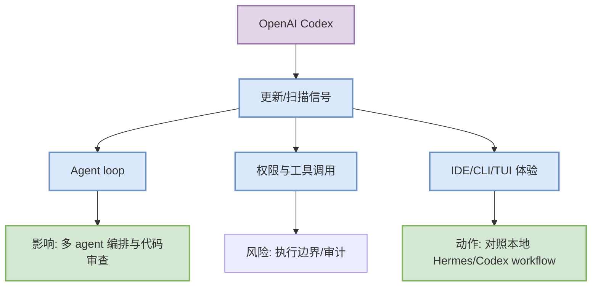

# OpenAI Codex 工具更新扫描 - 2026-09-11

> 类型：Coding/AI 工具更新  
> 工具/厂商：OpenAI Codex / OpenAI  
> 来源类型：Changelog / Release Notes / GitHub Release  
> 原文链接：https://github.com/openai/codex/releases/tag/rust-v0.154.0  
> 返回日报：[[Daily/2026-09-11]]

## 一句话结论

rust-v0.154.0 / 2026-09-09，terminal agent release watch；对 AI coding workflow 的关注点是 agent loop、权限模式、MCP/工具调用、IDE/CLI/TUI、远程执行与上下文窗口。

## 信息压缩图示

## 机制拆解

| 观察点 | 为什么重要 | 今日判断 |
|---|---|---|
| Agent mode / loop | 决定任务分解、执行和回放能力 | rust-v0.154.0 / 2026-09-09，terminal agent release watch |
| 权限/远程执行 | 影响安全边界和自动化程度 | 需继续 watch |
| IDE/CLI/TUI | 影响工程师日常接入方式 | 需与 Codex/Cline/Gemini CLI 对照 |

## 对我的影响

- 若出现 release：优先看 breaking changes、工具调用权限、上下文窗口和日志能力。
- 若无新项：保留固定扫描，避免漏掉后续 Claude Tag、agent mode、MCP、pricing/rate limit 变化。

## 相关链接

- 原文：https://github.com/openai/codex/releases/tag/rust-v0.154.0
- 返回日报：[[Daily/2026-09-11]]

#ai-radar #coding-tools
