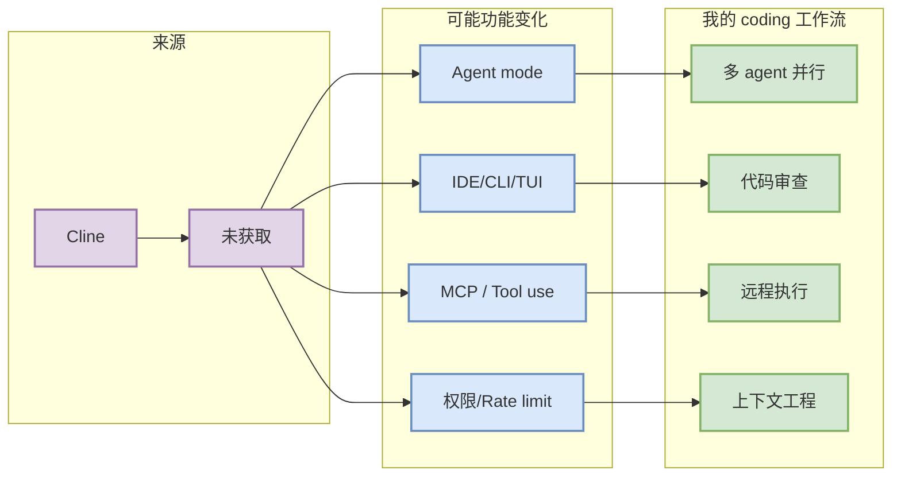

# Cline 工具更新观察

> 一句话结论：今日以 release/changelog 端点扫描 Cline；最新信号为 `未获取`，需要结合原文确认功能细节。

## TL;DR
- 工具/厂商：Cline
- 来源类型：GitHub Release / Changelog / Docs
- 发布时间或 tag：低置信/访问失败 / 未获取
- 原文：https://github.com/cline/cline/releases
- 对 AI coding workflow 的影响：重点看 agent mode、MCP、IDE/CLI、权限、上下文和远程执行是否变化。

## 元信息表
| 字段 | 值 |
|---|---|
| 工具 | Cline |
| release/tag | 未获取 |
| 发布时间 | 低置信/访问失败 |
| 来源类型 | GitHub Release / Changelog |
| 原文 | https://github.com/cline/cline/releases |

## 信息压缩图示

## 功能变化摘要
GitHub release endpoint 访问失败或该项目未使用 GitHub Releases。

## 对我的影响
若本次更新涉及 agent mode、上下文窗口、MCP 或权限模式，优先评估它是否能降低多 agent 编排和代码审查成本；若只是小修复，则作为低优先级观察。

## 可信度与局限性
自动扫描 release/changelog 只能确认“有无发布信号”，不能替代人工完整阅读文档。

#ai-radar #coding-tools
