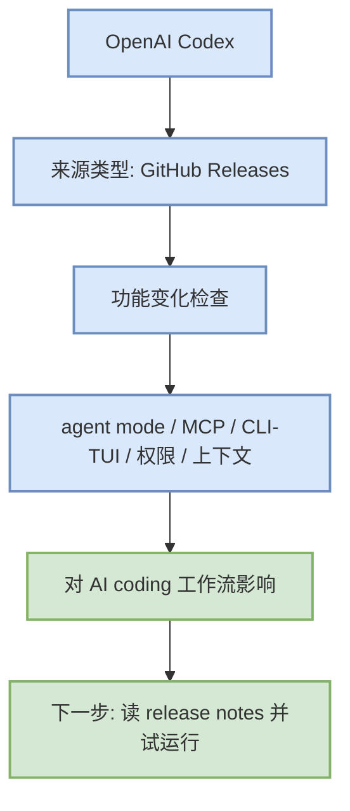

# OpenAI Codex 工具更新 - 2026-09-14

> 工具/厂商：OpenAI Codex / OpenAI
> 来源类型：GitHub Releases
> 原文：https://github.com/openai/codex/releases/tag/rust-v0.154.0

## 一句话结论
已获取 latest release；代表更新：rust-v0.154.0 / 0.154.0 / 2026-09-09T22:35:38Z。

## 信息压缩图示

## 更新元信息
| 字段 | 值 |
|---|---|
| 工具/厂商 | OpenAI Codex / OpenAI |
| 来源类型 | GitHub Releases |
| 今日状态 | 已获取 latest release |
| 代表更新 | rust-v0.154.0 / 0.154.0 / 2026-09-09T22:35:38Z |
| 发布时间/release tag | 2026-09-09T22:35:38Z |
| 原文 | https://github.com/openai/codex/releases/tag/rust-v0.154.0 |

## 对 AI coding 工作流的影响
需要重点检查是否涉及 Claude Tag、agent mode、MCP、IDE 集成、远程执行、权限模式、上下文窗口、CLI/TUI、pricing/rate limit。

## 可信度与局限性
GitHub Release 项可信度较高；网页 changelog 入口若无结构化 API，则标为低置信。

#ai-radar #coding-tools
