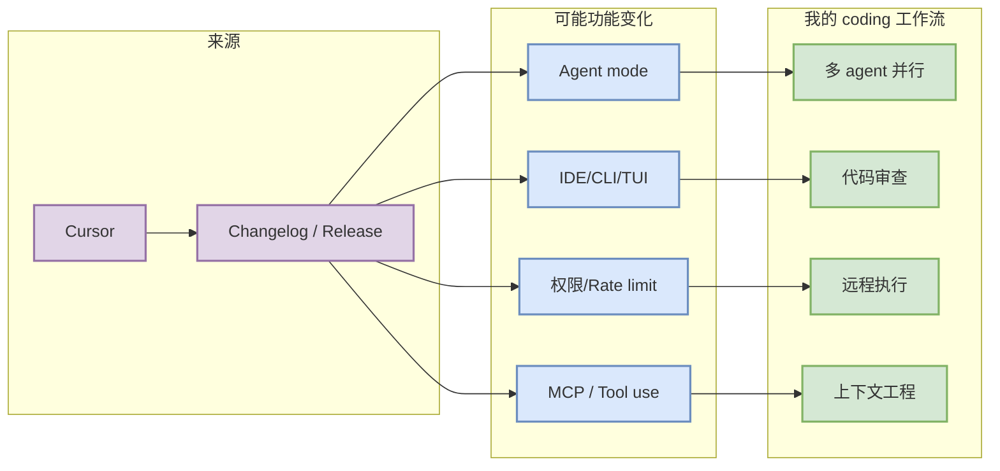

# Cursor 工具更新观察

> 一句话结论：今日 Cursor 扫描状态为：低置信：仅保留 changelog 入口，未自动验证新功能。

## TL;DR
- 工具/厂商：Cursor / Cursor
- 来源类型：Changelog / Release Notes / Docs / GitHub Releases
- 原文：https://cursor.com/changelog
- 对 AI coding workflow 的影响：重点观察 agent mode、MCP、IDE/CLI/TUI、权限、远程执行、上下文窗口、pricing/rate limit。

## 元信息表
| 字段 | 值 |
|---|---|
| 工具 | Cursor |
| 厂商 | Cursor |
| repo | 未绑定公开 repo |
| 今日状态 | 低置信：仅保留 changelog 入口，未自动验证新功能 |
| 原文 | https://cursor.com/changelog |

## 信息压缩图示

## 影响矩阵
| 功能方向 | 需要验证的问题 | 对我的影响 |
|---|---|---|
| Agent loop | 是否支持更长上下文、计划/执行、review loop | 影响多 agent 编排效率 |
| MCP / tools | 是否改动 tool schema、权限和沙箱 | 影响远程执行安全边界 |
| IDE/CLI | 是否改善 TUI/IDE 集成和日志 | 影响日常 coding workflow |

## 可信度与局限性
今日只完成固定入口扫描和 direct repo/snapshot fallback；没有把每个 changelog 正文完整抽取为确定功能差异。

#ai-radar #coding-tools
