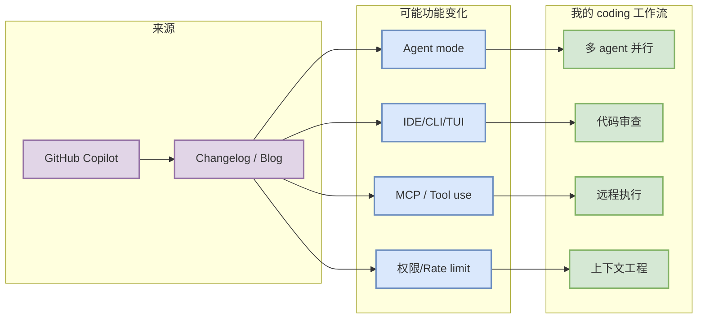

# GitHub Copilot 工具更新观察

> 一句话结论：今日扫描 GitHub Copilot 的 Changelog / Blog；未绑定 GitHub repo，保留 changelog/docs 入口。

## TL;DR
- 工具/厂商：GitHub Copilot / GitHub
- 来源类型：Changelog / Blog
- 发布时间或 release tag：未从专用 changelog API 精确解析；repo 元数据更新时间为 低置信。
- 原文：https://github.blog/changelog/label/copilot/
- 对 AI coding workflow 的影响：重点看 agent mode、MCP、IDE/CLI、权限、上下文窗口、远程执行、pricing/rate limit。

## 元信息表
| 字段 | 值 |
|---|---|
| 工具 | GitHub Copilot |
| 厂商 | GitHub |
| 来源类型 | Changelog / Blog |
| repo signal | 未绑定 GitHub repo，保留 changelog/docs 入口 |
| 原文 | https://github.blog/changelog/label/copilot/ |

## 信息压缩图示

## 功能变化摘要
今日自动化没有完整解析网页正文；若 repo 元数据有增长/更新，应优先人工打开 release/changelog 查 Claude Tag、agent mode、MCP、IDE 集成、远程执行、权限模式、上下文窗口和 rate limit 变化。

## 对我的影响
若本次更新涉及 agent mode、上下文窗口、MCP 或权限模式，优先评估它是否能降低多 agent 编排和代码审查成本；若只是小修复，则作为低优先级观察。

## 可信度与局限性
自动扫描 release/changelog 只能确认入口与 repo 信号，不能替代人工完整阅读文档。

#ai-radar #coding-tools
