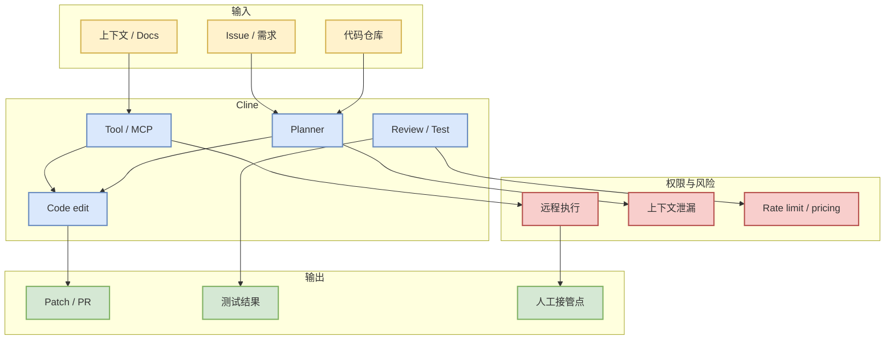

# Cline 工具扫描 - 2026-10-01

> 类型：Coding/AI 工具更新  
> 大类：Coding 工具 / AI 工具功能更新  
> 创建日期：2026-10-01  
> 原文链接：https://github.com/cline/cline/releases  
> 网页详情：https://github.com/dyt27666-oss/AI-news-report-obsidians/blob/main/Industry/Tools/2026-10-01/cline.md  
> 返回日报：[[Daily/2026-10-01]]

## 一句话结论
Cline 今日状态：watchlist / direct repo fallback；重点关注 agent mode、MCP、IDE/CLI、权限、上下文窗口、远程执行与 rate limit 变化。

## TL;DR
- **工具/厂商**：Cline / Cline
- **来源类型**：GitHub Releases
- **代表更新**：[[GitHub/LoopEngineer/2026-10-01/cline-cline]]
- **对我的影响**：影响 AI coding workflow、tmux 多 agent 监控、代码审查和自动化权限边界。

## 工具工作流图

### 影响矩阵
| 变化方向 | 关注点 | 对工作流的意义 |
|---|---|---|
| CLI/TUI | 是否适合 tmux 多 agent | 提升并行开发监控 |
| IDE 集成 | diff/review/test 是否顺滑 | 降低人工切换成本 |
| MCP/工具调用 | 是否可控、可审计 | 决定能否接入内部工具 |
| 权限/rate limit | 是否会阻塞长任务 | 影响自动化稳定性 |

## 可信度与局限性
未确认具体 release 时不包装成“今日新增”；本页主要作为固定矩阵覆盖和后续复核入口。

## 相关链接
- 原文：https://github.com/cline/cline/releases
- 相关 GitHub：[[GitHub/LoopEngineer/2026-10-01/cline-cline]]
- 返回日报：[[Daily/2026-10-01]]

## 标签
#ai-radar #coding-tool
