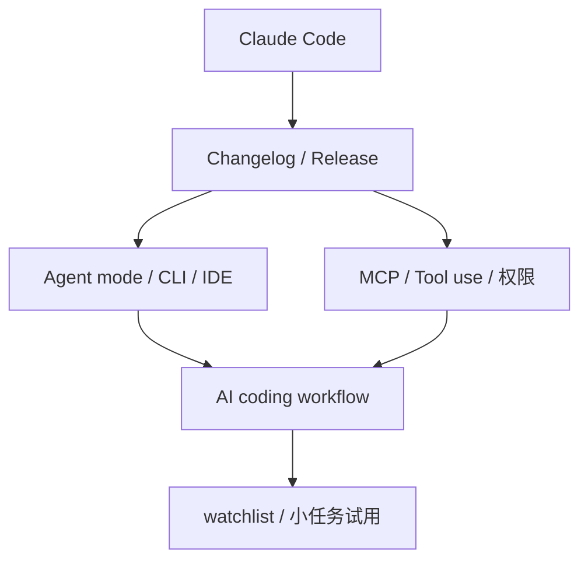

# Claude Code 工具扫描 - 2026-10-02

> 类型：Coding 工具 / AI 工具功能更新
> 工具/厂商：Claude Code / Anthropic
> 来源类型：Changelog / Release Notes
> 今日状态：watchlist / direct repo fallback
> 原文链接：https://docs.anthropic.com/en/release-notes/claude-code
> 返回日报：[[Daily/2026-10-02]]

## 一句话结论
Claude Code 今日纳入 Coding 工具扫描矩阵；重点关注 agent mode、MCP、IDE 集成、远程执行、权限模式、上下文窗口、CLI/TUI、pricing/rate limit。

## 信息压缩图示

## 功能影响矩阵
| 关注点 | 今日状态 | 对我的影响 |
|---|---|---|
| agent mode | watchlist | 影响任务拆解与自动执行 |
| MCP / tools | watchlist | 影响工具生态连接 |
| IDE / CLI | watchlist | 影响 tmux 多 agent 工作流 |
| 权限 / rate limit | 待复核 | 影响无人值守任务稳定性 |

## 标签
#ai-radar #coding-tools
