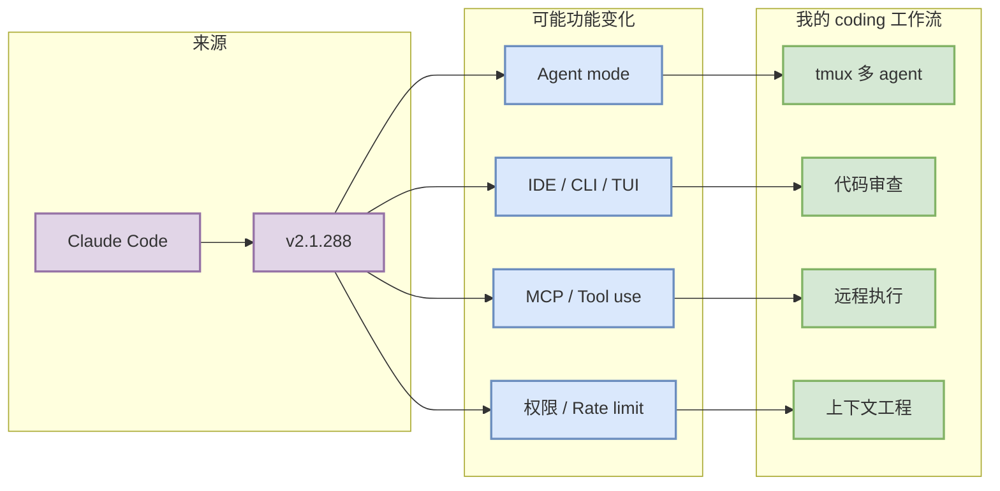

# Claude Code 工具更新观察

> 一句话结论：今日扫描 Claude Code 的 Changelog / Release Notes；最新自动化信号为 `v2.1.288`，需打开原文确认功能细节。

## TL;DR
- 工具/厂商：Claude Code / Anthropic
- 来源类型：Changelog / Release Notes
- 发布时间或 tag：2026-10-02T20:19:57Z / v2.1.288
- 原文：https://docs.anthropic.com/en/release-notes/claude-code
- 对 AI coding workflow 的影响：重点关注 agent mode、MCP、IDE/CLI/TUI、权限模式、上下文窗口、远程执行、pricing/rate limit。

## 元信息表
| 字段 | 值 |
|---|---|
| 工具 | Claude Code |
| 厂商 | Anthropic |
| release/tag | v2.1.288 |
| 发布时间 | 2026-10-02T20:19:57Z |
| 来源类型 | Changelog / Release Notes |
| 原文 | https://docs.anthropic.com/en/release-notes/claude-code |

## 信息压缩图示

## 功能变化摘要
## What's changed  - Added `$.ui.selection()` for mods: returns the text you last selected in fullscreen mode and, when the selection lies within one transcript row, that row - Added a built-in `gh api` to cloud sessions whose image has no GitHub CLI, and fixe

## 对我的影响
若本次更新涉及 agent mode、MCP、权限模式、上下文窗口或远程执行，优先评估它是否能降低多 agent 编排、代码审查和 unattended coding 的成本；若只是小修复，则作为低优先级观察。

## 可信度与局限性
自动扫描 release/changelog 只能确认“有无发布信号”，不能替代人工完整阅读文档。

#ai-radar #coding-tools
