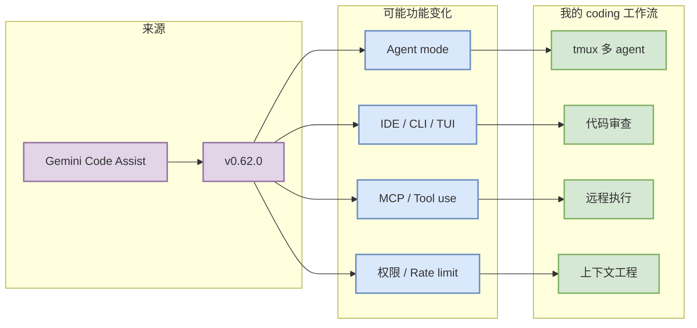

# Gemini Code Assist 工具更新观察

> 一句话结论：今日扫描 Gemini Code Assist 的 Release Notes / Gemini CLI repo；最新自动化信号为 `v0.62.0`，需打开原文确认功能细节。

## TL;DR
- 工具/厂商：Gemini Code Assist / Google
- 来源类型：Release Notes / Gemini CLI repo
- 发布时间或 tag：2026-09-29T21:17:07Z / v0.62.0
- 原文：https://cloud.google.com/gemini/docs/codeassist/release-notes
- 对 AI coding workflow 的影响：重点关注 agent mode、MCP、IDE/CLI/TUI、权限模式、上下文窗口、远程执行、pricing/rate limit。

## 元信息表
| 字段 | 值 |
|---|---|
| 工具 | Gemini Code Assist |
| 厂商 | Google |
| release/tag | v0.62.0 |
| 发布时间 | 2026-09-29T21:17:07Z |
| 来源类型 | Release Notes / Gemini CLI repo |
| 原文 | https://cloud.google.com/gemini/docs/codeassist/release-notes |

## 信息压缩图示

## 功能变化摘要
## What's Changed * fix(a2a-server): add early return on unsupported store in tasks metadata endpoint by @jesussamuel-byte in https://github.com/google-gemini/gemini-cli/pull/29334 * Changelog for v0.61.0-preview.0 by @gemini-cli-robot in https://github.com/go

## 对我的影响
若本次更新涉及 agent mode、MCP、权限模式、上下文窗口或远程执行，优先评估它是否能降低多 agent 编排、代码审查和 unattended coding 的成本；若只是小修复，则作为低优先级观察。

## 可信度与局限性
自动扫描 release/changelog 只能确认“有无发布信号”，不能替代人工完整阅读文档。

#ai-radar #coding-tools
