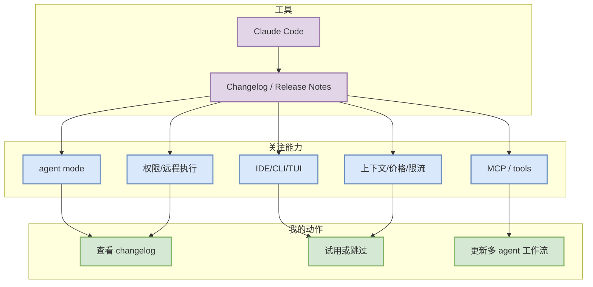

# Claude Code - 2026-10-04

> 一句话结论：今日工具扫描矩阵保留 Claude Code；状态为 入口扫描 + repo 活跃度观察。

## TL;DR
- 工具/厂商：Claude Code / Anthropic
- 来源类型：Changelog / Release Notes
- 功能变化：agent mode / MCP / CLI 权限 / 上下文变化需关注
- 发布时间 / release tag：latest docs/release notes scan
- 原文：https://docs.anthropic.com/en/release-notes/claude-code

## Coding workflow 影响图

## 专业解读
Claude Code 对 AI coding workflow 的价值取决于它是否改善 agent loop、上下文保持、权限边界、IDE/CLI 切换、MCP 工具调用以及远程执行安全。今日记录以扫描状态为主，避免把未确认网页入口误写成确定 release。

## 可信度与局限性
- 来源类型：Changelog / Release Notes
- 今日状态：入口扫描 + repo 活跃度观察
- 局限性：部分商业网页 changelog 需要人工复核。

## 相关链接
- 原文：https://docs.anthropic.com/en/release-notes/claude-code
- Daily：[[Daily/2026-10-04]]

#AI-Radar #CodingTools
