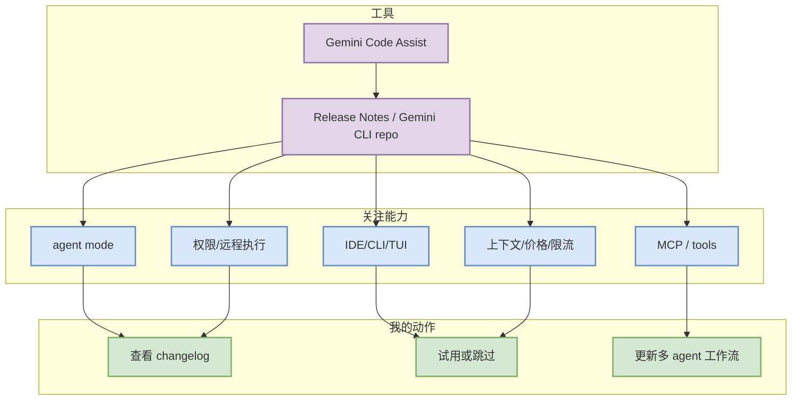

# Gemini Code Assist - 2026-10-04

> 一句话结论：今日工具扫描矩阵保留 Gemini Code Assist；状态为 入口扫描 + direct repo fallback。

## TL;DR
- 工具/厂商：Gemini Code Assist / Google
- 来源类型：Release Notes / Gemini CLI repo
- 功能变化：Gemini CLI / Code Assist / MCP / IDE 集成
- 发布时间 / release tag：latest docs scan
- 原文：https://cloud.google.com/gemini/docs/codeassist/release-notes

## Coding workflow 影响图

## 专业解读
Gemini Code Assist 对 AI coding workflow 的价值取决于它是否改善 agent loop、上下文保持、权限边界、IDE/CLI 切换、MCP 工具调用以及远程执行安全。今日记录以扫描状态为主，避免把未确认网页入口误写成确定 release。

## 可信度与局限性
- 来源类型：Release Notes / Gemini CLI repo
- 今日状态：入口扫描 + direct repo fallback
- 局限性：部分商业网页 changelog 需要人工复核。

## 相关链接
- 原文：https://cloud.google.com/gemini/docs/codeassist/release-notes
- Daily：[[Daily/2026-10-04]]

#AI-Radar #CodingTools
