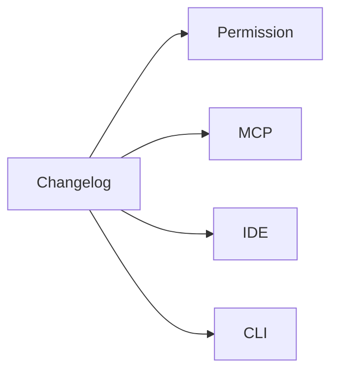

# Claude Code 工具扫描

> 来源：https://docs.anthropic.com/en/release-notes/claude-code

## 结论
今日未确认高置信新增；继续关注权限、MCP、IDE、CLI/TUI、上下文窗口和 remote execution。

```mermaid
flowchart LR
  Changelog --> Permission
  Changelog --> MCP
  Changelog --> IDE
  Changelog --> CLI
```

#ai-radar #coding-tool
