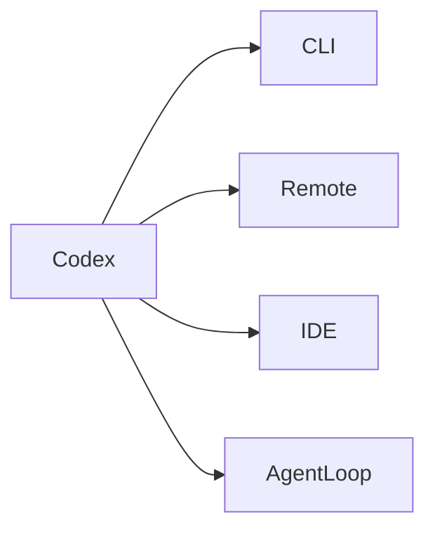

# OpenAI Codex 工具扫描

> 来源：https://developers.openai.com/codex/changelog

## 结论
今日未确认高置信新增；继续关注 CLI、remote execution、IDE integration、权限模式和 agent loop。

```mermaid
flowchart LR
  Codex --> CLI
  Codex --> Remote
  Codex --> IDE
  Codex --> AgentLoop
```

#ai-radar #coding-tool
