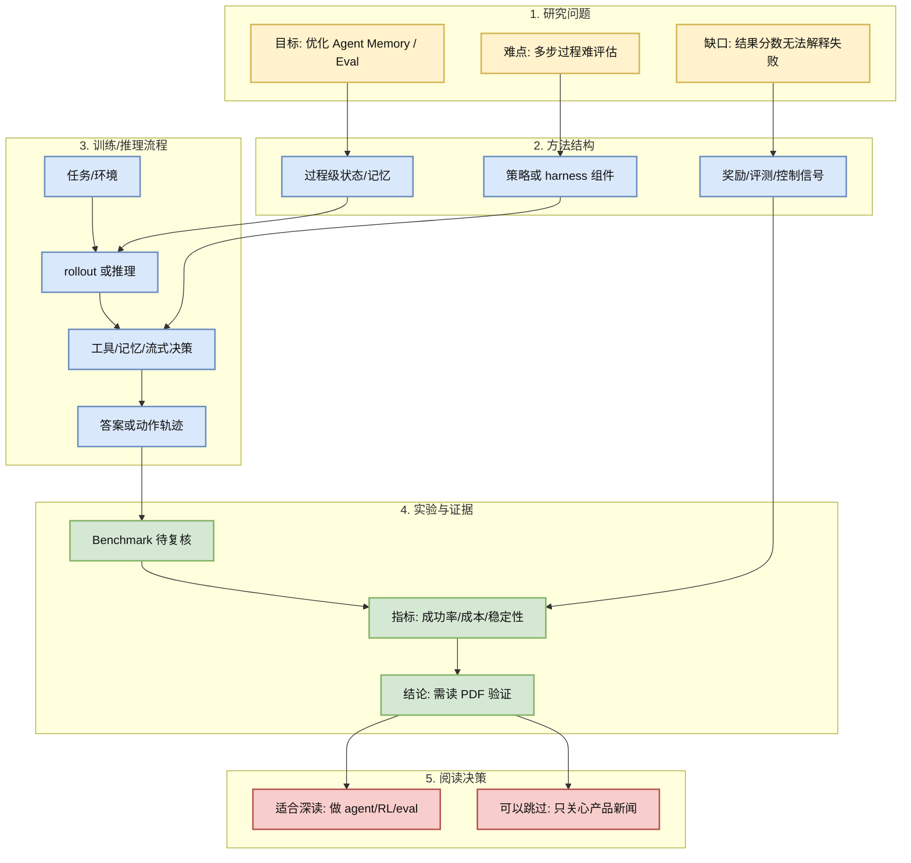
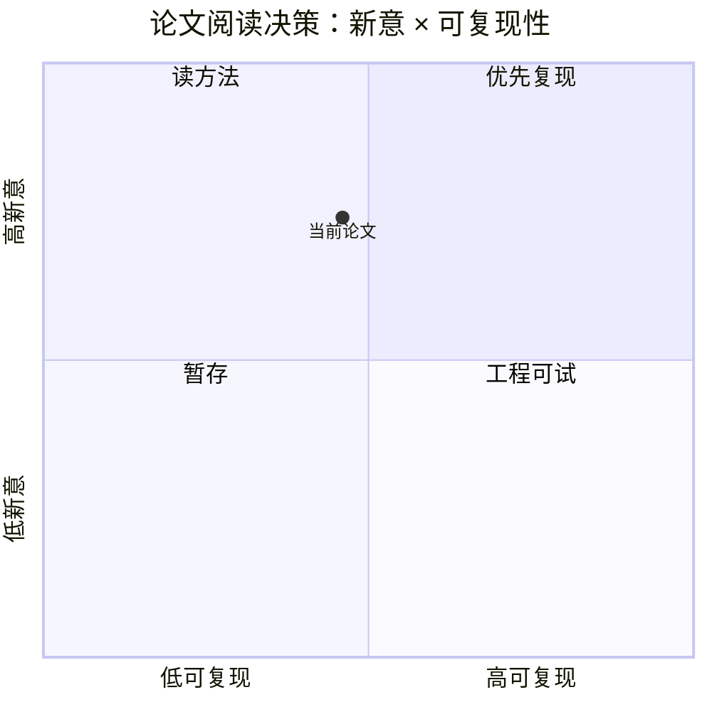

# Memory is Reconstructed, Not Retrieved: Graph Memory for LLM Agents

> 类型：论文
> 大类：论文
> 小类：Agent Memory / Eval
> 推荐等级：可 skim
> 创建日期：2026-06-16
> 原文链接：https://arxiv.org/abs/2606.06036
> PDF：https://arxiv.org/pdf/2606.06036
> 网页详情：https://github.com/dyt27666-oss/AI-news-report-obsidians/blob/main/Papers/2026-06-16/Graph-Memory-for-LLM-Agents.md
> 返回日报：[[Daily/2026-06-16]]

## 一句话结论

把 agent memory 看成可重构图结构，而不是简单向量检索，强调关系、事件和上下文的动态重组。

## TL;DR

- **研究问题**：Agent Memory / Eval 中如何把多步推理、agent 行为或推理成本纳入可优化对象。
- **核心方法**：从标题和索引信息看，重点在过程级优化、记忆结构、harness 组合或自适应 reasoning。
- **关键结果**：本次采集未能读取完整 arXiv XML/PDF，结果细节需后续复核。
- **对我的价值**：对长期 agent、research agent 和任务恢复有直接价值：记忆系统要能解释、压缩和更新，而不是只做 top-k retrieval。
- **建议动作**：先收藏并二次阅读 PDF；若方法含代码，再评估复现成本。

## 论文信息

| 字段 | 内容 |
|---|---|
| 论文来源 | Hugging Face Papers / arXiv |
| 来源类型 | 论文索引 / 预印本 |
| 标题 | Memory is Reconstructed, Not Retrieved: Graph Memory for LLM Agents |
| 作者/机构 | Hugging Face Papers listed authors |
| 发布时间 | 2026-06 |
| arXiv | [abs](https://arxiv.org/abs/2606.06036) |
| OpenReview / 会议页 | 未发现 |
| Semantic Scholar | 未稳定获取（API 429/SSL 问题） |
| PDF | [pdf](https://arxiv.org/pdf/2606.06036) |
| 代码 | 未发现 |
| 方向 | Agent Memory / Eval |

## 方法/系统图示

### 辅助图：阅读/复现决策矩阵

## 专业解读

对长期 agent、research agent 和任务恢复有直接价值：记忆系统要能解释、压缩和更新，而不是只做 top-k retrieval。 这类论文值得关注的原因是：LLM agent 和 RL 系统越来越依赖多步交互轨迹，传统“输入一次、输出一次、打一个分”的评测方式不够。真正的工程问题包括：如何定义中间状态、如何把失败归因到记忆/工具/策略/奖励、如何让推理成本可控，以及如何把环境并行化后仍保持评测可信。

## 通俗解释

它们研究的不是“模型会不会答题”，而是“模型像一个执行任务的人一样走很多步时，怎么记事、怎么选动作、怎么知道自己哪一步错了”。

## 方法拆解

| 组件 | 作用 | 输入 | 输出 | 关键假设 |
|---|---|---|---|---|
| 任务/环境 | 提供可交互问题 | prompt、工具、状态 | 轨迹 | 环境能稳定复现 |
| 策略/记忆模块 | 决定下一步动作 | 历史轨迹、上下文 | tool call / reasoning step | 中间状态可压缩 |
| 评测/奖励层 | 判断过程和结果 | 轨迹、答案、约束 | 分数/反馈 | 指标能反映真实任务价值 |

## 实验与证据

| 实验 | 说明 | 我怎么看 |
|---|---|---|
| benchmark | 需阅读 PDF 后确认 | 当前只作为高相关候选 |
| 工程复现 | 代码未发现 | 先不投入复现，只加入阅读队列 |

## 局限性 / 风险

- 当前元数据来自 Hugging Face Papers 索引，arXiv API 当次返回 429，细节未完整验证。
- 代码链接未发现，可复现性不确定。
- 如果 benchmark 偏合成任务，对生产 agent 的迁移价值会下降。

## 对我的影响

| 维度 | 影响 | 建议动作 |
|---|---|---|
| AI Infra | 需要 trace、reward、eval、environment runtime | 设计 agent trace schema |
| LLM 工程 | 过程级优化会影响 token budget 和 latency | 关注 success-per-token |
| RL / Game AI | 环境与 rollout 可复现性是关键 | 比较与游戏环境并行训练的接口 |
| Agent / Eval | 强相关 | 后续深读 PDF |

## 相关链接

- 原文：https://arxiv.org/abs/2606.06036
- PDF：https://arxiv.org/pdf/2606.06036
- 网页详情：https://github.com/dyt27666-oss/AI-news-report-obsidians/blob/main/Papers/2026-06-16/Graph-Memory-for-LLM-Agents.md
- 代码：未发现
- 相关卡片：[[Daily/2026-06-16]]

## 标签

#ai-radar #paper #agent #rl #eval
