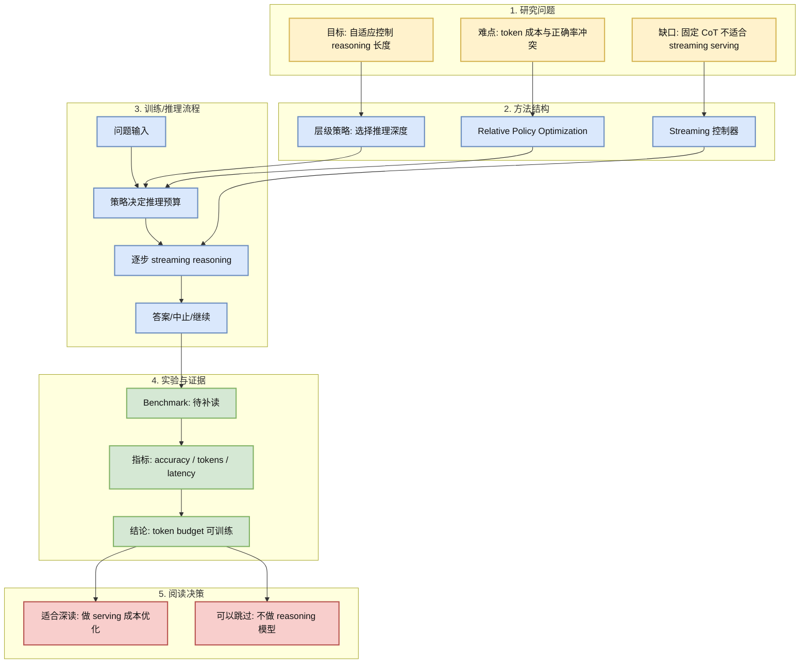
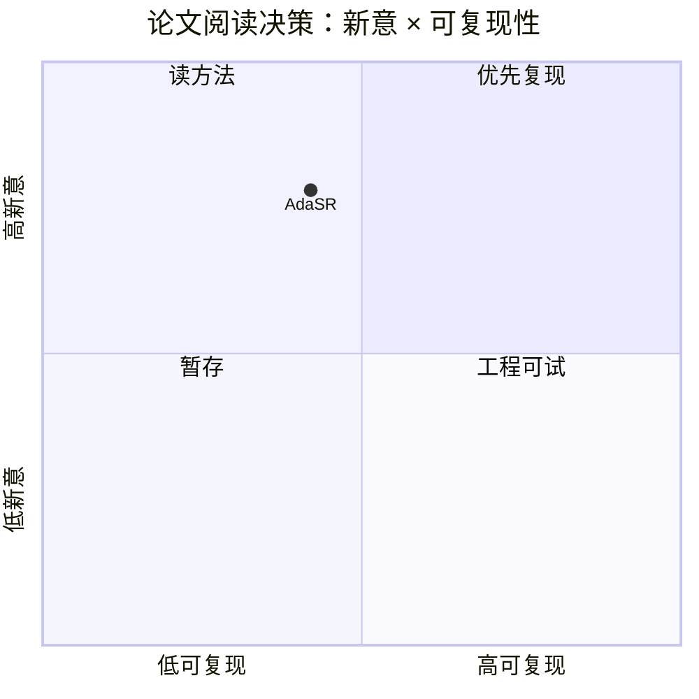

# AdaSR: Adaptive Streaming Reasoning with Hierarchical Relative Policy Optimization

> 类型：论文
> 大类：论文
> 小类：Streaming Reasoning / Post-training / Serving Cost
> 推荐等级：可 skim
> 创建日期：2026-06-17
> 原文链接：https://arxiv.org/abs/2606.14694
> PDF：https://arxiv.org/pdf/2606.14694
> 网页详情：https://github.com/dyt27666-oss/AI-news-report-obsidians/blob/main/Papers/2026-06-17/AdaSR-Adaptive-Streaming-Reasoning.md
> 返回日报：[[Daily/2026-06-17]]

## 一句话结论

AdaSR 的价值在于把 streaming reasoning 的 token budget 和推理策略变成可优化对象，直接连接 post-training 与 serving 成本。

## TL;DR

- **研究问题**：长 reasoning/streaming 输出容易浪费 token，且不同问题需要不同推理深度。
- **核心方法**：标题显示使用 hierarchical relative policy optimization 来做自适应 streaming reasoning。
- **关键结果**：本次未能稳定读取 PDF，实验细节需补读。
- **对我的价值**：如果方法成立，可用于 success-per-token、latency-per-success 这类 serving 指标。
- **建议动作**：后续深读；看 reward、停止策略、层级策略和在线推理兼容性。

## 论文信息

| 字段 | 内容 |
|---|---|
| 论文来源 | arXiv |
| 来源类型 | 预印本 / 论文索引 |
| 标题 | AdaSR: Adaptive Streaming Reasoning with Hierarchical Relative Policy Optimization |
| 作者/机构 | 本次扫描未稳定获取，需补读 arXiv |
| 发布时间 | 2026-06 扫描到 |
| arXiv | [abs](https://arxiv.org/abs/2606.14694) |
| OpenReview / 会议页 | 未发现 |
| Semantic Scholar | 未稳定获取 |
| PDF | [pdf](https://arxiv.org/pdf/2606.14694) |
| 代码 | 未发现 |
| 方向 | Streaming Reasoning / RLHF / Serving |

## 方法/系统图示

## 专业解读

Reasoning 模型的工程问题正在从“能否答对”转向“用多少 token、多少延迟、多少成本答对”。如果 AdaSR 能在 streaming 场景里动态调整推理深度，它就能把 post-training 的 reward 设计与 serving 的 cost model 连接起来。

对 LLM serving 工程师，关键要看三点：是��需要额外 policy head、是否影响流式输出体验、是否能在在线请求里安全提前停止。对 RL/post-training 工程师，关键要看 relative policy optimization 如何定义偏好和层级 reward。

## 通俗解释

不是每道题都需要模型“长篇大论地想”。AdaSR 想让模型学会：简单题少想一点，难题多想一点，而且边输出边决定是否继续。

## 方法拆解

| 组件 | 作用 | 输入 | 输出 | 关键假设 |
|---|---|---|---|---|
| 层级策略 | 决定推理深度 | prompt/中间状态 | budget/动作 | 难度可被状态识别 |
| Relative Optimization | 学习更优推理策略 | 成对结果/奖励 | 策略更新 | reward 可靠 |
| Streaming 控制 | 在线输出与停止 | token 流 | answer/continue/stop | 停止不损害正确率 |

## 实验与证据

| 实验 | 说明 | 我怎么看 |
|---|---|---|
| 待补读 PDF | arXiv API 本次 429 | 需要确认是否真的改善 latency/cost |
| 指标设计 | 应关注 accuracy-token-latency 三角 | 与 serving KPI 高度相关 |

## 局限性 / 风险

- 当前详情基于索引和标题信号，未深读 PDF。
- 自适应 reasoning 可能带来输出不稳定或提前停止错误。
- 如果训练成本很高，线上节省未必覆盖成本。

## 对我的影响

| 维度 | 影响 | 建议动作 |
|---|---|---|
| AI Infra | 可纳入 serving cost model | 关注 token/latency 指标 |
| LLM 工程 | post-training 与推理策略结合 | 补读方法 |
| RL / Game AI | 层级策略思想可迁移 | 观察 reward 设计 |
| Agent / Eval | success-per-token 可做 agent KPI | 加入 eval 指标 |

## 相关链接

- 原文：https://arxiv.org/abs/2606.14694
- PDF：https://arxiv.org/pdf/2606.14694
- 网页详情：https://github.com/dyt27666-oss/AI-news-report-obsidians/blob/main/Papers/2026-06-17/AdaSR-Adaptive-Streaming-Reasoning.md
- 代码：未发现
- 相关卡片：[[Daily/2026-06-17]]

## 标签

#ai-radar #paper #serving #reasoning #post-training #rlhf
