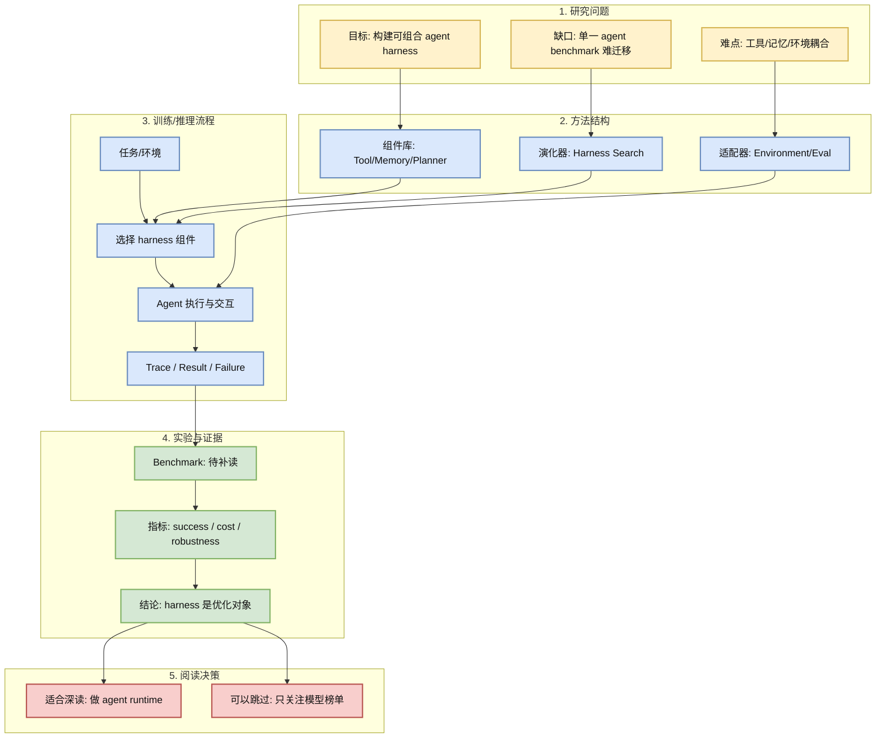
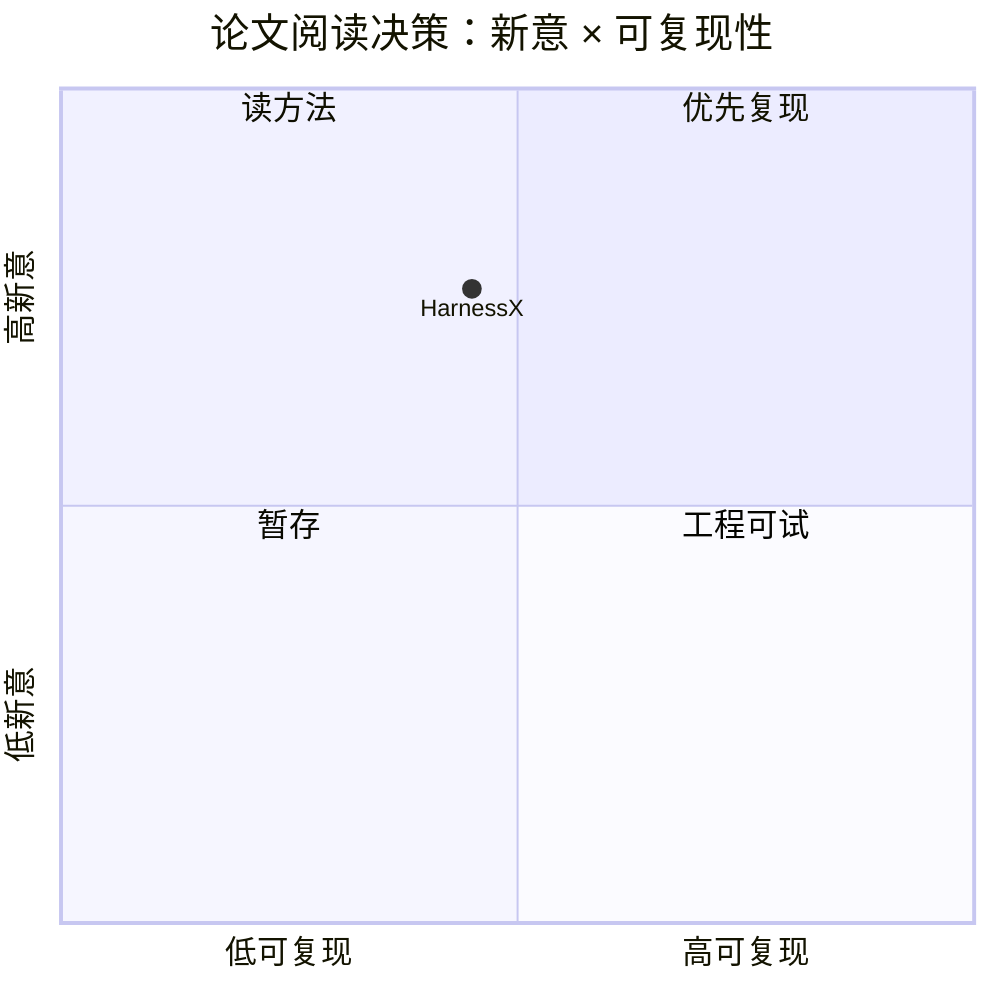

# HarnessX: A Composable, Adaptive, and Evolvable Agent Harness Foundry

> 类型：论文
> 大类：论文
> 小类：Agent Infra / Harness / Eval
> 推荐等级：可 skim
> 创建日期：2026-06-17
> 原文链接：https://arxiv.org/abs/2606.14249
> PDF：https://arxiv.org/pdf/2606.14249
> 网页详情：https://github.com/dyt27666-oss/AI-news-report-obsidians/blob/main/Papers/2026-06-17/HarnessX-Agent-Harness-Foundry.md
> 返回日报：[[Daily/2026-06-17]]

## 一句话结论

HarnessX 代表 agent 研究的基础设施转向：真正需要优化的不只是单个模型，而是可组合、可演化、可评测的 agent harness。

## TL;DR

- **研究问题**：多步 agent 系统缺少统一 harness，工具、记忆、环境、评测和控制流难组合。
- **核心方法**：将 agent harness 拆成可组合组件，并强调 adaptive/evolvable 的系统生成或调优。
- **关键结果**：本次未能读取 PDF，结果细节需补读；标题和摘要信号与 agent infra 强相关。
- **对我的价值**：可作为 Hermes/ECC/OpenHands 等 runtime 设计的研究参照。
- **建议动作**：后续补读 PDF，重点看组件抽象、benchmark 和是否有代码。

## 论文信息

| 字段 | 内容 |
|---|---|
| 论文来源 | arXiv |
| 来源类型 | 预印本 / 论文索引 |
| 标题 | HarnessX: A Composable, Adaptive, and Evolvable Agent Harness Foundry |
| 作者/机构 | 本次扫描未稳定获取，需补读 arXiv |
| 发布时间 | 2026-06 扫描到 |
| arXiv | [abs](https://arxiv.org/abs/2606.14249) |
| OpenReview / 会议页 | 未发现 |
| Semantic Scholar | 未稳定获取 |
| PDF | [pdf](https://arxiv.org/pdf/2606.14249) |
| 代码 | 未发现 |
| 方向 | Agent Infra / Harness / Eval |

## 方法/系统图示

## 专业解读

Agent harness 是 agent 系统里容易被忽视但最工程化的部分。模型负责产生动作，harness 决定模型能看到什么、能调用什么、如何记忆、如何失败恢复、如何计分、如何被审计。HarnessX 这类论文如果能把这些模块系统化，对构建生产 agent 和 agentic RL 环境都有帮助。

目前最大不确定性是论文具体实现与实验是否足够扎实。标题很强，但需要确认是否只是框架概念，还是有可复现实验和代码。

## 通俗解释

如果 agent 是一个选手，harness 就是比赛规则、工具箱、记分牌和教练组。只换选手不改比赛系统，长任务表现很难稳定提升。

## 方法拆解

| 组件 | 作用 | 输入 | 输出 | 关键假设 |
|---|---|---|---|---|
| Harness 组件库 | 抽象工具/记忆/规划器 | 任务需求 | 可组合模块 | 模块边界可统一 |
| Eval Adapter | 对接不同环境 | trace/result | 指标/奖励 | 指标能反映真实成功 |
| Evolution/Search | 自动改进 harness | 历史结果 | 新组合 | 搜索空间可控 |

## 实验与证据

| 实验 | 说明 | 我怎么看 |
|---|---|---|
| 待补读 PDF | arXiv API 本次 429，未获取摘要全文 | 必须后续确认 benchmark |
| 工程相关性 | 标题和方向高度贴合 agent infra | 值得进入阅读列表 |

## 局限性 / 风险

- 当前详情基于索引信号，未完成 PDF 深读。
- 需要确认是否有开源代码和真实 benchmark。
- harness 自动演化可能带来安全和可解释性风险。

## 对我的影响

| 维度 | 影响 | 建议动作 |
|---|---|---|
| AI Infra | agent runtime 组件化参考 | 补读 PDF |
| LLM 工程 | 长任务成功率可能来自 harness | 设计 trace 指标 |
| RL / Game AI | 环境/harness 可作为训练外壳 | 关注 reward 接口 |
| Agent / Eval | 高相关 | 纳入 agent eval 观察 |

## 相关链接

- 原文：https://arxiv.org/abs/2606.14249
- PDF：https://arxiv.org/pdf/2606.14249
- 网页详情：https://github.com/dyt27666-oss/AI-news-report-obsidians/blob/main/Papers/2026-06-17/HarnessX-Agent-Harness-Foundry.md
- 代码：未发现
- 相关卡片：[[Daily/2026-06-17]]

## 标签

#ai-radar #paper #agent #harness #eval
