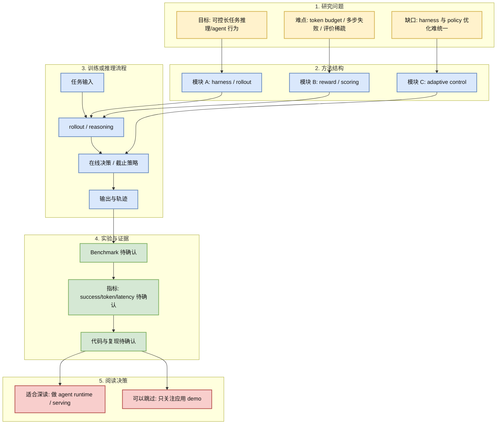
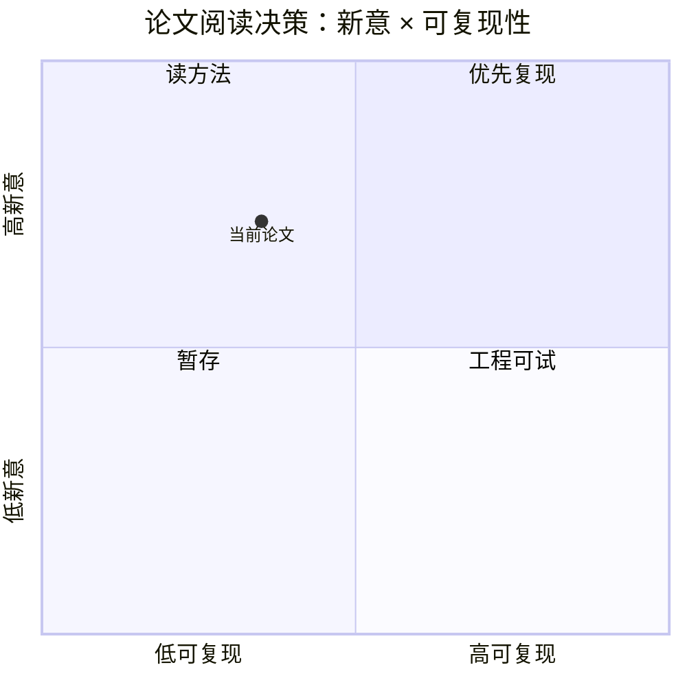

# HarnessX: A Composable, Adaptive, and Evolvable Agent Harness Foundry

> 类型：论文
> 大类：论文
> 小类：Agent / Serving / Post-training
> 推荐等级：后续
> 创建日期：2026-06-18
> 原文链接：https://arxiv.org/abs/2606.14249
> PDF：https://arxiv.org/pdf/2606.14249
> 网页详情：https://github.com/dyt27666-oss/AI-news-report-obsidians/blob/main/Papers/2026-06-18/HarnessX-Agent-Harness-Foundry.md
> 返回日报：[[Daily/2026-06-18]]

## 一句话结论

HarnessX 是关于 composable/adaptive/evolvable agent harness 的近期候选，关注 agent 外层运行框架。

## TL;DR

- **研究问题**：如何把 agent harness / streaming reasoning / policy optimization 做成可评估、可调度的工程对象。
- **核心方法**：今日 arXiv API 429/timeout，未能稳定获取全文；本页作为论文 watchlist 详情页，需补读 PDF。
- **关键结果**：未验证，等待原文确认。
- **对我的价值**：对 Hermes/ECC/OpenHands 这类 agent runtime 设计有直接参考价值：harness 可能成为独立可评估、可演化的 infra 层。
- **建议动作**：补读 PDF，优先确认 benchmark、代码和是否能复现。

## 论文信息

| 字段 | 内容 |
|---|---|
| 论文来源 | arXiv |
| 来源类型 | 预印本 / 论文索引 |
| 标题 | HarnessX: A Composable, Adaptive, and Evolvable Agent Harness Foundry |
| 作者/机构 | API 未稳定获取，需原文确认 |
| 发布时间 | 2026-06 近期候选，需原文确认版本 |
| arXiv | [abs](https://arxiv.org/abs/2606.14249) |
| OpenReview / 会议页 | 未发现 |
| Semantic Scholar | 未稳定获取 |
| PDF | [pdf](https://arxiv.org/pdf/2606.14249) |
| 代码 | 未发现 |
| 方向 | Agent Harness / Serving / Post-training |

## 方法/系统图示

## 专业解读

对 Hermes/ECC/OpenHands 这类 agent runtime 设计有直接参考价值：harness 可能成为独立可评估、可演化的 infra 层。 但由于今日 arXiv/Semantic Scholar 访问不稳定，本页不把摘要当作已验证事实，只把它作为 watchlist。真正需要确认的是：是否有清晰 benchmark，是否公开代码，reward 或控制策略是否能迁移到生产 serving/agent runtime。

## 通俗解释

这类论文关注让模型不只是想得更多，而是知道什么时候该想、怎么想、错了怎么被记录和改进。

## 方法拆解

| 组件 | 作用 | 输入 | 输出 | 关键假设 |
|---|---|---|---|---|
| Rollout / Harness | 收集多步行为轨迹 | 任务和工具 | trace | trace 足够表达失败原因 |
| Reward / Eval | 判断行为质量 | 输出和中间步骤 | score | 指标能代表真实成功率 |
| Adaptive Control | 控制推理预算 | 状态和分数 | 停止/继续决策 | 预算控制不牺牲关键能力 |

## 实验与证据

| 实验 | 说明 | 我怎么看 |
|---|---|---|
| Benchmark | 待 PDF 确认 | 需关注是否贴近真实 agent/serving |
| Ablation | 待 PDF 确认 | 需看控制模块是否真有贡献 |

## 局限性 / 风险

- 今日未能稳定获取 API metadata，作者、摘要和实验需原文确认。
- 如果 benchmark 只覆盖 toy tasks，工程价值会下降。
- 如果没有代码，短期只能做概念参考。

## 对我的影响

| 维度 | 影响 | 建议动作 |
|---|---|---|
| AI Infra | 可影响 runtime/eval/control plane 设计 | 补读 PDF |
| LLM 工程 | 连接 reasoning budget 与成功率 | 提炼指标 |
| RL / Game AI | reward/rollout 思路可迁移 | 观察 |
| Agent / Eval | 强相关 | 加入 watchlist |

## 相关链接

- 原文：https://arxiv.org/abs/2606.14249
- PDF：https://arxiv.org/pdf/2606.14249
- 网页详情：https://github.com/dyt27666-oss/AI-news-report-obsidians/blob/main/Papers/2026-06-18/HarnessX-Agent-Harness-Foundry.md
- 代码：未发现
- 相关卡片：[[Daily/2026-06-18]]

## 标签

#ai-radar #paper #agent #serving #post-training
