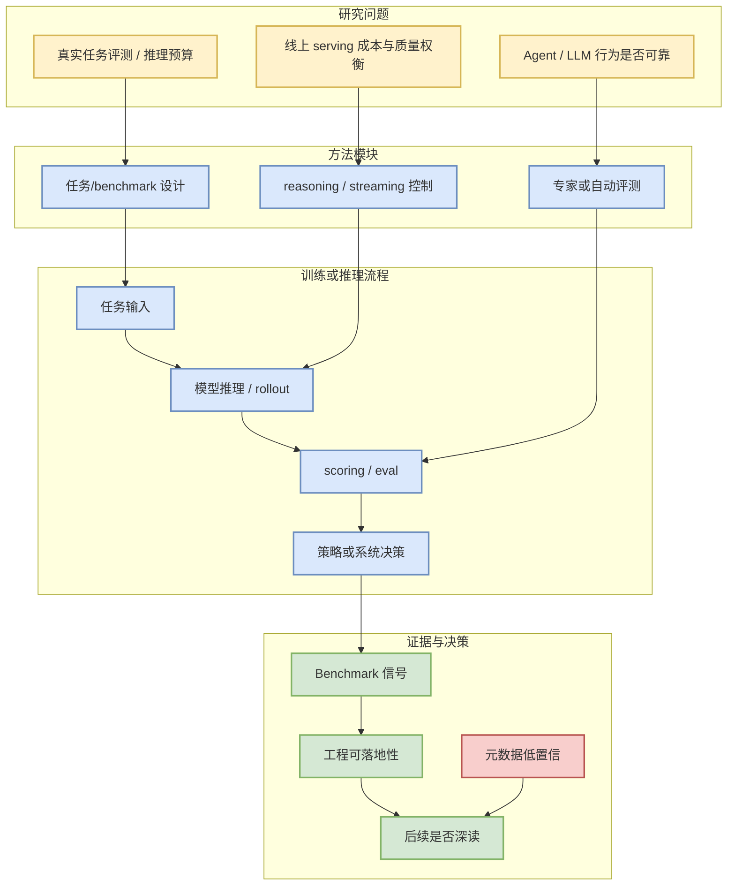

# AdaSR Adaptive Streaming Reasoning

## 一句话结论
自适应 streaming reasoning 方向与推理预算、延迟控制和 serving 策略相关；arXiv 今日访问失败，沿用 watchlist。

## TL;DR
- 论文来源：arXiv watchlist
- 来源类型：preprint / low-confidence metadata
- 原文/索引：https://arxiv.org/
- 采集说明：今日 arXiv/Semantic Scholar 出现 429/timeout，论文项以高相关 watchlist 和公司研究 benchmark 为主，已标注低置信来源。

## 元信息
| 字段 | 值 |
|---|---|
| 论文来源 | arXiv watchlist |
| 来源类型 | preprint / low-confidence metadata |
| 作者/机构 | 见原文 |
| 发布时间 | 近期/待核验 |
| abs 链接 | https://arxiv.org/ |
| PDF 链接 | 待核验 |
| 代码链接 | 未发现 |

## 信息压缩图示

## 专业解读
自适应 streaming reasoning 方向与推理预算、延迟控制和 serving 策略相关；arXiv 今日访问失败，沿用 watchlist。 对用户最有价值的是把研究问题转成系统问题：如何定义任务、如何控制 reasoning budget、如何把评测结果变成 serving 或 post-training 的调参依据。

## 通俗解释
它回答的是“模型看起来会做题，是否真的能在复杂任务中稳定完成目标”。

## 关键机制拆解
| 机制 | 需要核验的问题 | 对工程的影响 |
|---|---|---|
| Benchmark 设计 | 任务是否真实、可复现 | 决定评测可信度 |
| 推理流程 | 是否控制 latency/cost | 决定 serving 价值 |
| 结果证据 | 是否有 ablation / baseline | 决定是否复现 |

## 对我的影响
适合纳入 agent eval / serving quality / post-training reward design 的阅读池，但需要在源站恢复后补齐元数据。

## 可信度与局限性
本页受 arXiv/Semantic Scholar 429/timeout 影响，部分字段待核验；已避免把低置信论文包装成确定结论。

## 我应该如何跟进
1. 明天或源站恢复后补抓 PDF/作者/实验结果。
2. 若有代码，检查是否能复现实验。
3. 抽取可迁移到内部 agent eval 的指标。

## 相关链接
- 原文/索引：[AdaSR Adaptive Streaming Reasoning](https://arxiv.org/)
- 返回日报：[[Daily/2026-06-19]]

#ai-radar #paper #eval #llm
