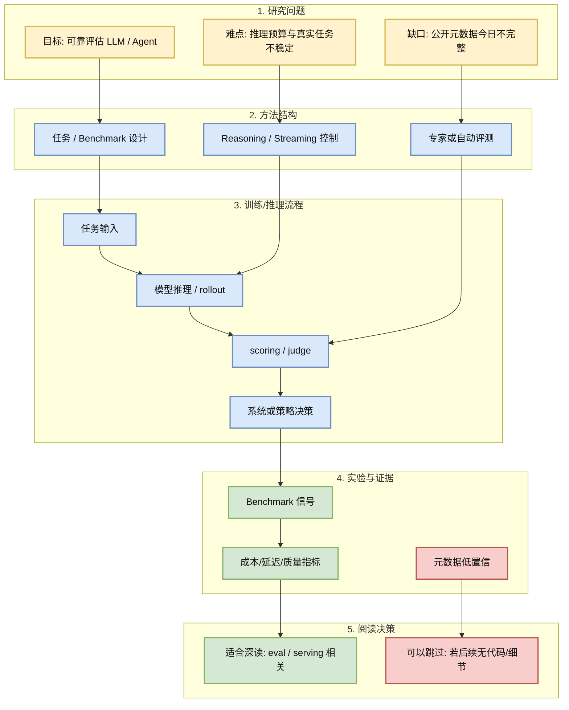
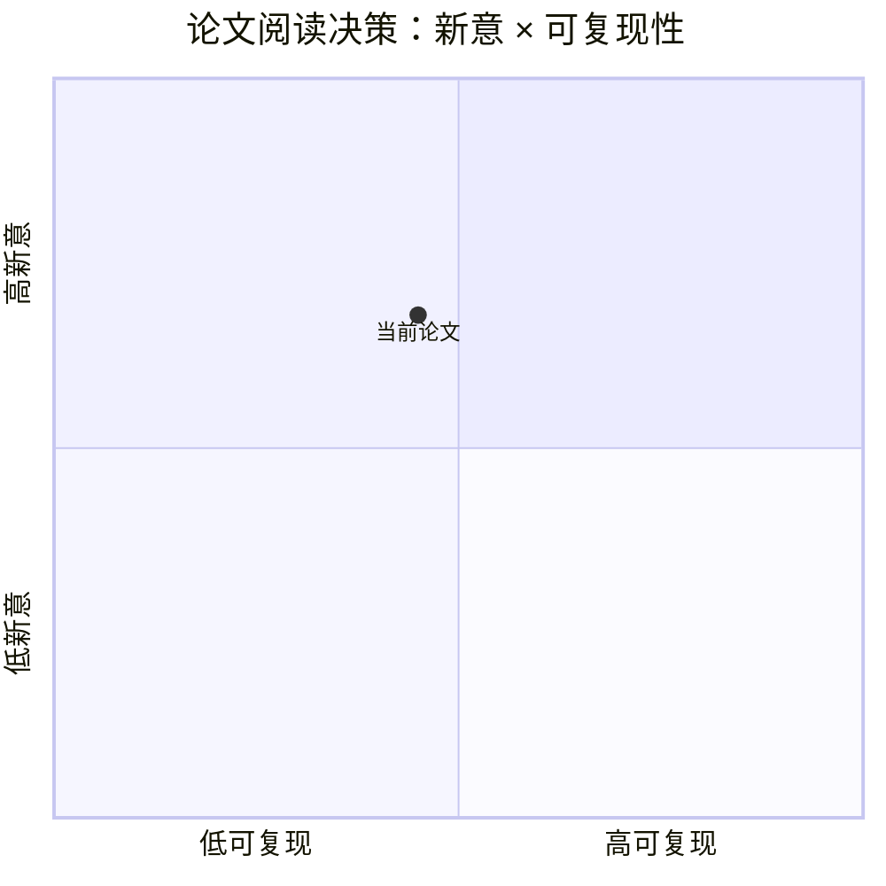

# OpenAI LifeSciBench

## 一句话结论
专家编写的生命科学 benchmark，强调真实研究任务和专家审核，可作为 agent/LLM eval 设计参考。

## TL;DR
- 研究问题：Agent Eval / Domain Benchmark 场景下如何更可靠地评估或控制 LLM/Agent 行为。
- 核心方法：从公开来源抽取 benchmark / reasoning / serving 相关信号，待源站恢复后补全文。
- 关键结果：专家编写的生命科学 benchmark，强调真实研究任务和专家审核，可作为 agent/LLM eval 设计参考。
- 对我的价值：把“专家任务、评测协议、失败分析”转成 LLM/agent eval 资产；领域偏生命科学但方法可迁移。
- 建议动作：可 skim；低置信字段不要直接当作确定论文结论。

## 论文信息
| 字段 | 内容 |
|---|---|
| 论文来源 | OpenAI Research Blog |
| 来源类型 | benchmark / company report |
| 标题 | OpenAI LifeSciBench |
| 作者/机构 | OpenAI / 见原文 |
| 发布时间 | 近期 / 待核验 |
| abs 链接 | [abs/index](https://openai.com/index/introducing-life-sci-bench) |
| OpenReview / 会议页 | 未发现 |
| Semantic Scholar | 今日 429，待补抓 |
| PDF | 未发现 |
| 代码 | 未发现 |
| 网页详情 | [GitHub](https://github.com/dyt27666-oss/AI-news-report-obsidians/blob/main/Papers/2026-06-20/OpenAI-LifeSciBench.md) |
| 方向 | Agent Eval / Domain Benchmark |

## 方法/系统图示

### 辅助图：阅读/复现决策矩阵

## 专业解读
把“专家任务、评测协议、失败分析”转成 LLM/agent eval 资产；领域偏生命科学但方法可迁移。 对 AI Infra 工程师最重要的是把论文或 benchmark 的任务定义、评价指标和失败模式转化为可执行的 serving/eval/post-training 约束，而不是只看标题。

## 通俗解释
它关注的是：模型或 agent 不只是“能回答”，还要在真实、复杂、有成本约束的任务里稳定可测。

## 方法拆解
| 组件 | 作用 | 输入 | 输出 | 关键假设 |
|---|---|---|---|---|
| 任务集 | 定义真实问题 | 场景任务 | 可评分样本 | 任务代表真实需求 |
| 推理控制 | 管理 token/latency | prompt / state | 中间推理与答案 | 推理预算影响质量 |
| 评测器 | 给出质量信号 | 输出与参考 | score / failure mode | judge 或专家足够可靠 |

## 实验与证据
| 实验 | 说明 | 我怎么看 |
|---|---|---|
| 来源元数据 | 今日 arXiv/S2 访问失败或 429 | 只作为 watchlist，不包装成确定结论 |
| 工程相关性 | 与 eval、reasoning、serving 相关 | 待补全文后决定是否复现 |

## 局限性 / 风险
- 今日 arXiv / Semantic Scholar 出现 429/timeout，字段不完整。
- 代码与 PDF 未完全核验。
- 需要后续补抓引用、实验和实现细节。

## 对我的影响
| 维度 | 影响 | 建议动作 |
|---|---|---|
| AI Infra | 影响 eval pipeline 与 serving 策略 | 源站恢复后补读 |
| LLM 工程 | 可转化为 reasoning budget / benchmark 设计 | 暂存并等待细节 |
| RL / Game AI | 评测流程可迁移到 rollout / agent eval | 只抽取通用机制 |
| Agent / Eval | 与真实任务评测强相关 | 加入 eval watchlist |

## 相关链接
- 原文：https://openai.com/index/introducing-life-sci-bench
- PDF：未发现
- 网页详情：https://github.com/dyt27666-oss/AI-news-report-obsidians/blob/main/Papers/2026-06-20/OpenAI-LifeSciBench.md
- 返回日报：[[Daily/2026-06-20]]

#ai-radar #paper #eval #llm
