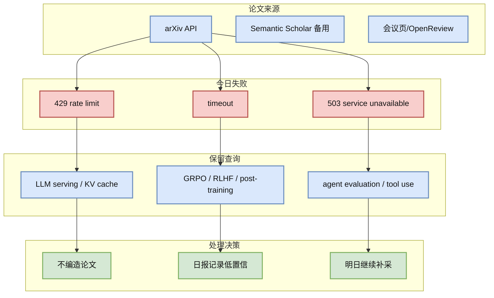
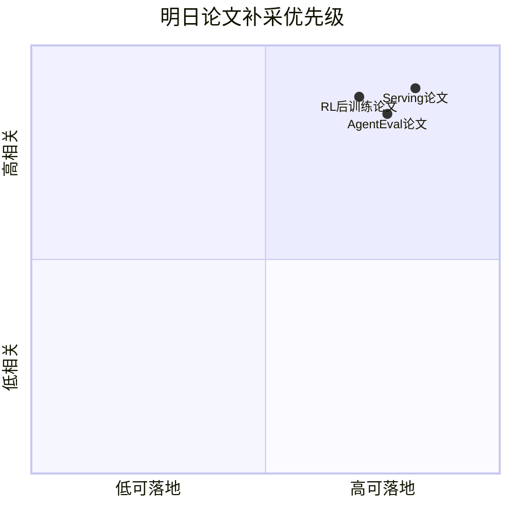

# arXiv Watchlist: RL post-training / GRPO / agent evaluation

> 类型：论文观察卡
> 大类：论文
> 小类：RLHF / Agent Eval
> 推荐等级：低置信
> 创建日期：2026-06-21
> 原文链接：https://export.arxiv.org/api/query
> PDF：未核验
> 网页详情：https://github.com/dyt27666-oss/AI-news-report-obsidians/blob/main/Papers/2026-06-21/arxiv-watchlist-rl-post-training-grpo-agent-evaluation.md
> 返回日报：[[Daily/2026-06-21]]

## 一句话结论

今日 arXiv API 多次 429/timeout/503，未能可靠核验新论文；保留 RL post-training 与 agent eval 查询作为低置信 watchlist。

## TL;DR

- **研究问题**：RLHF / Agent Eval 方向是否出现新方法。
- **核心方法**：未核验；arXiv API 失败，今天不编造论文元数据。
- **关键结果**：未核验。
- **对我的价值**：透明记录失败来源，明天或手动检索时继续补齐。
- **建议动作**：等 arXiv 恢复后按 query 复查。

## 论文信息

| 字段 | 内容 |
|---|---|
| 论文来源 | arXiv |
| 来源类型 | 预印本索引 / 今日访问失败 |
| 标题 | arXiv Watchlist: RL post-training / GRPO / agent evaluation |
| 作者/机构 | 未核验 |
| 发布时间 | 未核验 |
| arXiv | [API](https://export.arxiv.org/api/query) |
| OpenReview / 会议页 | 未发现 |
| Semantic Scholar | 未查询 |
| PDF | 未核验 |
| 代码 | 未发现 |
| 方向 | RLHF / Agent Eval |

## 方法/系统图示

### 辅助图：补采优先级

## 专业解读

今天论文源的正确处理方式是透明失败，而不是把未经核验的标题混进必读区。对 serving、RLHF/GRPO、agent eval 来说，论文元数据必须包含来源、类型、作者、abs/PDF/code；缺失这些字段会污染知识库。

## 通俗解释

今天 arXiv 像是限流了。日报仍然保留论文板块和失败记录，但不会假装读到了不存在或未验证的新论文。

## 标签

#ai-radar #paper #low-confidence
