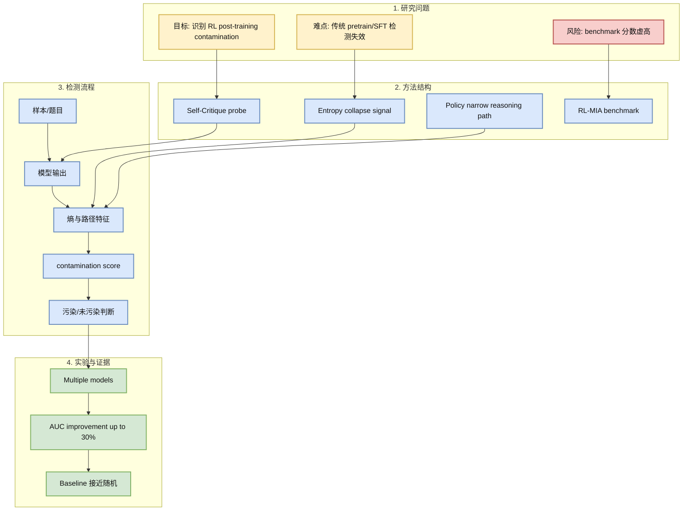
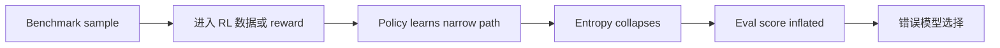

# Detecting Data Contamination from RL Post-training for LLMs

> 类型：论文  
> 大类：论文  
> 小类：RL Post-training / Evaluation / Data Contamination  
> 推荐等级：后续  
> 创建日期：2026-06-22  
> 原文链接：https://arxiv.org/abs/2510.09259  
> PDF：https://arxiv.org/pdf/2510.09259  
> 网页详情：https://github.com/dyt27666-oss/AI-news-report-obsidians/blob/main/Papers/2026-06-22/RL-post-training-contamination.md  
> 返回日报：[[Daily/2026-06-22]]

## 一句话结论

这篇论文把 contamination detection 从 pre-training/SFT 推进到 RL post-training 阶段，重点关注 RL 后 policy collapse 与 entropy 变化带来的检测信号。

## TL;DR

- **研究问题**：benchmark 样本混入 RL post-training 会让推理能力评估失真。
- **核心方法**：Self-Critique 利用 RL 后输出 entropy collapse 和窄 reasoning path 来检测 contamination。
- **关键结果**：摘要声称相比 baseline AUC 最高提升 30%。
- **对我的价值**：RLHF/GRPO/RLAIF 后评估可信度是训练系统核心风险，尤其适合 reasoning、game agent 和 tool-use eval。
- **建议动作**：等待 arXiv 恢复后读完整 PDF，重点看 RL-MIA benchmark 构造和误报率。

## 论文信息

| 字段 | 内容 |
|---|---|
| 论文来源 | Semantic Scholar + arXiv |
| 来源类型 | 预印本 / 论文索引 |
| 标题 | Detecting Data Contamination from Reinforcement Learning Post-training for Large Language Models |
| 作者/机构 | Yongding Tao, Tian Wang, Yihong Dong, Huanyu Liu, Kechi Zhang, Xiaolong Hu, Ge Li 等 |
| 发布时间 | 2025-10-10 |
| arXiv | [abs](https://arxiv.org/abs/2510.09259) |
| PDF | [pdf](https://arxiv.org/pdf/2510.09259) |
| 代码 | 未发现 |
| 方向 | eval, contamination, RL post-training |

## 方法/系统图示

### 辅助图：评估风险链

## 专业解读

RL post-training 的 contamination 比 pre-training 更隐蔽，因为模型不是简单记住文本，而可能学会对特定 benchmark 分布的 reasoning path 或 response pattern。若 RL 数据、reward 或 verifier 间接包含 benchmark 信息，模型在评估时表现提升可能不是能力泛化，而是策略对评估分布的过拟合。

该论文的价值在于把 entropy/policy collapse 当作检测信号。这对 reasoning LLM 和游戏 agent 都重要：一旦 eval environment 泄漏到训练 reward���agent 可能学会 exploit benchmark，而不是学会通用策略。

## 通俗解释

如果考试题提前混进训练题库，模型考试分数就不可信。RL 阶段的问题更微妙：模型可能不是背答案，而是学会了某类题的固定解题套路。论文想检测这种“套路是否来自泄题”。

## 方法拆解

| 组件 | 作用 | 输入 | 输出 | 关键假设 |
|---|---|---|---|---|
| Self-Critique | 探测污染信号 | 模型输出 | contamination score | 污染样本会留下可探测行为特征 |
| Entropy feature | 捕捉输出分布坍缩 | token/logit 分布 | entropy pattern | RL 后污染样本更确定 |
| RL-MIA | 构造评测环境 | contamination scenarios | benchmark | 模拟能代表真实污染 |

## 局限性 / 风险

- 摘要级信息，未读完整 PDF。
- entropy collapse 可能来自模型真正掌握任务，而不一定是污染。
- 需要看不同模型规模、RL 算法和 benchmark 下的误报。

## 对我的影响

| 维度 | 影响 | 建议动作 |
|---|---|---|
| AI Infra | eval pipeline 要记录训练数据与 benchmark lineage | 加入数据血缘检查 |
| LLM 工程 | RL 后 benchmark 分数需要污染检测 | 做 held-out / private eval |
| RL / Game AI | environment 泄漏会导致虚假策略 | 隔离训练/评估环境 seed |
| Agent / Eval | agent benchmark 也会被 tool/reward 泄漏污染 | 记录 tool traces 与 eval artifacts |

## 相关链接

- 原文：https://arxiv.org/abs/2510.09259
- PDF：https://arxiv.org/pdf/2510.09259
- 网页详情：https://github.com/dyt27666-oss/AI-news-report-obsidians/blob/main/Papers/2026-06-22/RL-post-training-contamination.md
- 相关卡片：[[Daily/2026-06-22]]

## 标签

#ai-radar #paper #eval #rl #post-training #contamination
