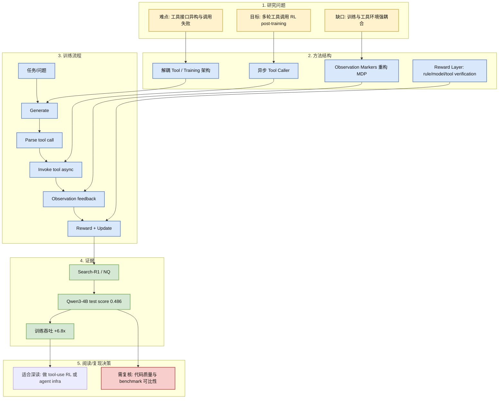
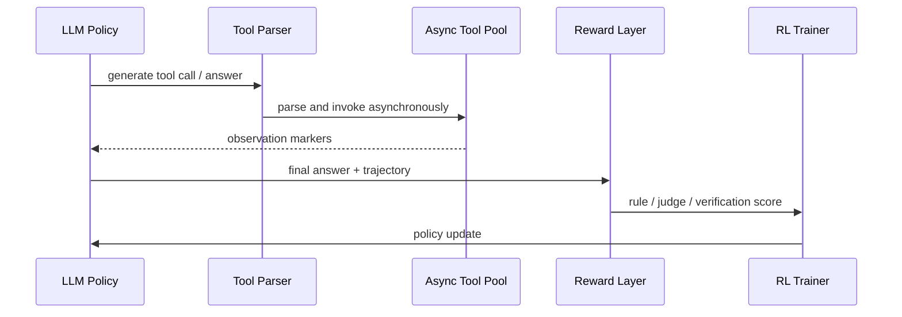

# RLFactory: Plug-and-Play RL Post-Training for LLM Multi-Turn Tool-Use

> 类型：论文  
> 大类：论文  
> 小类：RL Post-training / Tool-use Agent  
> 推荐等级：必读  
> 创建日期：2026-06-22  
> 原文链接：https://arxiv.org/abs/2509.06980  
> PDF：https://arxiv.org/pdf/2509.06980  
> 网页详情：https://github.com/dyt27666-oss/AI-news-report-obsidians/blob/main/Papers/2026-06-22/RLFactory-tool-use-rl-post-training.md  
> 返回日报：[[Daily/2026-06-22]]

## 一句话结论

RLFactory 把多轮工具调用 agent 的 RL post-training 拆成异步工具调用、tool/training 解耦和奖励层，是今天最贴近工程落地的 RL 论文信号。

## TL;DR

- **研究问题**：LLM 在多轮工具调用中需要稳定处理 tool heterogeneity、接口失败、观测反馈和动态 reward。
- **核心方法**：异步 caller + 解耦工具/训练架构 + rule/model/tool-verification reward layer + observation markers 重构 MDP。
- **关键结果**：摘要声称在 Search-R1 with Qwen3-4B 上 NQ test score 0.486，并相对类似训练技术提升训练吞吐 6.8x。
- **对我的价值**：这和 RL 游戏 agent 的环境并行、rollout、reward design、异步模拟器非常相似。
- **建议动作**：优先读方法和系统实现，不要只看 benchmark；如果代码可用，复现吞吐路径。

## 论文信息

| 字段 | 内容 |
|---|---|
| 论文来源 | Semantic Scholar + arXiv |
| 来源类型 | 预印本 / 论文索引 |
| 标题 | RLFactory: A Plug-and-Play Reinforcement Learning Post-Training Framework for LLM Multi-Turn Tool-Use |
| 作者/机构 | Jiajun Chai, Guojun Yin, Zekun Xu, Chuhuai Yue, Yiling Jia, Siyu Xia 等 |
| 发布时间 | 2025-08-31 / Semantic Scholar publicationDate |
| arXiv | [abs](https://arxiv.org/abs/2509.06980) |
| Semantic Scholar | Semantic Scholar API result |
| PDF | [pdf](https://arxiv.org/pdf/2509.06980) |
| 代码 | https://github.com/Simple-Efficient/RL-Factory |
| 方向 | RL post-training, tool-use, agent training infra |

## 方法/系统图示

### 辅助图：训练时序

## 专业解读

这篇论文的关键价值在于把 tool-use 训练从“prompt 工程 + 离线样本”推进到接近真实交互环境的 RL pipeline。多轮工具调用本质上是一个部分可观测 MDP：模型输出 action，外部工具返回 observation，reward 可能来自答案正确性、工具校验、规则约束或 judge model。工程难点不只在算法，而在高并发工具调用、失败重试、轨迹记录、reward 合成和训练吞吐。

RLFactory 的 async caller 和 decoupled architecture 对 RL 游戏模型也有迁移价值。游戏环境、搜索工具、数据库工具都可以被看作 env step；训练系统需要同时处理延迟、失败、状态标记和 reward attribution。它的 6.8x 吞吐结果如果可复现，重点应来自异步并行和工具/训练解耦，而不是单纯算法改进。

## 通俗解释

传统 LLM 像是在纸上答题；tool-use agent 像是在边查资料、边计算、边改答案。RLFactory 试图搭一个训练工厂，让模型在真实调用工具的过程中学习：什么时候调用、怎么读工具结果、怎么修正答案。

## 方法拆解

| 组件 | 作用 | 输入 | 输出 | 关键假设 |
|---|---|---|---|---|
| Async Caller | 并行调用外部工具 | parsed tool call | observation | 工具调用可安全异步化 |
| Reward Layer | 统一不同 reward 信号 | trajectory / answer / tool result | scalar reward | reward 可以覆盖正确性与过程质量 |
| Observation Markers | 把工具反馈纳入 MDP | tool result | structured observation | 模型能利用显式 marker 学会状态转移 |

## 实验与证据

| 实验 | 说明 | 我怎么看 |
|---|---|---|
| Search-R1 / NQ | 摘要声称 Qwen3-4B test score 0.486 | 需要复核 baseline 是否严格同算力同数据 |
| Throughput | 摘要声称训练吞吐 +6.8x | 工程价值高，应优先看实现与并发模型 |

## 局限性 / 风险

- 摘要信息不足，需等 arXiv/PDF 恢复后复核完整实验。
- 工具调用 RL 容易过拟合工具接口与 reward 规则。
- model-judge reward 可能引入偏置或 reward hacking。

## 对我的影响

| 维度 | 影响 | 建议动作 |
|---|---|---|
| AI Infra | tool-use training 需要异步环境池和轨迹日志 | 设计 env/tool abstraction 时保留 observation/reward schema |
| LLM 工程 | post-training 不再只靠静态偏好数据 | 关注 parse/invoke/update 的稳定性 |
| RL / Game AI | 和游戏环境并行 rollout 高度同构 | 借鉴 async caller 与 reward layer |
| Agent / Eval | tool verification 可作为 eval 信号 | 建立 tool-call success、answer correctness、trajectory quality 指标 |

## 相关链接

- 原文：https://arxiv.org/abs/2509.06980
- PDF：https://arxiv.org/pdf/2509.06980
- 代码：https://github.com/Simple-Efficient/RL-Factory
- 网页详情：https://github.com/dyt27666-oss/AI-news-report-obsidians/blob/main/Papers/2026-06-22/RLFactory-tool-use-rl-post-training.md
- 相关卡片：[[Daily/2026-06-22]]

## 标签

#ai-radar #paper #rl #post-training #tool-use #agent
