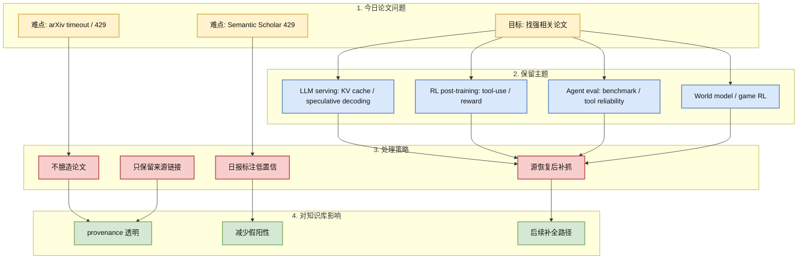
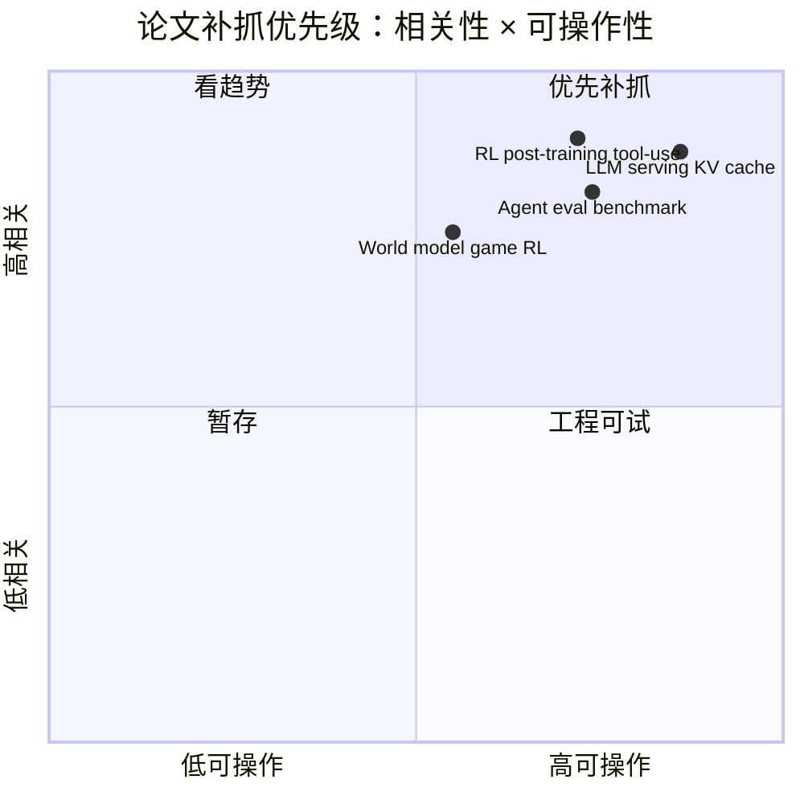

# 论文源低置信观察：arXiv / Semantic Scholar 今日限流

> 类型：论文
> 大类：论文
> 小类：Source Watchlist / RL Post-training / LLM Serving / Agent Eval
> 推荐等级：后续
> 创建日期：2026-06-23
> 原文链接：https://arxiv.org/
> PDF：未确认具体论文
> 网页详情：https://github.com/dyt27666-oss/AI-news-report-obsidians/blob/main/Papers/2026-06-23/arxiv-semantic-scholar-rate-limit-watchlist.md
> 返回日报：[[Daily/2026-06-23]]

## 一句话结论

今日 arXiv 多个强相关查询 timeout/429，Semantic Scholar 返回 429；论文区不臆造新论文，保留 RL post-training、LLM serving、Agent eval、world model 作为低置信 watchlist。

## TL;DR

- **研究问题**：如何在论文源不可用时仍保持 AI Radar 的透明 provenance 和后续补抓路径。
- **核心方法**：记录失败查询、保留主题 watchlist、不把未验证标题写成高置信论文。
- **关键结果**：本轮未生成高置信新论文条目；日报中显式标注采集失败。
- **对我的价值**：避免把缓存、旧结果或搜索噪音误当今日论文，保证知识库可信。
- **建议动作**：源恢复后优先补抓 LLM serving / RL post-training / Agent eval / world model 四类。

## 论文信息

| 字段 | 内容 |
|---|---|
| 论文来源 | arXiv / Semantic Scholar |
| 来源类型 | 预印本 API / 论文索引 API |
| 标题 | 未确认具体新论文 |
| 作者/机构 | 未确认 |
| 发布时间 | 未确认 |
| arXiv | [arXiv](https://arxiv.org/) |
| OpenReview / 会议页 | 未发现 |
| Semantic Scholar | [Semantic Scholar](https://www.semanticscholar.org/) |
| PDF | 未确认 |
| 代码 | 未发现 |
| 方向 | LLM Serving、RL Post-training、Agent Eval、World Model |

## 方法/系统图示

### 辅助图：补抓优先级

## 专业解读

论文雷达最容易在 API 限流时发生两类错误：第一，把旧缓存当作今日新论文；第二，只凭标题搜索片段生成过度解读。今天 arXiv 和 Semantic Scholar 都出现限流/timeout，因此正确做法是把论文区降级为 watchlist，并在日报的失败来源中记录具体错误。

后续补抓仍有明确优先级：LLM serving 关注 KV cache、speculative decoding、scheduler、batching；RL post-training 关注 GRPO/PPO/DPO、tool-use rollout、reward design；Agent eval 关注 benchmark、tool reliability、trajectory grading；World model / Game RL 关注 simulation、environment parallelism、model-based RL。

## 通俗解释

今天论文网站像“门口排队限流”，所以不应该假装看到了新论文。先把要找的主题写清楚，等源恢复再补读，这比编一个看似完整的论文区更可靠。

## 方法拆解

| 组件 | 作用 | 输入 | 输出 | 关键假设 |
|---|---|---|---|---|
| 查询记录 | 保留失败 provenance | arXiv/S2 查询 | 错误列表 | API 错误可复现 |
| 主题 watchlist | 保持研究方向连续 | 用户关注主题 | 补抓队列 | 主题仍高相关 |
| 低置信标注 | 避免误导 | 不完整来源 | 透明说明 | 用户接受延迟补全 |

## 实验与证据

| 实验 | 说明 | 我怎么看 |
|---|---|---|
| arXiv 查询 | 多个查询 timeout 或 429 | 不足以生成论文详情 |
| Semantic Scholar 查询 | 返回 429 | 不足以补 citation/abstract |

## 局限性 / 风险

- 今日没有高置信新论文详情。
- 可能漏掉当天真正重要的论文。
- 需要下一轮源恢复后补抓并回填。

## 对我的影响

| 维度 | 影响 | 建议动作 |
|---|---|---|
| AI Infra | serving 论文可能漏抓 | 明日优先补 KV cache/spec decode |
| LLM 工程 | post-training 论文可能漏抓 | 明日补 RLHF/GRPO/tool-use |
| RL / Game AI | world model/game RL 可能漏抓 | 保留 watchlist |
| Agent / Eval | agent benchmark 可能漏抓 | 关注 OpenReview/会议页替代源 |

## 相关链接

- 原文：https://arxiv.org/
- Semantic Scholar：https://www.semanticscholar.org/
- 网页详情：https://github.com/dyt27666-oss/AI-news-report-obsidians/blob/main/Papers/2026-06-23/arxiv-semantic-scholar-rate-limit-watchlist.md
- 相关卡片：[[Daily/2026-06-23]]

## 标签

#ai-radar #paper #low-confidence #arxiv #semantic-scholar #llm-serving #rl
