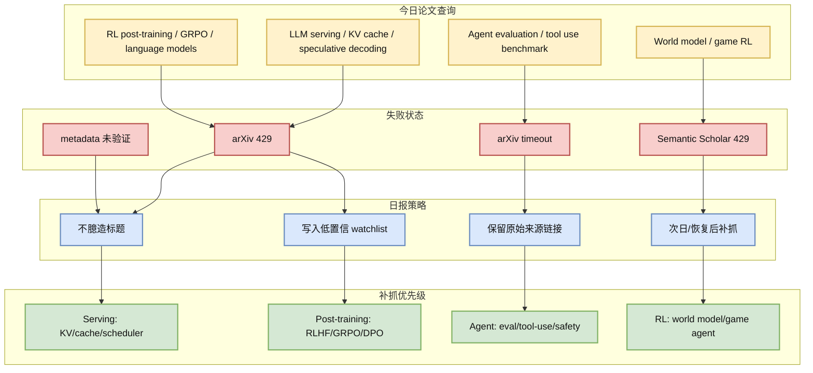
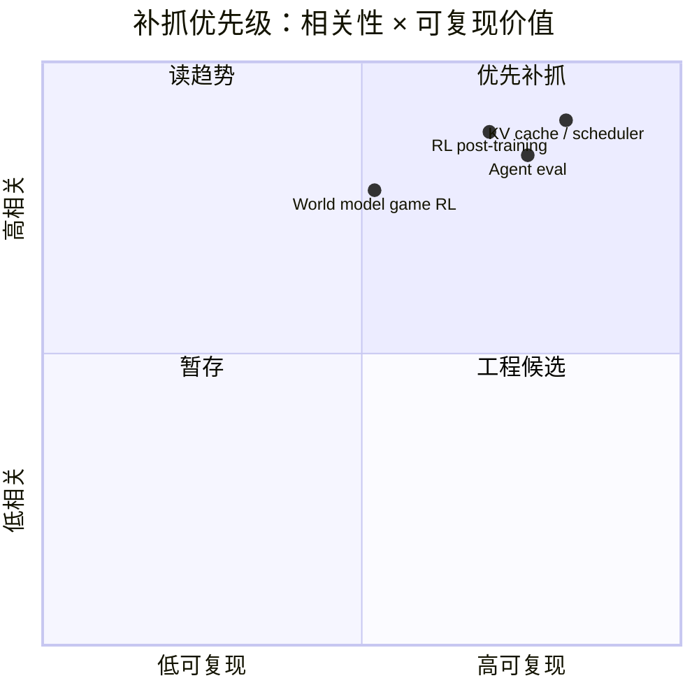

# arXiv / Semantic Scholar 限流 Watchlist：LLM Serving、RL Post-training、Agent Eval、World Model

> 类型：论文
> 大类：论文
> 小类：Source Watch / LLM Serving / RL / Agent Eval / World Model
> 推荐等级：低置信
> 创建日期：2026-06-24
> 原文链接：https://arxiv.org/
> PDF：未确认具体论文
> 网页详情：https://github.com/dyt27666-oss/AI-news-report-obsidians/blob/main/Papers/2026-06-24/arxiv-rate-limit-watchlist.md
> 返回日报：[[Daily/2026-06-24]]

## 一句话结论

今日 arXiv 查询 LLM serving、RL post-training、agent eval、world model/game RL 时出现 429/timeout；本日报不臆造新论文，只保留补抓主题和验证路径。

## TL;DR

- **研究问题**：论文源不可用时，如何保持 AI Radar 的 provenance 和后续可补抓性。
- **核心方法**：记录失败查询、保留主题 watchlist、等待 API 恢复后补抓。
- **关键结果**：未确认高置信新论文；论文区降级为低置信 source watch。
- **对我的价值**：避免把旧论文、缓存标题或未验证摘要混入日报。
- **建议动作**：API 恢复后优先补抓四类主题：KV cache/spec decode、RL post-training、agent eval、world model/game RL。

## 论文信息

| 字段 | 内容 |
|---|---|
| 论文来源 | arXiv / Semantic Scholar |
| 来源类型 | 预印本 API / 论文索引 API |
| 标题 | 今日未确认具体新论文 |
| 作者/机构 | 未确认 |
| 发布时间 | 未确认 |
| arXiv | [arXiv](https://arxiv.org/) |
| Semantic Scholar | [Semantic Scholar](https://www.semanticscholar.org/) |
| PDF | 未发现 |
| 代码 | 未发现 |
| 方向 | LLM Serving / RL Post-training / Agent Eval / World Model |

## 方法/系统图示

## 专业解读

论文源限流是自动研究系统的常态，不应导致日报质量崩溃。高质量做法是明确区分：来源已扫描但失败、来源可访问但无高相关新项、来源返回候选但 metadata 未验证。今日 arXiv 返回 429/timeout，因此不应把任何未验证标题写成“今日新论文”。

对用户最有价值的补抓方向仍然明确：Serving 关注 KV cache、continuous batching、scheduler、speculative decoding；Post-training 关注 RLHF/RLAIF/GRPO/DPO 和 reward design；Agent Eval 关注 tool-use trajectory、safety eval、long-horizon benchmark；Game/RL 关注 world model、simulation parallelism 和 environment design。

## 通俗解释

今天论文网站像“排队限流”，没拿到可靠论文信息。与其硬编几篇，不如老实记录失败，并把明天要补查的方向列清楚。

## 方法拆解

| 组件 | 作用 | 输入 | 输出 | 关键假设 |
|---|---|---|---|---|
| Source status | 记录 API 可用性 | HTTP 状态/timeout | 低置信说明 | 失败要透明 |
| Watchlist | 保留研究意图 | 关键词/主题 | 补抓队列 | 次日可继续 |
| Provenance gate | 防止幻觉论文 | abs/PDF/metadata | 是否纳入日报 | 未验证不纳入 |

## 实验与证据

| 实验 | 说明 | 我怎么看 |
|---|---|---|
| arXiv query | 多个主题返回 429/timeout | 源不可用，不能强行生成论文条目 |
| GitHub snapshot | 今日成功保存 130 repos | 固定 GitHub 板块可继续作为主信号 |

## 局限性 / 风险

- 可能漏掉今日真正重要的新论文。
- 低置信 watchlist 不能替代论文阅读。
- 明日如果仍限流，需要引入 arXiv RSS、Papers with Code 或缓存源。

## 对我的影响

| 维度 | 影响 | 建议动作 |
|---|---|---|
| AI Infra | Serving 论文可能漏抓 | API 恢复后优先补 KV/cache/scheduler |
| LLM 工程 | Post-training 新方法需补查 | 跟踪 GRPO/RLHF/DPO |
| RL / Game AI | world model/game RL 需补抓 | 关注 DeepMind/Meta/arXiv cs.LG |
| Agent / Eval | agent benchmark 仍是重点 | 补查 tool-use eval |

## 相关链接

- 原文：https://arxiv.org/
- Semantic Scholar：https://www.semanticscholar.org/
- 网页详情：https://github.com/dyt27666-oss/AI-news-report-obsidians/blob/main/Papers/2026-06-24/arxiv-rate-limit-watchlist.md

## 标签

#ai-radar #paper #source-watch #arxiv #semantic-scholar #low-confidence
