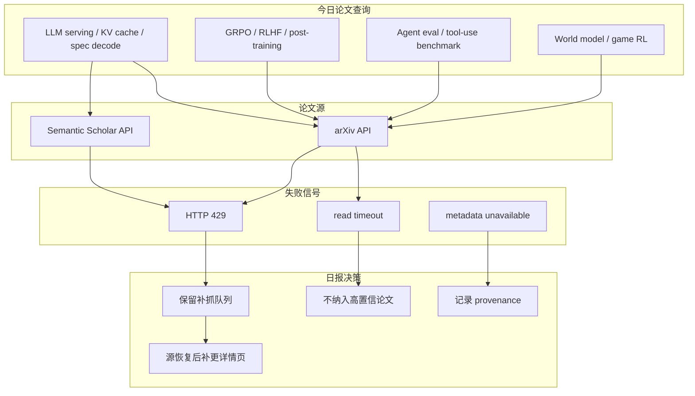
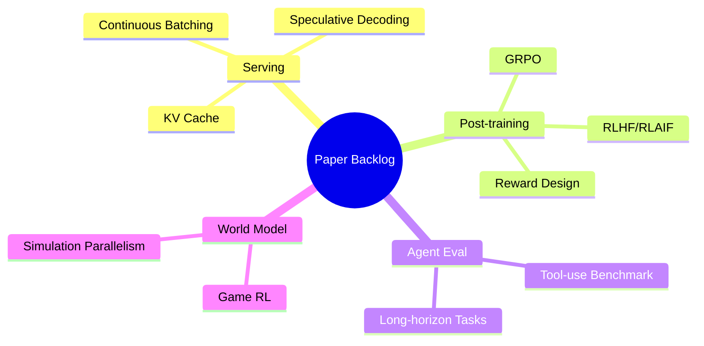

# 论文源限流 Watchlist：arXiv / Semantic Scholar

> 类型：论文来源状态  
> 大类：论文  
> 小类：LLM Serving / RL / Agent Eval / World Model  
> 推荐等级：低置信  
> 创建日期：2026-06-25  
> 原文链接：https://arxiv.org/  
> 网页详情：https://github.com/dyt27666-oss/AI-news-report-obsidians/blob/main/Papers/2026-06-25/arxiv-semantic-scholar-rate-limit-watchlist.md  
> 返回日报：[[Daily/2026-06-25]]

## 一句话结论
今日 arXiv 查询 LLM serving、RL post-training、agent eval、world model 时 timeout/429，Semantic Scholar 也 429；因此论文区只保留透明 watchlist，不臆造新论文。

## TL;DR
- **论文来源**：arXiv API、Semantic Scholar API。
- **来源类型**：预印本 API / 论文索引 API。
- **状态**：arXiv timeout + 429；Semantic Scholar 429。
- **建议动作**：源恢复后优先补抓 serving/KV cache/spec decode、GRPO/RLHF、agent eval、world model/game RL。

## 方法/系统图示

## 专业解读
论文日报的核心是可信 provenance。与其在 API 限流时用未验证标题填充，不如明确记录查询主题、失败类型和补抓策略。这样不会把低置信内容污染进长期知识库，也方便后续自动补抓。

## 实验与证据
| 查询主题 | arXiv 状态 | Semantic Scholar 状态 | 今日决策 |
|---|---|---|---|
| LLM serving / KV cache / speculative decoding | timeout | 429 | 不纳入高置信 |
| GRPO / RLHF / post-training | timeout | 429 | 加入补抓 |
| Agent evaluation / tool-use benchmark | 429 | 429 | 加入补抓 |
| World model / game RL | 429 | 429 | 加入补抓 |

## 对我的影响
| 维度 | 影响 | 建议动作 |
|---|---|---|
| AI Infra | Serving 新论文可能漏报 | 明日优先补抓 |
| LLM 工程 | Post-training/RLHF 暂缺新信号 | 不做未验证结论 |
| RL / Game AI | World model/game RL 需补抓 | 保留 query 队列 |
| Agent / Eval | Agent eval 论文可能漏报 | Semantic Scholar 恢复后补查引用 |

## 可信度与局限性
- 证据强度：本次实际请求返回 timeout/429。
- 局限性：限流不代表今日没有新论文，只代表本轮无法高置信验证。
- 潜在风险：如果连续限流，需要引入镜像、RSS 或延迟重试队列。

## 我应该如何跟进
1. 明日优先重试四组 query。
2. 增加 OpenReview、Papers with Code、会议页作为补充来源。
3. 将限流状态写入来源健康监控。

## 标签
#ai-radar #paper #arxiv #semantic-scholar #source-watch
