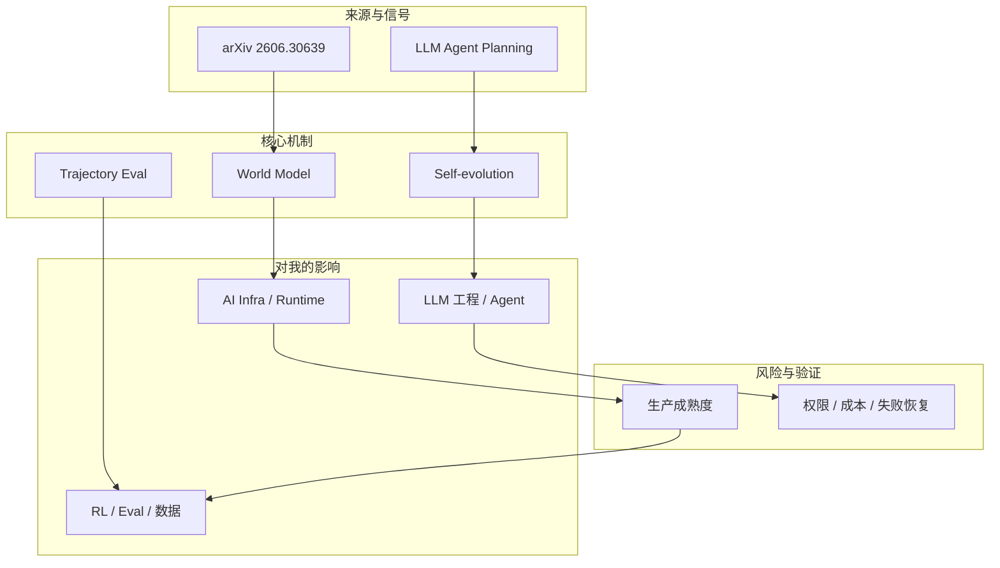
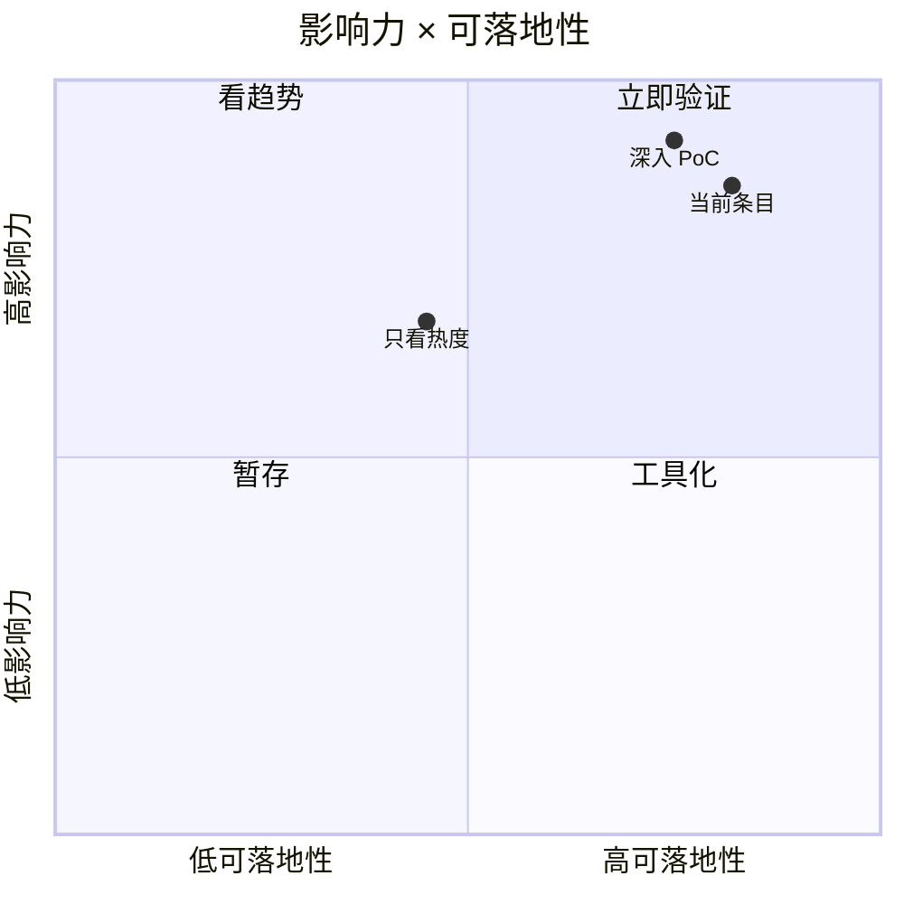

# Self-Evolving World Models for LLM Agent Planning

> 类型：论文 / arXiv  
> 大类：论文  
> 小类：World Model / LLM Agent Planning  
> 推荐等级：后续  
> 创建日期：2026-06-30  
> 原文链接：http://arxiv.org/abs/2606.30639v1  
> 网页详情：https://github.com/dyt27666-oss/AI-news-report-obsidians/blob/main/Papers/2026-06-30/self-evolving-world-models-llm-agent-planning.md  
> 返回日报：[[Daily/2026-06-30]]

## 一句话结论
这篇论文把 world model 用到 LLM agent planning，是连接 long-horizon agent、环境模拟和 RL/game AI 训练的高相关观察项。

## TL;DR
- **它是什么**：面向 LLM agent planning 的 self-evolving world model。
- **为什么重要**：agent 长程任务失败常来自对环境后果预测不足，world model 可能改善 planning/eval。
- **和我相关的点**：可借鉴到游戏 RL、工具调用模拟、agent trajectory 评估。
- **建议动作**：源恢复后读 PDF，确认方法、实验环境和是否有代码。

## 元信息
| 字段 | 内容 |
|---|---|
| type | 论文 / arXiv |
| major | 论文 |
| minor | World Model / LLM Agent Planning |
| rank | 后续 |
| authors | Xuan Zhang, Wenxuan Zhang, See-Kiong Ng, Yang Deng |
| published | 2026-06-29 |
| abs | http://arxiv.org/abs/2606.30639v1 |
| pdf | http://arxiv.org/pdf/2606.30639v1 |

## 信息压缩图示

## 专业解读
专业上，这条最值得看的是把 agent planning 从纯 prompt/search 推向可学习的环境预测。若方法能自我演化，就可能把失败轨迹转成模型改进信号，对 long-horizon agent eval、tool-use reward 和 game RL 环境模拟都有启发。

## 通俗解释
简单说，普通 agent 像边走边猜；world model 像在脑子里先试走几步，看哪条路更可能成功。

## 关键机制拆解
| 机制 | 解决的问题 | 为什么有效 | 可能的坑 |
|---|---|---|---|
| World model | 预测行动后果 | 降低长程规划盲走 | 模拟误差会累积 |
| Self-evolution | 从交互中改进 | 失败轨迹可转训练信号 | 需要防止自我确认偏差 |
| Agent planning | 选择工具/步骤 | 改善多步任务成功率 | benchmark 可能过窄 |

## 对我的影响
| 维度 | 影响 | 建议动作 |
|---|---|---|
| AI Infra | 需要 trajectory store 与 replay/eval 管线 | 关注数据 schema |
| LLM Agent | 可能改善 long-horizon planning | 读实验设置和失败案例 |
| RL / Game AI | 与 world model/game simulation 强相关 | 看能否迁移到游戏环境 |

## 可信度与局限性
- 证据强度：来自可访问原始页面、GitHub snapshot 或公开 changelog。
- 局限性：star/release/news 只能说明关注度或发布信号，不等于生产成熟。
- 验证要求：需要继续看 README、examples、issue、release diff、benchmark 和失败恢复机制。

## 我应该如何跟进
1. 把该条目放入 AI Infra / Agent runtime 对照表。
2. 如果与当前工作流直接相关，做 30-60 分钟 PoC。
3. 记录工具边界、成本、失败模式和可观测性。

## 相关链接
- 原文：http://arxiv.org/abs/2606.30639v1
- 网页详情：https://github.com/dyt27666-oss/AI-news-report-obsidians/blob/main/Papers/2026-06-30/self-evolving-world-models-llm-agent-planning.md

## 标签
#ai-radar #daily #ai-infra #llm #agent
