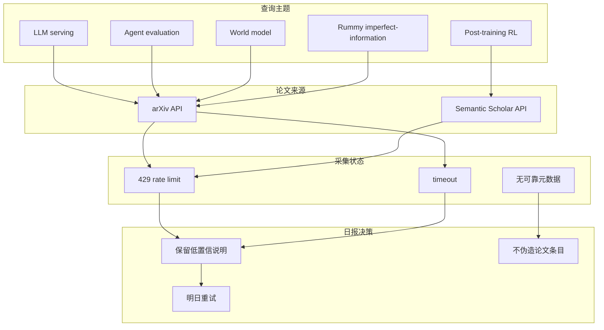

# Agent / Serving / RL 论文源扫描 watch

> 日期：2026-07-01  
> 论文来源：arXiv / Semantic Scholar  
> 来源类型：预印本索引 / 论文索引  
> 原文：arXiv API 与 Semantic Scholar API，本轮均触发 429 或 timeout。

## 一句话结论
今日论文源没有可靠新增高信号论文可纳入必读；保留透明低置信 watch，避免把 API 失败误写成“没有论文”。

## TL;DR
- arXiv 查询：`LLM serving inference`、`agent evaluation large language models`、`RL language models post training`、`world model reinforcement learning`、`rummy imperfect information game`。
- 结果：HTTP 429 / timeout。
- Semantic Scholar：HTTP 429。
- 决策：日报论文区只保留低置信源状态，不伪造标题。

## 元信息表
| 字段 | 内容 |
|---|---|
| 论文来源 | arXiv, Semantic Scholar |
| 来源类型 | 预印本 API / 论文索引 API |
| 发布时间 | 2026-07-01 扫描 |
| abs 链接 | 未取得可靠候选 |
| PDF 链接 | 未取得可靠候选 |
| 代码链接 | 未发现 |

## 信息压缩图示

## 专业解读
论文源失败不应影响固定板块完整性。对 AI Infra/RL 日报来说，透明 provenance 比填充噪声论文更重要；后续可用公司 research blog、GitHub release、OpenReview RSS 作为补充。

## 通俗解释
今天论文搜索接口像“堵车”，所以不把没验证的论文硬塞进日报。

## 关键机制拆解
| 查询 | 状态 | 决策 |
|---|---|---|
| arXiv | 429 / timeout | 明日重试 |
| Semantic Scholar | 429 | 明日重试或降低频率 |
| Rummy 论文 | 未取得可靠候选 | 只保留业务低置信说明 |

## 对我的影响
- 不影响 GitHub / Coding 工具 / 大厂矩阵的更新。
- 论文趋势今日低置信，不能据此做研究方向判断。

## 可信度与局限性
可信度低；这是源状态记录，不是论文综述。

## 我应该如何跟进
1. 明日重试 arXiv。
2. 若仍 429，改用 RSS 或本地缓存。
3. 对 rummy 论文单独做低频专项检索。

## 相关链接
- arXiv API：https://export.arxiv.org/api/query
- Semantic Scholar API：https://api.semanticscholar.org/
- 今日日报：[[Daily/2026-07-01]]

#ai-radar #paper-watch #low-confidence
