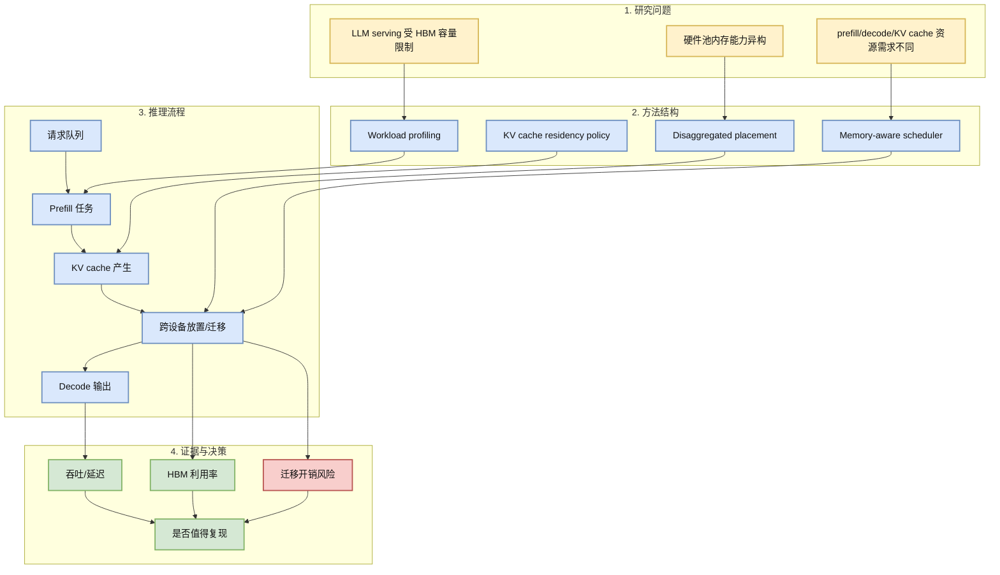
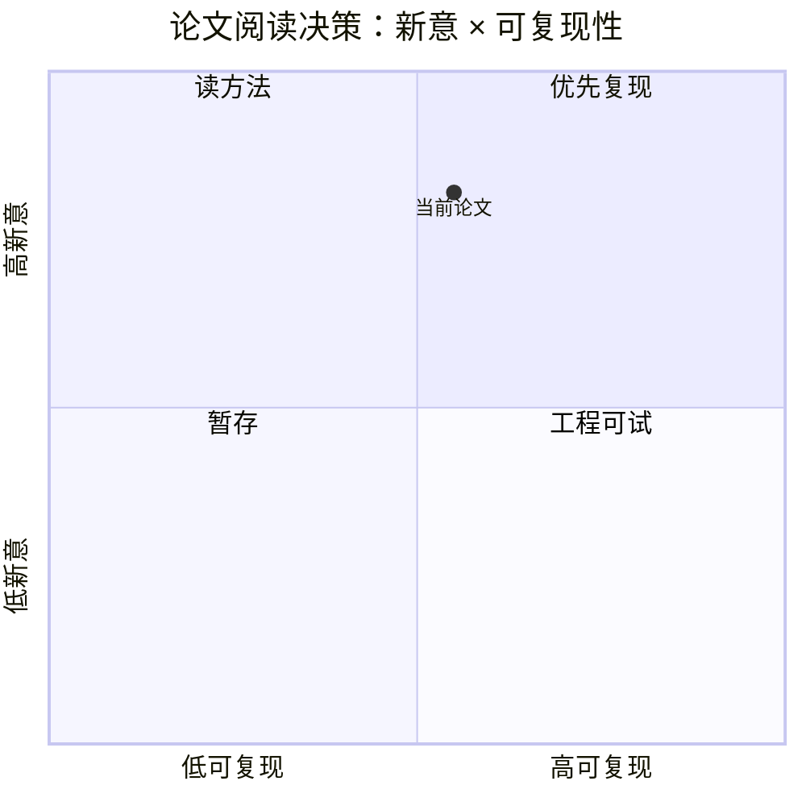

# HBM Is Not All You Need: Efficient Disaggregated LLM Serving across Memory-heterogeneous Accelerators

> 类型：论文  
> 大类：论文  
> 小类：LLM Serving / Disaggregated Inference  
> 推荐等级：必读  
> 创建日期：2026-07-02  
> 原文链接：https://arxiv.org/abs/2606.29986  
> PDF：https://arxiv.org/pdf/2606.29986  
> 返回日报：[[Daily/2026-07-02]]

## 一句话结论
这篇 2026-06-29 arXiv 论文把 LLM serving 的瓶颈从“单卡 HBM 不够”推进到“异构内存加速器如何做 disaggregated serving 调度”，非常贴近 KV cache / batch scheduler / 成本优化主线。

## TL;DR
- **研究问题**：如何在内存能力不同的加速器之间拆分 LLM serving workload。
- **核心方法**：围绕 HBM 容量差异做 disaggregated serving、placement 与调度。
- **关键结果**：本轮只可靠抓到 arXiv 元数据，未阅读全文实验细节；作为高相关论文先入 watchlist。
- **对我的价值**：直接关联 serving scheduler、KV cache residency、prefill/decode 分离与多硬件成本模型。
- **建议动作**：下载 PDF 深读方法与实验设置，和 vLLM/SGLang/DistServe 类系统对比。

## 论文信息
| 字段 | 内容 |
|---|---|
| 论文来源 | arXiv |
| 来源类型 | 预印本 |
| 标题 | HBM Is Not All You Need: Efficient Disaggregated LLM Serving across Memory-heterogeneous Accelerators |
| 作者/机构 | 本轮未完整解析，需 PDF 复核 |
| 发布时间 | 2026-06-29 |
| arXiv | [abs](https://arxiv.org/abs/2606.29986) |
| Semantic Scholar | 未查询成功 / 低置信 |
| PDF | [pdf](https://arxiv.org/pdf/2606.29986) |
| 代码 | 未发现 |
| 方向 | LLM Serving / KV Cache / Disaggregated Inference |

## 方法/系统图示

### 辅助图：阅读/复现决策矩阵

## 专业解读
LLM serving 过去常把优化点聚焦在 kernel、paged KV cache、continuous batching、speculative decoding。但真实集群里更难的是硬件不均匀：不同卡/节点的 HBM 容量、带宽、互联拓扑和成本都不一样。如果论文能给出异构内存感知的 placement 和 scheduler，它会影响 serving control plane 如何把 prefill、decode、KV cache 和迁移决策拆开。

## 通俗解释
不是所有 GPU 都有一样大的“高速显存仓库”。这篇论文研究的是：如果仓库大小不一样，怎样把请求、缓存和生成任务分配给不同机器，既不让大仓库闲着，也不让小仓库爆掉。

## 方法拆解
| 组件 | 作用 | 输入 | 输出 | 关键假设 |
|---|---|---|---|---|
| Workload profiling | 判断请求对显存/计算的需求 | prompt 长度、batch、模型 | 资源画像 | 请求特征可预测 |
| Memory-aware placement | 把任务放到合适设备 | 资源画像、硬件状态 | placement 决策 | 调度开销小于收益 |
| KV cache policy | 管理 cache 驻留/迁移 | KV blocks、会话状态 | cache plan | 互联带宽足够支撑迁移 |

## 实验与证据
| 实验 | 说明 | 我怎么看 |
|---|---|---|
| 元数据 | arXiv 2026-06-29，标题强相关 | 值得深读，但不能在未读 PDF 前引用具体指标 |
| 系统对比 | 需和 vLLM/SGLang/DistServe 类系统比 | 重点看 P99 latency 与成本曲线 |

## 局限性 / 风险
- 本轮只抓到可靠元数据；作者、实验与代码需 PDF 复核。
- 异构 serving 的收益高度依赖网络拓扑和 workload 分布。
- 若迁移开销过大，理论调度收益可能被 tail latency 吞掉。

## 对我的影响
| 维度 | 影响 | 建议动作 |
|---|---|---|
| AI Infra | 直接影响 serving scheduler 和 KV cache 设计。 | 标注为必读并和 vLLM/SGLang 对比。 |
| LLM 工程 | 帮助建立多硬件部署成本模型。 | 看是否支持 prefill/decode 分离。 |
| RL / Game AI | 大规模 rollout serving 也会受 cache/调度影响。 | 评估自博弈 rollout 推理集群是否适用。 |
| Agent / Eval | 长上下文 agent session 会放大 KV cache 压力。 | 关注 session pinning 与 eviction。 |

## 相关链接
- 原文：https://arxiv.org/abs/2606.29986
- PDF：https://arxiv.org/pdf/2606.29986
- 网页详情：https://github.com/dyt27666-oss/AI-news-report-obsidians/blob/main/Papers/2026-07-02/hbm-disaggregated-llm-serving.md
- 相关卡片：[[GitHub/2026-07-02/github-snapshot-top10]]

#ai-radar #paper #llm-serving #kv-cache #ai-infra
