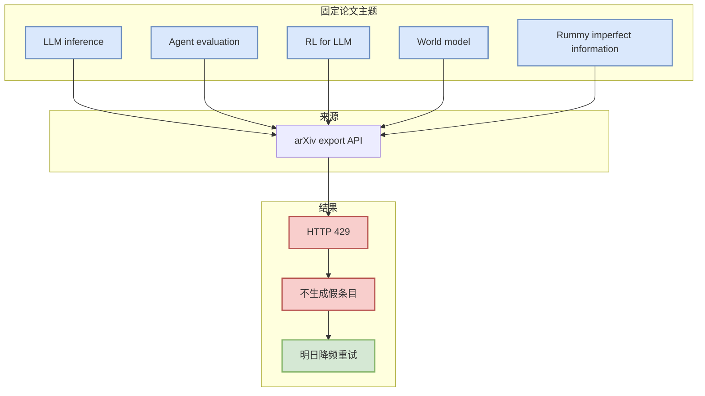

# Paper source rate-limit watch - 2026-07-03

> 类型：论文来源状态  
> 大类：论文  
> 小类：Source reliability  
> 推荐等级：低置信  
> 创建日期：2026-07-03  
> 原文链接：https://export.arxiv.org/api/query  
> 返回日报：[[Daily/2026-07-03]]

## 一句话结论

今日 arXiv API 对固定查询全部返回 429，因此论文板块只保留透明的失败记录，不伪造新论文。

## 查询状态

| 查询 | 来源 | 状态 | 处理 |
|---|---|---|---|
| large language model inference | arXiv API | HTTP 429 | 明日降频重试 |
| agent evaluation | arXiv API | HTTP 429 | 明日降频重试 |
| reinforcement learning language models | arXiv API | HTTP 429 | 明日降频重试 |
| world model reinforcement learning | arXiv API | HTTP 429 | 明日降频重试 |
| post training language models | arXiv API | HTTP 429 | 明日降频重试 |
| rummy imperfect information game AI | arXiv API | HTTP 429 | 明日降频重试 |

## 图示

## 对我的影响

| 维度 | 影响 | 建议动作 |
|---|---|---|
| AI Infra | 今日无法可靠发现 serving 新论文 | 明日先查 serving，再查 agent/RL |
| LLM 工程 | 论文 freshness 下降 | 不把旧论文包装成新发现 |
| RL / Game AI | Rummy 论文源缺失 | 使用 GitHub 业务候选作为低置信补充 |
| Agent / Eval | agent eval 论文缺失 | 明日改用 Semantic Scholar / OpenReview fallback |

## 标签

#ai-radar #paper #rate-limit #low-confidence
