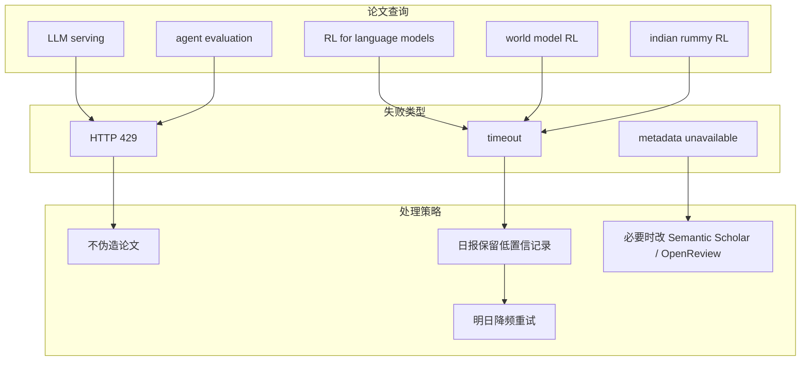

# Paper source rate-limit watch - 2026-07-04

> 类型：论文来源扫描 / 低置信记录  
> 返回日报：[[Daily/2026-07-04]]  
> 来源：arXiv API / Semantic Scholar watch

## 一句话结论

今日 arXiv 查询在 `LLM serving`、`agent evaluation`、`reinforcement learning language models`、`world model reinforcement learning`、`indian rummy reinforcement learning` 上返回 429 或 timeout；论文板块只保留透明低置信记录，不伪造新论文。

## TL;DR

- **论文来源**：arXiv API。
- **来源类型**：预印本 API / 论文索引。
- **今日状态**：429 Too Many Requests、Unknown Error、timeout。
- **处理方式**：不把未验证论文写成“新论文”；保留 watchlist 与明日重试动作。

## 查询记录

| 查询 | 来源 | 状态 | 影响 |
|---|---|---|---|
| `LLM serving` | arXiv API | HTTP 429 Too Many Requests | 无法确认今日 serving 新论文 |
| `agent evaluation` | arXiv API | HTTP 429 Unknown Error | 无法确认今日 agent eval 新论文 |
| `reinforcement learning language models` | arXiv API | timeout | 无法确认 RLHF/post-training 新论文 |
| `world model reinforcement learning` | arXiv API | timeout | 无法确认 world model 新论文 |
| `indian rummy reinforcement learning` | arXiv API | timeout | 无法确认 rummy/game AI 新论文 |

## 信息压缩图示

## 明日重试队列

| 主题 | 关键词 | 为什么重要 |
|---|---|---|
| Serving / Inference | KV cache, scheduler, speculative decoding, batching | 直接影响 LLM serving 成本和吞吐 |
| Agent Eval | benchmark, tool use, long-horizon agent | 影响 coding agent / research agent 评测体系 |
| Post-training / RL | GRPO, RLHF, RLAIF, reward design | 影响 LLM 训练和对齐管线 |
| World Model / Game AI | simulation, self-play, environment parallelism | 对 RL 游戏模型训练相关 |
| Point Rummy | rummy, imperfect information, MCTS, ISMCTS | 用户近期业务主题 |

## 可信度与局限性

- 证据强度：高于“透明失败记录”，低于“有效论文收录”。
- 局限性：未取得可验证 abstract/PDF/作者/发布时间。
- 风险：如果强行补论文，会污染知识库；因此今日选择低置信保留。

## 相关链接

- arXiv API：https://export.arxiv.org/api/query
- arXiv search：https://arxiv.org/search/
- Semantic Scholar：https://www.semanticscholar.org/
- 返回日报：[[Daily/2026-07-04]]

## 标签

#ai-radar #papers #arxiv #rate-limit #low-confidence
