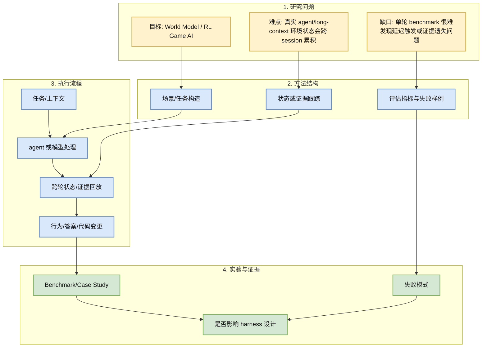
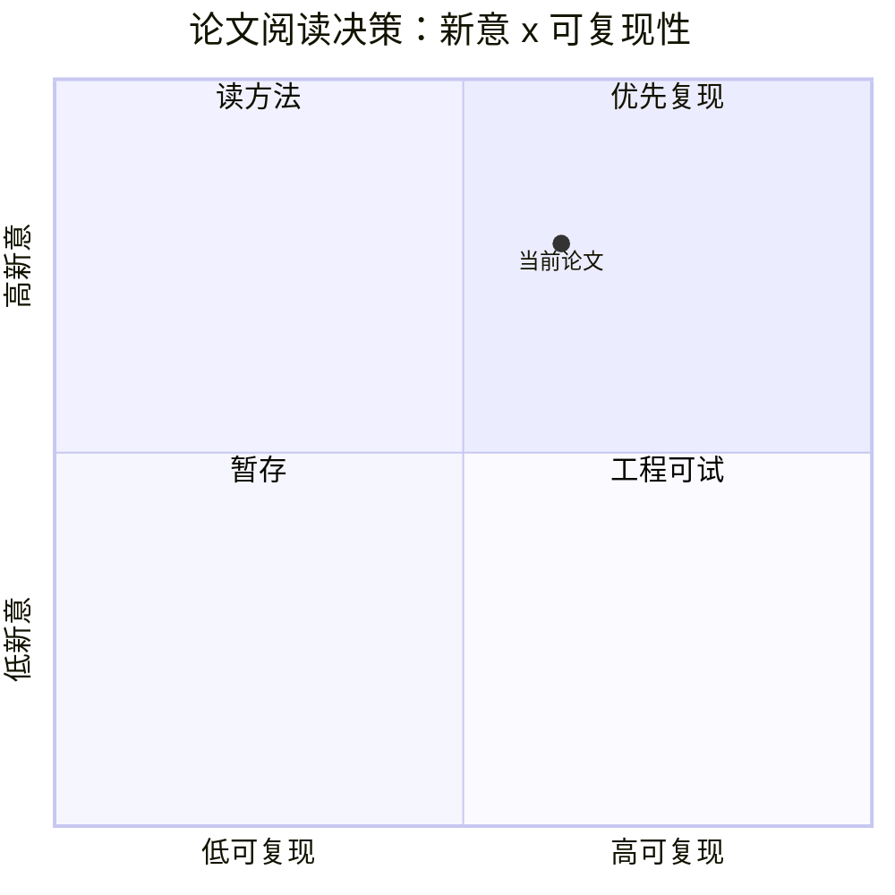

# WorldDirector: Building Controllable World Simulators with Persistent Dynamic Memory

> 类型：论文  
> 大类：论文  
> 小类：World Model / RL Game AI  
> 推荐等级：必读  
> 创建日期：2026-07-05  
> 原文链接：https://arxiv.org/abs/2607.02517v1  
> PDF：https://arxiv.org/pdf/2607.02517v1  
> 网页详情：https://github.com/dyt27666-oss/AI-news-report-obsidians/blob/main/Papers/2026-07-05/worlddirector-controllable-world-simulators.md  
> 返回日报：[[Daily/2026-07-05]]

## 一句话结论

WorldDirector 指向可控 world simulator 与动态记忆，对 RL/game AI 的环境生成和状态一致性有参考价值。

## TL;DR

- **研究问题**：A controllable video world model framework designed for persistent dynamic object memory and unrestricted viewpoint exploration.
- **核心方法**：从公开摘要看，论文围绕 persistent-state / long-context / world model 中的一个关键瓶颈构建测试或方法框架。
- **关键结果**：当前只读取到 arXiv 元数据和摘要，未做全文复现。
- **对我的价值**：适合作为 agent safety、long-context harness 或 world model simulator 的阅读入口。
- **建议动作**：先读 abstract + method figure，再决定是否进入复现。

## 论文信息

| 字段 | 内容 |
|---|---|
| 论文来源 | arXiv |
| 来源类型 | 预印本 |
| 标题 | WorldDirector: Building Controllable World Simulators with Persistent Dynamic Memory |
| 作者/机构 | Hanlin Wang, Hao Ouyang, Qiuyu Wang, Wen Wang |
| 发布时间 | 2026-07-02 |
| arXiv | [abs](https://arxiv.org/abs/2607.02517v1) |
| OpenReview / 会议页 | 未发现 |
| Semantic Scholar | 待补充 |
| PDF | [pdf](https://arxiv.org/pdf/2607.02517v1) |
| 代码 | 未发现 |
| 方向 | World Model / RL Game AI |

## 方法/系统图示

### 辅助图：阅读/复现决策矩阵

## 专业解读

这篇论文的价值在于把“模型能力”拉回到可测试的系统场景：agent 是否会在持久状态中留下隐蔽风险，长上下文是否真的能使用关键证据，或 world model 是否能保持动态记忆。对 AI Infra 工程师来说，重点不是单个 benchmark 分数，而是如何把这种失败模式转化为 harness、回放、日志、隔离和回归测试。

## 通俗解释

它像是在问：AI 不只是回答一道题，而是在一个会记住过去的工作台里连续干活。那它会不会把前面埋下的问题带到后面？会不会明明有证据却没用上？这正是 coding agent 和长期任务系统需要提前测试的。

## 方法拆解

| 组件 | 作用 | 输入 | 输出 | 关键假设 |
|---|---|---|---|---|
| 任务构造 | 暴露跨轮或长上下文失败 | 多轮任务/长文档 | 可评测样例 | 样例覆盖真实风险 |
| 状态跟踪 | 记录证据或持久状态 | agent 行为/上下文 | 证据链 | 日志足够完整 |
| 评估指标 | 判断是否失效 | 输出/行为 | 分数/失败类型 | 指标贴近真实工程 |

## 实验与证据

| 实验 | 说明 | 我怎么看 |
|---|---|---|
| arXiv 摘要信号 | 当前仅验证标题、作者、摘要和分类。 | 可进入深读，但不应直接引用实验结论。 |
| 工程映射 | 适合映射到 coding-agent harness 和长上下文 eval。 | 值得抽象成回归测试 checklist。 |

## 局限性 / 风险

- 今日未读取 PDF 全文，实验细节和代码可用性未确认。
- arXiv 搜索结果可能与 query 相关性不均，需要人工二次筛选。
- 若没有公开代码，短期复现成本较高。

## 对我的影响

| 维度 | 影响 | 建议动作 |
|---|---|---|
| AI Infra | 提醒在 agent runtime 中做状态隔离、审计日志和回放。 | 把风险项写进 harness 设计。 |
| LLM 工程 | 长上下文/持久状态不是简单扩窗。 | 增加证据定位和多轮一致性评测。 |
| RL / Game AI | world model / simulator 要验证记忆一致性。 | 关注可控环境和状态回放。 |
| Agent / Eval | 直接影响 coding agent 的安全和回归测试。 | 优先深读方法部分。 |

## 相关链接

- 原文：https://arxiv.org/abs/2607.02517v1
- PDF：https://arxiv.org/pdf/2607.02517v1
- 网页详情：https://github.com/dyt27666-oss/AI-news-report-obsidians/blob/main/Papers/2026-07-05/worlddirector-controllable-world-simulators.md
- 代码：未发现
- 相关卡片：[[Daily/2026-07-05]]

## 标签

#ai-radar #paper #agent-eval #long-context
