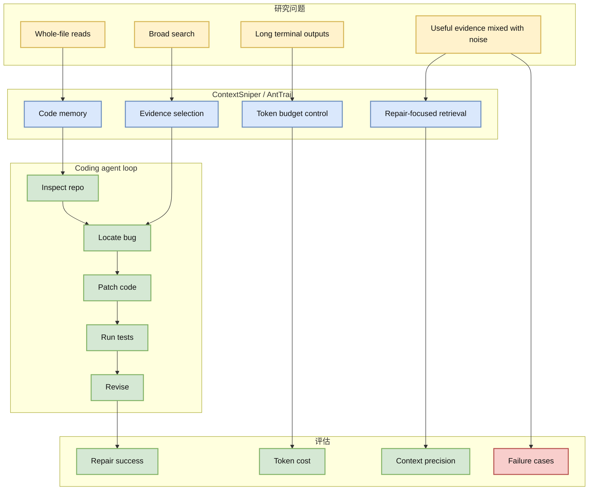

# ContextSniper：面向仓库级程序修复的 token-efficient code memory

> 类型：论文详情  
> 大类：论文 / Agent Eval  
> 小类：Repository-level Program Repair / Code Memory  
> 推荐等级：必读  
> 创建日期：2026-07-06  
> 论文来源：arXiv 预印本  
> arXiv：https://arxiv.org/abs/2607.01916v1  
> PDF：https://arxiv.org/pdf/2607.01916v1  
> 网页详情：https://github.com/dyt27666-oss/AI-news-report-obsidians/blob/main/Papers/2026-07-06/contextsniper-token-efficient-code-memory.md  
> 返回日报：[[Daily/2026-07-06]]

## 一句话结论

ContextSniper 关注 coding agent 在仓库级修复中浪费上下文预算的问题，提出 token-efficient code memory；它直接对应 AI coding workflow 的上下文工程和 agent-loop 评测。

## TL;DR

- **研究问题**：仓库级修复中，agent 常把 token 花在整文件读取、宽泛搜索和冗长 terminal 输出上。
- **核心方法**：构建更节省 token 的 code memory / evidence selection。
- **工程价值**：可用于设计 coding-agent harness 的上下文选择、日志裁剪和 repo memory。
- **建议动作**：把它和 ReContext、TUA-Bench、loop engineering 论文放在一起读。

## 元信息

| 字段 | 内容 |
|---|---|
| 论文来源 | arXiv |
| 来源类型 | 预印本 |
| 标题 | ContextSniper: AntTrail's Token-Efficient Code Memory for Repository-Level Program Repair |
| 作者/机构 | Chiwang Luk, Matin Mohammad Najafi, Zhifeng Jia 等 |
| 发布时间 | 2026-07-02 |
| arXiv ID | 2607.01916v1 |
| abs 链接 | https://arxiv.org/abs/2607.01916v1 |
| PDF 链接 | https://arxiv.org/pdf/2607.01916v1 |
| 代码链接 | 未发现 |
| Semantic Scholar / OpenReview / 会议页 | 未确认 |
| 标签 | #coding-agent #context-engineering #program-repair |

## 信息压缩图示

### 主图：从仓库噪声到 code memory

### 辅助结构：Context engineering 观察点

| 观察点 | 为什么重要 | 可转成什么工具 |
|---|---|---|
| 文件选择 | 决定是否看对代码 | repo map / symbol index |
| 搜索范围 | 控制 token 与噪声 | semantic grep / ranked search |
| terminal 输出裁剪 | 防止日志淹没证据 | output summarizer |
| repair memory | 避免重复读同一信息 | session memory / evidence cache |

## 专业解读

ContextSniper 的重要性在于它把 coding-agent 的失败从“模型不够聪明”转回到“上下文供应链不够好”。仓库级修复并不缺信息，缺的是把正确证据用有限 token 送到模型面前。对 long-horizon agent 来说，整文件读取和无差别搜索会迅速消耗上下文窗口，同时让模型更难定位真正相关的函数、调用链和测试失败。

这篇论文非常适合转化为工程任务：构建 code memory、ranked evidence、terminal output summarization、patch/test trace，并把 token cost 纳入 agent eval 指标。它也和 Loop Engineering 主题高度相关，因为 loop 的质量很大程度取决于每一步如何选择上下文。

## 通俗解释

AI 修代码时，经常像新人一样把整个项目到处翻一遍，结果上下文被无关信息塞满。ContextSniper 的目标是让它像有经验的工程师一样，只看最可能有用的文件、函数和错误日志。

## 关键机制拆解

| 机制 | 解决的问题 | 可能的工程实现 |
|---|---|---|
| Code memory | 跨步骤保留有效证据 | symbol graph + session cache |
| Evidence selection | 从噪声中找关键线索 | ranked search / embedding rerank |
| Token budget | 限制上下文浪费 | per-step token accounting |
| Repair loop | 将证据转化为 patch | inspect-patch-test-revise template |

## 对我的影响

| 维度 | 影响 | 建议动作 |
|---|---|---|
| AI coding workflow | 可优化 Codex/Claude/Cline 的上下文策略 | 做 evidence cache 插件或脚本 |
| Agent Eval | 不只评成功率，也评 token 与证据质量 | 加入 context precision 指标 |
| AI Infra | 需要 agent memory/control plane | 设计 repo-level memory schema |
| RL / Game AI | 可用于复杂训练环境代码修复 | 建立环境脚本 repair benchmark |

## 可信度与局限性

- 证据强度：中；来自 arXiv 摘要，未读完整实验细节。
- 局限性：代码链接未发现，复现路径未知。
- 风险：context memory 可能过拟合特定 benchmark 或语言生态。
- 需要确认：是否覆盖 SWE-bench 类任务、token saving 与成功率 tradeoff。

## 我应该如何跟进

1. 阅读 PDF，抽取 memory 架构和 benchmark 设置。
2. 将“文件选择 / 搜索 / 日志裁剪 / patch trace”变成 coding-agent 横评表。
3. 尝试在 Hermes/Codex 工作流中加入 evidence cache。

## 相关链接

- arXiv：https://arxiv.org/abs/2607.01916v1
- PDF：https://arxiv.org/pdf/2607.01916v1
- 返回：[[Daily/2026-07-06]]

## 标签

#ai-radar #paper #coding-agent #context-engineering
