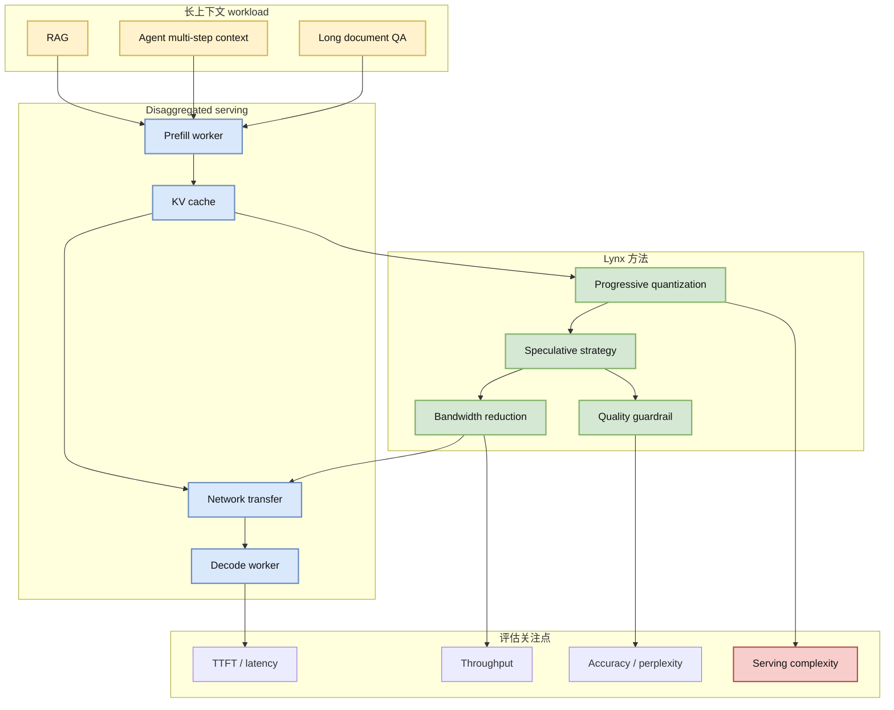

# Lynx：Progressive Speculative Quantization 加速长上下文 KV 传输

> 类型：论文详情  
> 大类：论文 / AI Infra  
> 小类：LLM Serving / KV Cache / Disaggregated Inference  
> 推荐等级：必读  
> 创建日期：2026-07-06  
> 论文来源：arXiv 预印本  
> arXiv：https://arxiv.org/abs/2607.01831v1  
> PDF：https://arxiv.org/pdf/2607.01831v1  
> 网页详情：https://github.com/dyt27666-oss/AI-news-report-obsidians/blob/main/Papers/2026-07-06/lynx-progressive-speculative-quantization.md  
> 返回日报：[[Daily/2026-07-06]]

## 一句话结论

Lynx 针对长上下文 disaggregated inference 中 KV cache 传输瓶颈，提出 progressive speculative quantization，是今天最贴近 LLM serving 基础设施的一篇论文。

## TL;DR

- **研究问题**：长上下文 RAG / agent workload 让 prefill-decode 分离架构承受巨大 KV cache 传输压力。
- **核心方法**：用 progressive speculative quantization 在传输路径上压缩 KV，尽量减少质量损失。
- **工程价值**：直接对应 disaggregated serving、KV transfer、网络带宽、端到端 latency。
- **建议动作**：深读方法与实验设置，和 vLLM / SGLang / TensorRT-LLM 的 KV 传输策略对照。

## 元信息

| 字段 | 内容 |
|---|---|
| 论文来源 | arXiv |
| 来源类型 | 预印本 |
| 标题 | Lynx: Progressive Speculative Quantization for accelerating KV Transfer in Long-Context Inference |
| 作者/机构 | Wenchen Han, Gingfung Matthew Yeung, Marco Barletta 等 |
| 发布时间 | 2026-07-02 |
| arXiv ID | 2607.01831v1 |
| abs 链接 | https://arxiv.org/abs/2607.01831v1 |
| PDF 链接 | https://arxiv.org/pdf/2607.01831v1 |
| 代码链接 | 未发现 |
| Semantic Scholar / OpenReview / 会议页 | 未确认 |
| 标签 | #llm-serving #kv-cache #disaggregated-inference |

## 信息压缩图示

### 主图：长上下文 KV 传输瓶颈

### 辅助结构：机制拆解矩阵

| 模块 | 解决的问题 | 需要检查的实验指标 |
|---|---|---|
| Disaggregated inference | prefill/decode 资源解耦 | 吞吐、TTFT、GPU 利用率 |
| KV transfer | 长上下文 KV cache 太大 | 传输量、网络带宽、延迟 |
| Quantization | 压缩 KV 表示 | 精度损失、模型/任务泛化 |
| Speculative strategy | 降低错误压缩风险 | rollback/校正成本 |

## 专业解读

这篇论文切中了当前 LLM serving 的真实瓶颈：长上下文与 agentic workloads 会反复拼接检索片段、工具结果和历史轨迹，prefill 产生的 KV cache 越来越大。若采用 prefill/decode disaggregation，KV cache 必须跨节点或跨设备传输，网络和内存带宽会成为端到端延迟的主要来源。

Lynx 的方法方向是对 KV transfer 做 progressive speculative quantization：不是只压模型权重或激活，而是直接压服务链路里的状态。对 AI Infra 来说，这类方法比单纯 kernel 优化更接近系统瓶颈，因为它改变了 serving control plane 如何管理状态、带宽和质量。

## 通俗解释

长上下文推理时，模型会生成一大堆“中间记忆”（KV cache）。如果这些记忆要在机器之间搬来搬去，就像搬家时家具太多。Lynx 的想法是把这些家具先聪明地压缩，再搬运，同时尽量不弄坏。

## 关键机制拆解

| 机制 | 价值 | 风险 |
|---|---|---|
| KV cache 压缩 | 减少网络传输 | 可能影响生成质量 |
| Progressive | 分阶段控制误差 | 实现复杂度更高 |
| Speculative | 提前假设可压缩路径 | 错误猜测需要校正 |
| Serving 集成 | 直接改善系统链路 | 需适配 scheduler/cache runtime |

## 对我的影响

| 维度 | 影响 | 建议动作 |
|---|---|---|
| AI Infra | KV transfer 是 disaggregated serving 核心瓶颈 | 深读实验设置，抽可复现指标 |
| LLM Serving | 对 RAG / agent long context 有直接价值 | 和 vLLM/SGLang prefix/KV cache 策略对照 |
| Agent | 长轨迹 agent 会扩大 KV 压力 | 建立 agent context 长度与 KV 成本模型 |
| 成本 | 降低跨节点带宽和延迟 | 关注压缩质量与复杂度 tradeoff |

## 可信度与局限性

- 证据强度：中；来自 arXiv 摘要，尚未读完整实验细节。
- 局限性：未发现代码，无法验证真实系统集成成本。
- 风险：KV 量化对不同模型、不同任务和长上下文位置可能敏感。
- 需要确认：是否支持主流 serving 框架、是否有端到端 benchmark。

## 我应该如何跟进

1. 阅读 PDF 的系统架构和实验设置。
2. 抽取 KV transfer bandwidth、TTFT、throughput、quality loss 四个指标。
3. 对照 vLLM / SGLang / TensorRT-LLM 的 disaggregated serving 路线。

## 相关链接

- arXiv：https://arxiv.org/abs/2607.01831v1
- PDF：https://arxiv.org/pdf/2607.01831v1
- 返回：[[Daily/2026-07-06]]

## 标签

#ai-radar #paper #llm-serving #kv-cache
