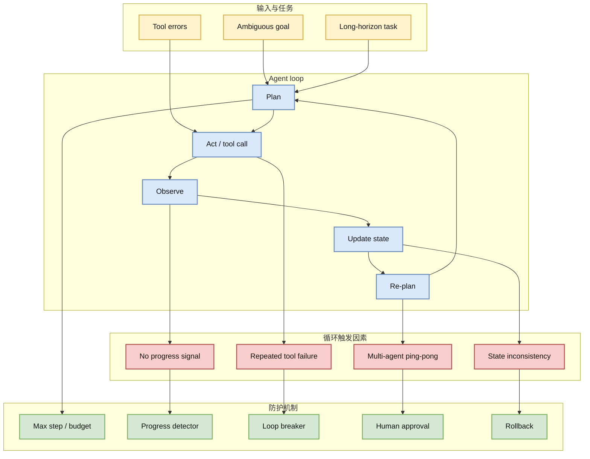

# When Agents Do Not Stop：LLM Agent 无限循环失败模式

> 类型：论文详情  
> 大类：论文 / Agent Safety / Eval  
> 小类：Infinite Agentic Loops  
> 推荐等级：必读  
> 创建日期：2026-07-06  
> 论文来源：arXiv 预印本  
> arXiv：https://arxiv.org/abs/2607.01641v1  
> PDF：https://arxiv.org/pdf/2607.01641v1  
> 网页详情：https://github.com/dyt27666-oss/AI-news-report-obsidians/blob/main/Papers/2026-07-06/when-agents-do-not-stop.md  
> 返回日报：[[Daily/2026-07-06]]

## 一句话结论

这篇论文把 LLM agent 的“停不下来”作为独立失败模式研究，直接对应 coding agent、tool-use agent 和多 agent 编排中的预算、终止条件与安全控制。

## TL;DR

- **研究问题**：LLM agents 在计划、工具调用、状态更新和协作中可能陷入无限循环。
- **为什么重要**：长任务 agent 如果没有终止条件，会浪费 token、算力、API 配额并可能持续修改状态。
- **工程价值**：可转化为 max-step、progress detector、loop breaker、rollback、human approval 机制。
- **建议动作**：纳入 coding-agent loop regression，用真实 terminal trace 检测循环。

## 元信息

| 字段 | 内容 |
|---|---|
| 论文来源 | arXiv |
| 来源类型 | 预印本 |
| 标题 | When Agents Do Not Stop: Uncovering Infinite Agentic Loops in LLM Agents |
| 作者/机构 | Xinyi Hou, Shenao Wang, Yanjie Zhao 等 |
| 发布时间 | 2026-07-02 |
| arXiv ID | 2607.01641v1 |
| abs 链接 | https://arxiv.org/abs/2607.01641v1 |
| PDF 链接 | https://arxiv.org/pdf/2607.01641v1 |
| 代码链接 | 未发现 |
| Semantic Scholar / OpenReview / 会议页 | 未确认 |
| 标签 | #agent-eval #agent-safety #loop-engineering |

## 信息压缩图示

### 主图：无限 agent loop 的形成路径

### 辅助结构：Loop breaker 设计表

| 防护机制 | 触发条件 | 适合放在哪里 |
|---|---|---|
| Max step | 步数或时间超限 | agent runner |
| Budget guard | token / API 成本超限 | model gateway |
| Progress detector | 多轮没有新证据或 diff | planner / evaluator |
| Tool retry cap | 同一命令反复失败 | tool wrapper |
| Human approval | 高风险写入或删除 | permission layer |
| Rollback | 失败后状态污染 | git/workspace manager |

## 专业解读

随着 LLM agent 从一次性问答走向长任务执行，循环失败会成为基础设施问题。传统 chat failure 只是答案差；agent failure 可能持续调用工具、改文件、消耗预算，甚至在多 agent 系统里互相触发。对 coding agent 尤其危险：如果测试一直失败，agent 可能不断修改无关代码，导致状态污染。

论文的价值在于把“终止条件”提升为 agent runtime 的一等公民。好的 loop engineering 不只是提示词，还要在 harness 层定义进展度量、重复检测、预算上限、工具重试、人工批准和 rollback。这个方向也能和 GitHub Copilot session streaming、Claude Code/Cline CLI 的 trace 结合，形成过程级 agent eval。

## 通俗解释

AI agent 像一个会不断尝试的实习生。如果没有人告诉它什么时候该停，它可能一直重复查同一个文件、跑同一个失败命令、改越来越多无关代码。这篇论文研究的就是这种“停不下来”的问题。

## 关键机制拆解

| 机制 | 价值 | 风险 |
|---|---|---|
| 终止条件 | 防止无限执行 | 太严格会提前停止 |
| 进展检测 | 判断是否真的变好 | 需要可观测 trace |
| 循环识别 | 发现重复动作 | 可能误判探索行为 |
| 回滚 | 避免状态污染 | 需要良好 git/workspace 管理 |

## 对我的影响

| 维度 | 影响 | 建议动作 |
|---|---|---|
| AI Infra | agent runner 必须有预算与终止控制 | 在 harness 中加入 max-step / cost cap |
| Coding Agent | 防止重复读文件、重复跑失败命令 | 记录命令与 diff 指纹 |
| Agent Eval | 成功率之外要评循环率 | 建 loop regression dataset |
| RL / Game AI | 自博弈/仿真 agent 也会无限探索 | 增加 episode termination checks |

## 可信度与局限性

- 证据强度：中；来自 arXiv 摘要，未读完整实验。
- 局限性：具体 benchmark、loop 类型覆盖范围待确认。
- 风险：不同 agent framework 的循环形态差异很大。
- 需要确认：是否提供可复现检测器或数据集。

## 我应该如何跟进

1. 阅读 PDF，抽 loop taxonomy 和检测指标。
2. 在 coding-agent runner 加入 step/cost/progress guard。
3. 用历史失败 session 做 loop detector smoke test。

## 相关链接

- arXiv：https://arxiv.org/abs/2607.01641v1
- PDF：https://arxiv.org/pdf/2607.01641v1
- 返回：[[Daily/2026-07-06]]

## 标签

#ai-radar #paper #agent-safety #loop-engineering
