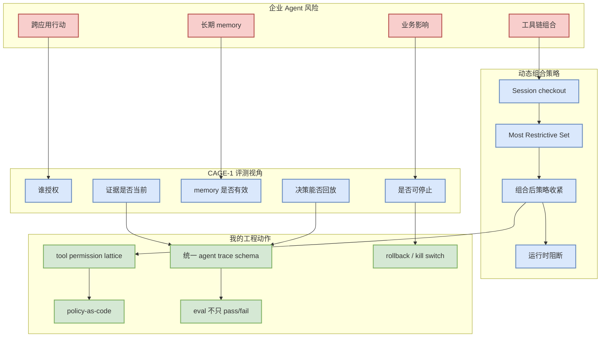

# Agent Control / Governance / Policy Papers Watch

> 日期：2026-07-07  
> 来源：arXiv / 预印本  
> 代表论文：CAGE-1 与 DSCC  
> 原文：https://arxiv.org/abs/2607.03510v1 / https://arxiv.org/abs/2607.03423v1

## 一句话结论

CAGE-1 与 DSCC 共同说明：企业 agent 评测正在从“答案对不对”转向“谁授权、什么策略、能否回放、能否实时阻断”。

## TL;DR

- CAGE-1：关注 enterprise agentic AI 的 control、assurance、governance evaluation。
- DSCC：关注多工具 agent chain 的动态组合策略，避免单工具合法但组合后违规。
- 对 coding agent：权限、工具链、memory、evidence、replay、stop control 都应成为评测对象。
- 对 AI Infra：需要策略引擎、trace schema、audit log、policy composition、runtime enforcement。

## 元信息

| 字段 | CAGE-1 | DSCC |
|---|---|---|
| 论文 | CAGE-1: Control, Assurance, and Governance Evaluation for Enterprise Agentic AI | Securing Multi-Tool AI Agent Chains With Dynamic, Real-Time Compositional Policies |
| 来源 | arXiv | arXiv |
| 来源类型 | 预印本 | 预印本 |
| 发布时间 | 2026-07-03 | 2026-07-03 |
| 分类 | cs.SE, cs.AI, cs.CY | cs.CR, cs.AI |
| 原文 | https://arxiv.org/abs/2607.03510v1 | https://arxiv.org/abs/2607.03423v1 |
| 代码链接 | 未发现 | 未发现 |

## 信息压缩图示

## 机制拆解

| 机制 | 解决的问题 | 对 coding agent 的映射 |
|---|---|---|
| Authorization trace | 证明谁允许 agent 做某事 | PR 修改、shell 命令、部署、secret 访问 |
| Evidence freshness | 防止过期上下文 | repo state、issue、CI log、文档版本 |
| Memory validity | 防止错误长期记忆 | skills、project memory、user preferences |
| Policy composition | 单工具许可组合成违规链 | read file + exfiltrate network；test + deploy |
| Stop control | agent 可控终止 | max-step、budget、kill switch、rollback |

## 专业解读

企业 agent 的核心问题不是模型能否生成答案，而是过程是否可治理。CAGE-1 更像评测框架，DSCC 更像 runtime enforcement 机制。两者结合后，可以形成 agent control plane：trace、policy、permission、memory、evidence、kill switch。

## 通俗解释

一个 agent 能写代码还不够。企业更关心：它有没有权限、为什么这么做、证据是不是新的、出错能不能停、事后能不能复盘。

## 对我的影响

- 适合纳入 Claude Code / Codex / Copilot / Cline 的横评维度。
- Hermes/Codex 类 agent runner 应显式记录 tool chain、权限和 evidence。
- 多 agent tmux 工作流需要统一 audit log，不然很难做 postmortem。

## 可信度与局限性

- 可信度：中，摘要信号强，但需要读全文验证框架成熟度。
- 局限：CAGE-1 可能偏概念评测，DSCC 的实际系统开销和集成复杂度需确认。

## 我应该如何跟进

1. 抽取 CAGE-1 的指标体系。
2. 检查 DSCC 的策略组合形式化定义。
3. 为 coding agent 设计 permission lattice 和 trace schema。

## 相关链接

- CAGE-1：https://arxiv.org/abs/2607.03510v1
- DSCC：https://arxiv.org/abs/2607.03423v1

#ai-radar #paper #agent-security #governance #coding-agent #eval
