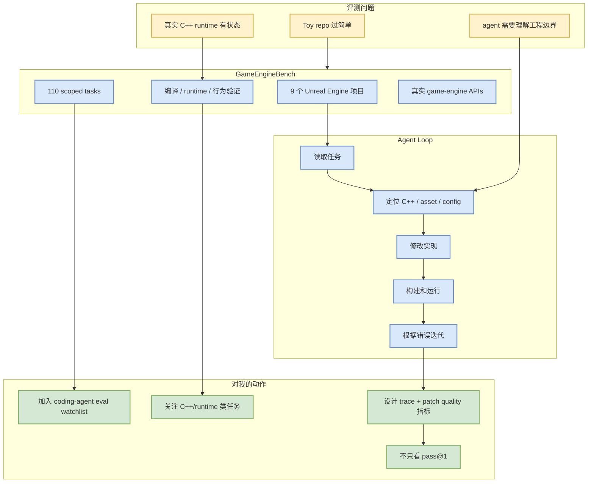

# GameEngineBench: Evaluating Coding Agents on Real C++ Runtime Environments

> 日期：2026-07-07  
> 来源：arXiv / 预印本  
> 原文：https://arxiv.org/abs/2607.03525v1  
> PDF：https://arxiv.org/pdf/2607.03525v1

## 一句话结论

GameEngineBench 把 coding agent 评测从 toy repo 推到 Unreal Engine 5 / C++ / 实时交互环境，是更接近真实工程系统的 agent eval 信号。

## TL;DR

- 评测对象：coding agents 在真实 C++ game engine runtime 中完成 scoped implementation tasks。
- 数据形态：9 个真实 Unreal Engine 项目，110 个任务。
- 关键价值：覆盖状态、渲染、physics、asset pipeline、runtime interaction，不再只是单文件补丁。
- 对用户价值：适合作为 AI coding workflow 中“复杂系统修改能力”的 benchmark 参考。

## 元信息

| 字段 | 内容 |
|---|---|
| 论文 | GameEngineBench: Evaluating Coding Agents on Real C++ Runtime Environments |
| 作者/机构 | Brian La, Sejoon Chang, Ben Kim, Junyoung Bae, Aamish Ahmad Beg |
| 来源 | arXiv |
| 来源类型 | 预印本 |
| 发布时间 | 2026-07-03 |
| 分类 | cs.SE, cs.CL |
| 代码链接 | 未发现 |

## 信息压缩图示

## 机制拆解

| 模块 | 作用 | 关注点 |
|---|---|---|
| 真实工程项目 | 避免 synthetic benchmark 过拟合 | repo size、build dependency、runtime 可复现性 |
| Scoped tasks | 控制任务边界 | 是否代表真实 feature / bugfix |
| C++ runtime | 暴露编译、链接、状态、交互问题 | agent 的错误恢复能力 |
| Game engine | 结合 physics/render/network/asset pipeline | 比普通脚本任务更贴近复杂系统 |

## 专业解读

这类 benchmark 的价值不在“游戏”本身，而在工程复杂度：C++ 编译链、Unreal Engine APIs、状态机、实时交互、资源配置会同时影响结果。对 coding agent 来说，这更接近 AI Infra 工程里的 runtime patch、性能修复、系统集成任务。

## 通俗解释

以前很多 coding agent 考试像“补一道小题”；GameEngineBench 更像“在一个真实游戏引擎项目里改功能，还要能跑起来”。这会暴露 agent 是否真的理解大型工程。

## 对我的影响

- 可作为 Claude Code / Codex / Cline / Qwen Code 横评任务类型参考。
- 需要记录完整 agent trace：读了哪些文件、跑了哪些命令、失败后如何修。
- 对 RL 游戏模型训练也有间接价值：真实 engine task 可测试 agent 对 simulation environment 的理解。

## 可信度与局限性

- 可信度：中高，任务环境真实，主题与 coding-agent eval 强相关。
- 局限：需要读全文确认任务构造、baseline、执行环境和复现成本；暂未发现代码仓库。

## 我应该如何跟进

1. 深读 PDF，抽取 task schema 和 evaluation metric。
2. 检查是否有公开 benchmark repo。
3. 将 “C++ runtime task” 加入 AI coding agent 横评候选。

## 相关链接

- arXiv abs：https://arxiv.org/abs/2607.03525v1
- arXiv PDF：https://arxiv.org/pdf/2607.03525v1

#ai-radar #paper #coding-agent #evaluation #cpp #game-engine
