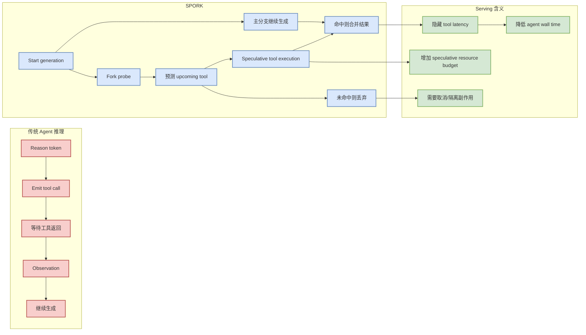

# SPORK: Self-Speculative Forking to Accelerate Agentic LLM Inference

> 日期：2026-07-07  
> 来源：arXiv / 预印本  
> 原文：https://arxiv.org/abs/2607.03333v1  
> PDF：https://arxiv.org/pdf/2607.03333v1

## 一句话结论

SPORK 把 agent 的 Thought-Action-Observation 串行等待变成可预测、可并行隐藏的 serving 问题，是今天最贴近 agent inference infra 的论文。

## TL;DR

- 问题：agent 发出 tool call 后 GPU 空等，论文称等待占 16-37% wall time，既有报告可到 35-61%。
- 方法：在 generation 开始 fork probe，让模型自己预测即将调用的 tool，提前做 speculative tool execution。
- 价值：不依赖额外 predictor、历史 trace 或静态 workflow graph，更适合 day-one deployment。
- 对用户：适合映射到 coding agent、RAG agent、browser agent 的 tool-call latency hiding。

## 元信息

| 字段 | 内容 |
|---|---|
| 论文 | SPORK: Self-Speculative Forking to Accelerate Agentic LLM Inference |
| 作者/机构 | Huajun Bai, Weiwei Lv, Huichuan Zheng, Youyou Lu, Jiwu Shu |
| 来源 | arXiv |
| 来源类型 | 预印本 |
| 发布时间 | 2026-07-03 |
| 分类 | cs.DC, cs.AI, cs.LG |
| 代码链接 | 未发现 |

## 信息压缩图示

## 辅助结构：落地风险矩阵

| 维度 | 收益 | 风险 | 工程要求 |
|---|---|---|---|
| 只读工具 | 高，最容易并行 | 低 | cache + cancellation |
| 写操作工具 | 可能高 | 高，可能产生副作用 | sandbox / dry-run / two-phase commit |
| Browser / web search | 中高 | 成本和 rate limit | timeout budget |
| Coding agent shell | 高 | 命令副作用、环境污染 | allowlist / rollback / workspace isolation |

## 专业解读

SPORK 的关键是把 agent runtime 里的“工具等待”纳入 serving scheduler。对 LLM infra 而言，这不是单纯模型优化，而是 model generation、tool runtime、cache、cancellation、side-effect control 的联合调度问题。

## 通俗解释

agent 想用工具时通常要等工具跑完。SPORK 的思路像“提前猜它马上要查什么”，如果猜对，就省掉等待时间；如果猜错，就丢掉提前跑的结果。

## 对我的影响

- coding agent 可以把 read-only tool、search、测试发现类操作作为 speculative candidates。
- 需要为工具调用引入副作用等级：只读、可回滚写、不可回滚写。
- 对 tmux 多 agent 监控，可增加 “tool wait ratio” 和 “speculation hit rate” 指标。

## 可信度与局限性

- 可信度：中高，问题定义与 agent serving 强相关，摘要给出明确 wall-time 数据。
- 局限：需要读全文确认 benchmark、probe 开销、错误工具调用的安全处理。

## 我应该如何跟进

1. 读 PDF 中 benchmark 和 hit-rate 细节。
2. 把 coding agent 工具按副作用等级分类。
3. 设计一个只读 speculative tool execution 小实验。

## 相关链接

- arXiv abs：https://arxiv.org/abs/2607.03333v1
- arXiv PDF：https://arxiv.org/pdf/2607.03333v1

#ai-radar #paper #agent #serving #tool-use #inference
