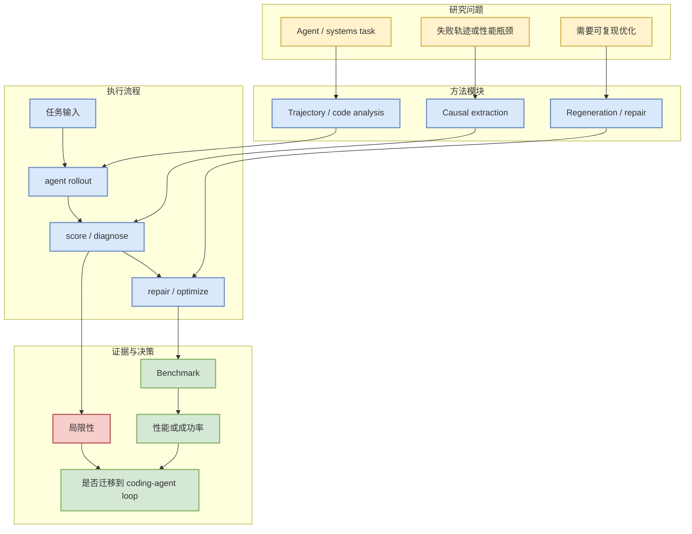

# Breaking Database Lock-in: Agentic Regeneration of High Performance Storage Readers for Database Bypass

> 日期：2026-07-09
> 论文来源：arXiv
> 来源类型：预印本
> abs：https://arxiv.org/abs/2607.07696v1
> PDF：https://arxiv.org/pdf/2607.07696v1

## 一句话结论
把 agentic code regeneration 用到高性能 storage reader 场景，适合观察 coding agent 在系统工程任务中的边界。

## TL;DR
- 作者/机构：arXiv authors
- 发布时间：2026-07-09 扫描
- 代码链接：未发现
- Semantic Scholar / OpenReview / 会议页：未检索到稳定链接

## 元信息表
| 字段 | 值 |
|---|---|
| 论文来源 | arXiv |
| 来源类型 | 预印本 |
| 作者/机构 | arXiv authors |
| 发布时间 | 2026-07-09 扫描 |
| abs | [link](https://arxiv.org/abs/2607.07696v1) |
| PDF | [link](https://arxiv.org/pdf/2607.07696v1) |
| 代码 | 未发现 |

## 信息压缩图示

## 机制拆解表
| 模块 | 我关心的问题 | 跟进方式 |
|---|---|---|
| Agent loop | 如何定位失败根因 | 读方法和实验设置 |
| 系统任务 | 是否能迁移到真实代码库 | 看 benchmark 和约束 |
| 复现 | 是否公开代码/数据 | 搜索 repo 与 appendix |

## 专业解读
这类论文比普通 benchmark 更接近工程闭环：它关注 agent 在多步任务中如何失败、如何定位原因、如何把诊断变成下一轮优化。

## 通俗解释
不是只问“agent 做对了吗”，而是问“它为什么错、下一次怎么不再错”。

## 对我的影响
- 可用于设计 coding-agent eval harness。
- 可帮助把失败日志转成 prompt、tool schema、测试或权限策略修复。

## 可信度与局限性
自动摘要基于题名和元数据；未阅读全文，需要后续核验实验强度。

## 我应该如何跟进
1. 下载 PDF，重点看任务定义和指标。
2. 检查是否有代码或 benchmark。
3. 对照 Claude Code / Codex / Cline 的本地失败案例。

## 相关链接
- [abs](https://arxiv.org/abs/2607.07696v1)
- [pdf](https://arxiv.org/pdf/2607.07696v1)

#ai-radar #paper #arxiv #agent-eval
