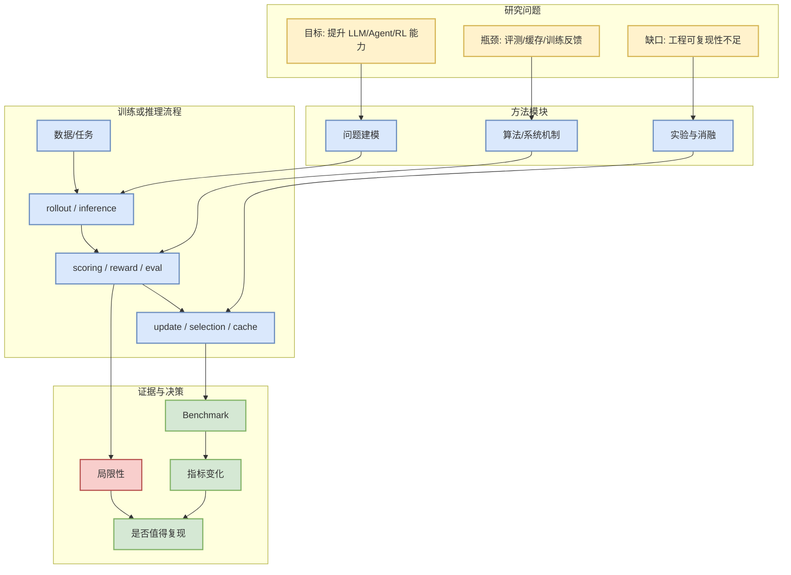

# Co-LMLM: Continuous-Query Limited Memory Language Models

> 日期：2026-07-09
> 论文来源：arXiv
> 来源类型：预印本
> abs：https://arxiv.org/abs/2607.07707v1
> PDF：https://arxiv.org/pdf/2607.07707v1

## 一句话结论
Limited memory language models (LMLMs) externalize factual knowledge during pretraining to a knowledge base (KB), rather than memorizing it in their weights. During generation, the

## TL;DR
- 作者/机构：Yair Feldman, Linxi Zhao, Nathan Godey, Dongyoung Go
- 发布时间：2026-07-08
- 代码链接：未发现
- Semantic Scholar / OpenReview / 会议页：未检索到稳定链接

## 元信息表
| 字段 | 值 |
|---|---|
| 论文来源 | arXiv |
| 来源类型 | 预印本 |
| 作者/机构 | Yair Feldman, Linxi Zhao, Nathan Godey, Dongyoung Go |
| 发布时间 | 2026-07-08 |
| abs | [link](https://arxiv.org/abs/2607.07707v1) |
| PDF | [link](https://arxiv.org/pdf/2607.07707v1) |
| 代码 | 未发现 |

## 信息压缩图示

## 机制拆解表
| 模块 | 我关心的问题 | 跟进方式 |
|---|---|---|
| 方法 | 是否能用于 serving / agent / RL 环境 | 读方法与实验章节 |
| 指标 | 是否报告吞吐、成功率、成本、稳定性 | 抽取 benchmark |
| 复现 | 是否有代码和配置 | 搜索 repo / appendix |

## 专业解读
这篇论文进入日报的原因是主题与 AI Infra、LLM、agent eval、post-training 或 world model 强相关。阅读时不要只看 abstract，要判断它是否改变系统设计或训练/评测闭环。

## 通俗解释
先把它当作一个新的工程假设：它声称某个瓶颈可以被更好地处理，我们需要判断这个假设能否迁移到自己的系统。

## 对我的影响
- 如果是 serving：关注调度、KV cache、batching 和 SLO。
- 如果是 agent/RL：关注环境、reward、评测统计与可复现性。

## 可信度与局限性
自动摘要基于 arXiv 元数据；未阅读全文，结论需要后续核验。

## 我应该如何跟进
1. 下载 PDF 深读方法和实验。
2. 搜索代码和 benchmark。
3. 与现有 vLLM/SGLang/verl/OpenRLHF 或 coding-agent eval loop 对照。

## 相关链接
- [abs](https://arxiv.org/abs/2607.07707v1)
- [pdf](https://arxiv.org/pdf/2607.07707v1)

#ai-radar #paper #arxiv
