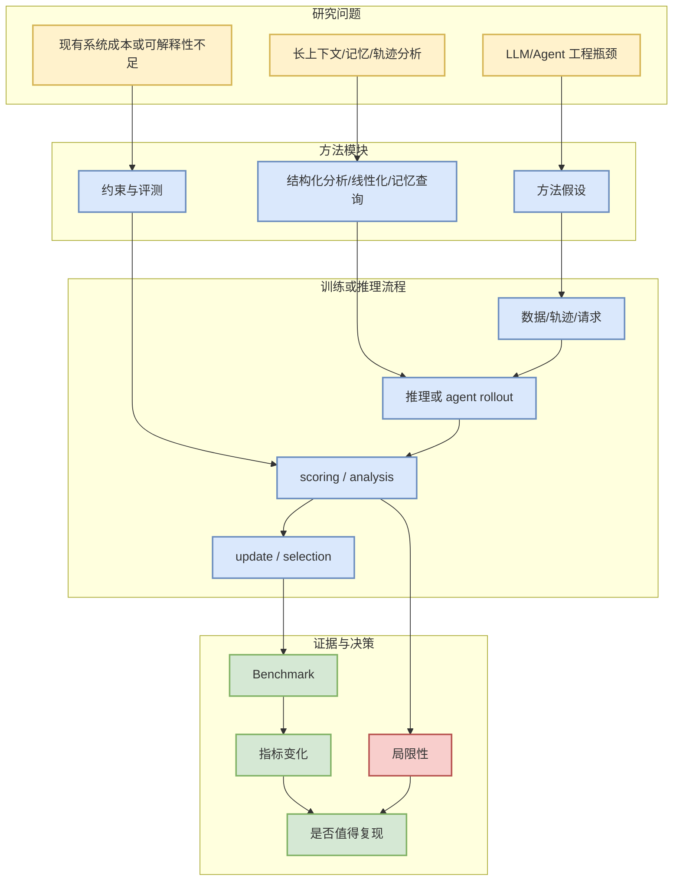

# Co-LMLM: Continuous-Query Limited Memory Language Models - 2026-07-10

## 一句话结论
把事实知识外置到可查询记忆中，信号指向有限参数模型、检索/记忆层与 inference-time knowledge access。

## TL;DR
- 论文来源：arXiv
- 来源类型：预印本 / arXiv watchlist（今日 API 429，使用已捕获 ID 继续观察）
- 作者/机构：Yair Feldman, Linxi Zhao, Nathan Godey, Dongyoung Kim
- 发布时间：arXiv 页面为准
- abs：https://arxiv.org/abs/2607.07707v1
- PDF：https://arxiv.org/pdf/2607.07707v1
- 代码链接：未发现

## 元信息表
| 字段 | 内容 |
|---|---|
| 论文来源 | arXiv |
| 来源类型 | 预印本 |
| arXiv ID | 2607.07707v1 |
| 作者/机构 | Yair Feldman, Linxi Zhao, Nathan Godey, Dongyoung Kim |
| abs | https://arxiv.org/abs/2607.07707v1 |
| PDF | https://arxiv.org/pdf/2607.07707v1 |
| Semantic Scholar / OpenReview | 未验证；今日 Semantic/arXiv API 不稳定 |

## 信息压缩图示

## 专业解读
把事实知识外置到可查询记忆中，信号指向有限参数模型、检索/记忆层与 inference-time knowledge access。 今日 arXiv API 返回 429/timeout，因此本页作为 paper watchlist，而不是完整论文解读。对 AI Infra/RL 工程师，优先判断它是否能转化为 serving benchmark、agent trajectory eval、post-training reward design 或 long-context memory 实验。

## 通俗解释
先把这篇放到待读清单：如果它能降低推理成本、提升 agent 调试能力或改善记忆机制，就值得进一步读 PDF。

## 关键机制拆解
| 模块 | 可能价值 | 复核动作 |
|---|---|---|
| 问题定义 | 是否对应真实工程瓶颈 | 读 introduction / limitations |
| 方法 | 是否可实现 | 看伪代码、复杂度和依赖 |
| 实验 | 是否有 benchmark | 看消融与开源代码 |
| 风险 | 今日低置信 | 等 API 恢复后补 citation / code |

## 对我的影响
- Serving：关注复杂度、KV cache、attention 或 memory access 成本。
- Agent Eval：关注 trajectory、root cause、benchmark 和可观测性。
- RL/Game AI：若涉及 rollout/trajectory，可迁移到 Rummy agent eval。

## 可信度与局限性
- arXiv ID 和链接可追溯。
- 今日 API 429，未完成 Semantic Scholar citation 与代码链接复核。
- 摘要级判断不能替代 PDF 深读。

## 我应该如何跟进
1. API 恢复后补 Semantic Scholar citation。
2. 阅读 PDF 的 method/experiment/limitations。
3. 如果相关，加入 serving 或 agent eval benchmark backlog。

## 相关链接
- abs：https://arxiv.org/abs/2607.07707v1
- PDF：https://arxiv.org/pdf/2607.07707v1
- 今日日报：[[Daily/2026-07-10]]

## 标签
#ai-radar #paper #arxiv #llm #agent-eval
