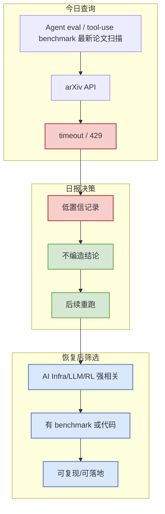

# Agent eval / tool-use benchmark 最新论文扫描

> 类型：论文源观察
> 大类：论文
> 小类：AI Infra / LLM / Agent / RL
> 推荐等级：低置信
> 创建日期：2026-07-25
> 原文链接：https://export.arxiv.org/api/query?search_query=all:agent+evaluation+benchmark+tool+use&sortBy=submittedDate&sortOrder=descending
> 网页详情：https://github.com/dyt27666-oss/AI-news-report-obsidians/blob/main/Papers/2026-07-25/agent-eval-watchlist.md
> 返回日报：[[Daily/2026-07-25]]

## 一句话结论

今日 arXiv 连续 timeout / 429，本页保留查询入口与筛选框架，不能把未验证结果当作新论文结论。

## TL;DR

- **研究问题**：Agent eval / tool-use benchmark 最新论文扫描。
- **核心方法**：待 arXiv 恢复后逐篇验证 abstract / PDF。
- **关键结果**：今日未取得可靠结果。
- **对我的价值**：避免因为 API 失败而遗漏 serving、post-training RL、agent eval 的新论文方向。
- **建议动作**：稍后用同一查询重跑，优先保留有代码/benchmark 的论文。

## 论文信息

| 字段 | 内容 |
|---|---|
| 论文来源 | arXiv |
| 来源类型 | 预印本 API 查询 / 低置信 watchlist |
| 查询链接 | [原文](https://export.arxiv.org/api/query?search_query=all:agent+evaluation+benchmark+tool+use&sortBy=submittedDate&sortOrder=descending) |
| 代码 | 未发现 |
| PDF | 未验证 |

## 方法/系统图示

### 阅读/复现决策矩阵

| 维度 | 当前状态 | 后续动作 |
|---|---|---|
| 可信度 | 低，API 失败 | 重跑并读取 abstract/PDF |
| 相关性 | 查询主题高相关 | 只保留 serving/RL/agent/eval 强相关 |
| 工程价值 | 待验证 | 优先有代码/benchmark |

## 专业解读

本页的价值在 provenance：记录今天确实扫过该方向，但上游返回 timeout/429。对于自动日报，透明记录失败比强行填入不可靠论文更重要。

## 对我的影响

| 维度 | 影响 | 建议动作 |
|---|---|---|
| AI Infra | 可能遗漏 serving 新方法 | 稍后重跑并核验 PDF |
| LLM 工程 | 可能遗漏 post-training / eval 新基准 | 补 Semantic Scholar / OpenReview |
| RL / Game AI | Rummy/Game AI 查询无可靠结果 | 保留业务主题低置信说明 |
| Agent / Eval | benchmark 新论文待查 | 下一次优先扫描 |

## 相关链接

- 原文：https://export.arxiv.org/api/query?search_query=all:agent+evaluation+benchmark+tool+use&sortBy=submittedDate&sortOrder=descending
- 网页详情：https://github.com/dyt27666-oss/AI-news-report-obsidians/blob/main/Papers/2026-07-25/agent-eval-watchlist.md

## 标签

#ai-radar #paper #low-confidence
