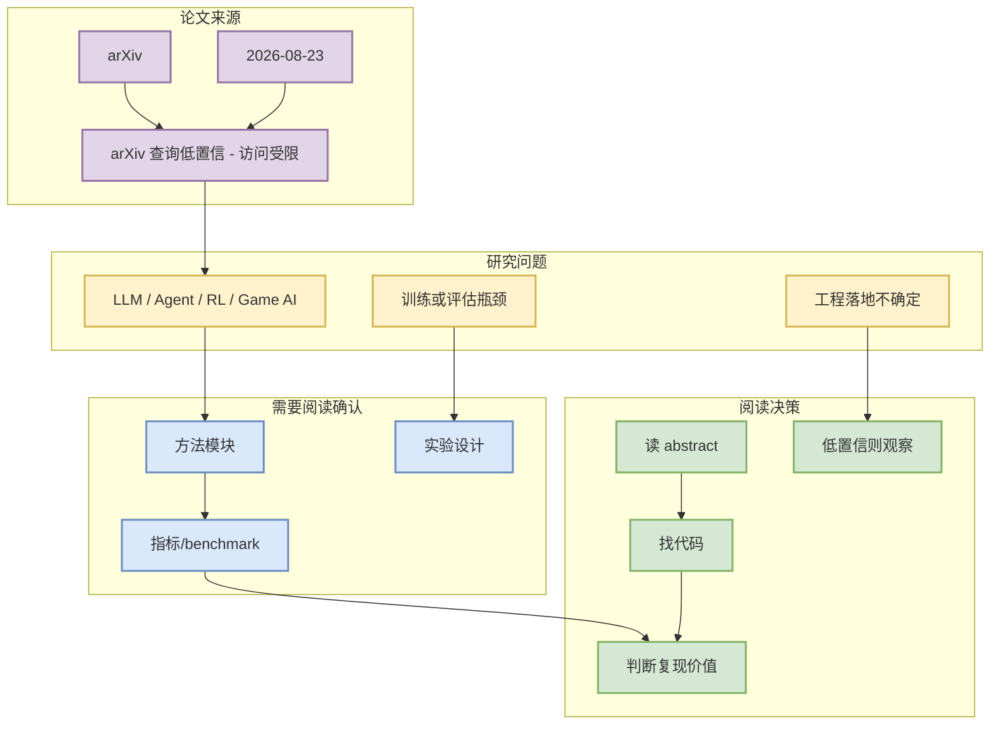

# arXiv 查询低置信 / 访问受限

> 类型：论文详情  
> 论文来源：arXiv  
> 来源类型：预印本 / API 扫描  
> 创建日期：2026-08-23  
> 原文链接：https://arxiv.org/search/advanced  
> PDF：未确认  
> 返回日报：[[Daily/2026-08-23]]

## 一句话结论
这篇论文进入今日低/中置信论文候选，因为标题或摘要命中了 LLM serving、agent eval、RL/post-training、world model 或 game AI 关键词。

## TL;DR
- **它是什么**：HTTP Error 429: Unknown Error
- **为什么重要**：若方法涉及训练、推理、agent 评估或游戏策略，可转化为用户的 AI Infra / RL game pipeline 设计参考。
- **建议动作**：先读 abstract 和实验设置，确认是否有代码或 benchmark。

## 元信息
| 字段 | 内容 |
|---|---|
| 来源 | arXiv |
| 来源类型 | 预印本 |
| 作者/机构 | arXiv API |
| 发布时间 | 2026-08-23 |
| abs | [abs](https://arxiv.org/search/advanced) |
| PDF | [PDF](未确认) |
| 代码 | 未发现 |

## 信息压缩图示

## 机制 / 影响矩阵
| 维度 | 今日判断 | 跟进 |
|---|---|---|
| AI Infra | 需确认是否有系统/吞吐/成本实验 | 看实验章节 |
| LLM 工程 | 需确认是否涉及模型训练、推理或 post-training | 看方法章节 |
| RL / Game AI | 关键词命中但需要排除弱相关 | 看 benchmark / environment |
| Agent / Eval | 若含 eval/harness，可纳入 Loop Engineer 观察 | 查代码链接 |

## 可信度与局限性
- 证据强度：arXiv API 元数据；未读取全文。
- 局限性：可能存在弱相关或主题漂移，日报中按低/中置信标注。
- 原文：https://arxiv.org/search/advanced

#ai-radar #paper #arxiv
