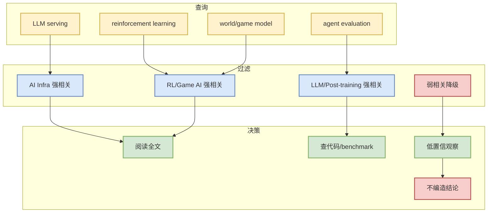

# arXiv LLM/RL/Agent 低置信扫描 - 2026-08-24

> 一句话结论：arXiv API 访问失败 / 低置信：HTTP Error 429: Unknown Error

## TL;DR
- 论文来源：arXiv
- 来源类型：预印本索引 / API 查询
- 今日状态：低置信候选；未阅读全文，不升级为必读。
- 原文入口：https://arxiv.org/search/advanced

## 论文扫描机制图

## 可信度与局限性
arXiv 可能限流或返回泛化结果；今天只把它作为低置信候选，不写未验证论文摘要。

## 相关链接
- 原文：https://arxiv.org/search/advanced
- 今日日报：[[Daily/2026-08-24]]

#ai-radar #paper #arxiv #low-confidence
