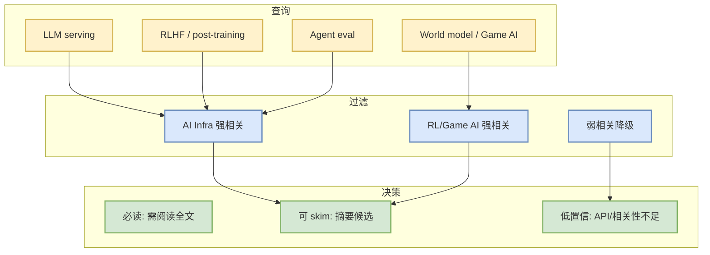

# arXiv LLM/RL/Agent 扫描 - 2026-08-25

> 一句话结论：今日 arXiv 扫描仅作为候选入口；未阅读全文的论文不升级为必读。

## 候选表
| 论文来源 / 来源类型 | 标题 | 作者/机构 | 发布时间 | 摘要压缩 | PDF/原文 |
|---|---|---|---|---|---|
| arXiv / 预印本索引 | 低置信扫描 | arXiv API | 未确认 | LLM serving inference: HTTP Error 429: Too Many Requests；reinforcement learning language models: HTTP Error 429: Unknown Error | [原文](https://arxiv.org/search/advanced) |

## 论文扫描机制图

## 可信度与局限性
- 错误/限制：LLM serving inference: HTTP Error 429: Too Many Requests; reinforcement learning language models: HTTP Error 429: Unknown Error
- 未阅读全文，不编造方法贡献或实验结果。

#ai-radar #papers #arxiv
