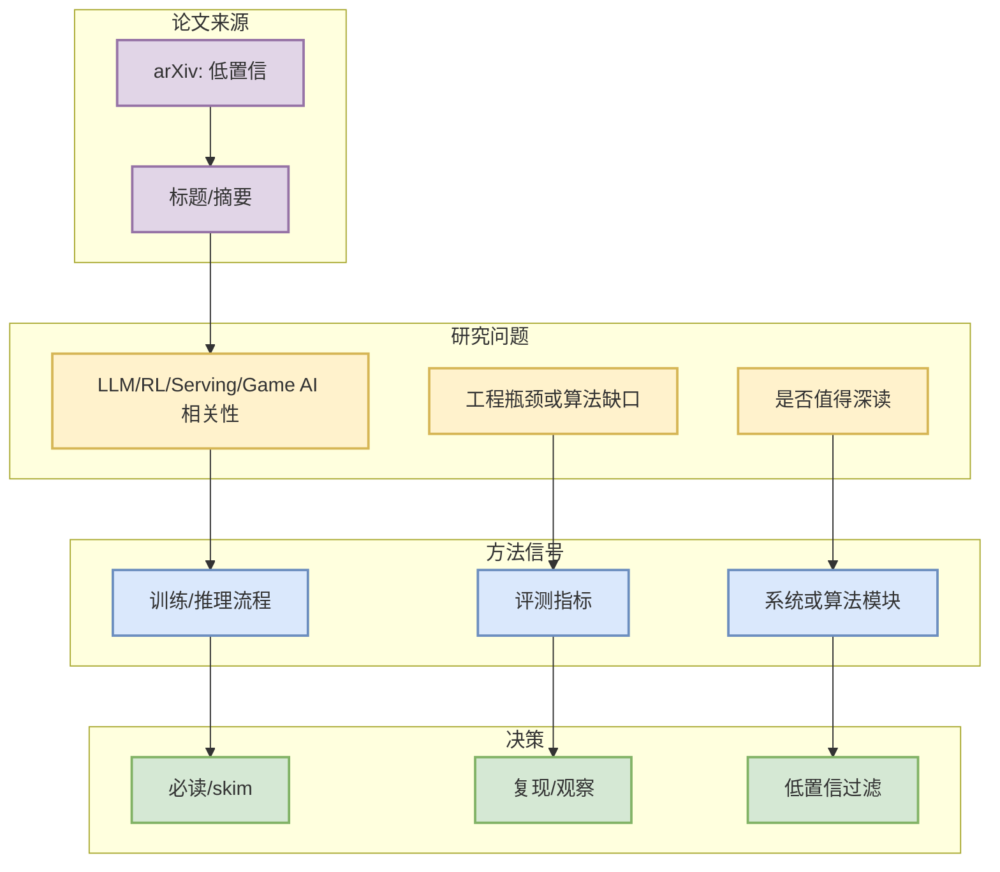

# arXiv 查询失败: cat:cs.AI AND all:agent evaluation

> 一句话结论：该论文/条目从 arXiv 检索获得，用于判断 LLM/RL/Serving/Game AI 是否有值得深读的新信号。

## TL;DR
- 来源：arXiv
- 来源类型：预印本索引 / API 检索
- 发布时间：2026-08-29
- 作者/机构：API
- 摘要压缩：HTTP Error 400: Bad Request

## 元信息表
| 字段 | 值 |
|---|---|
| 论文来源 | arXiv |
| 来源类型 | 预印本 |
| arXiv ID | 低置信 |
| 作者 | API |
| 发布时间 | 2026-08-29 |
| abs | https://export.arxiv.org/api/query |
| PDF | https://export.arxiv.org/api/query |
| 代码链接 | 未发现 |

## 信息压缩图示

## 机制/影响矩阵
| 维度 | 判断 |
|---|---|
| AI Infra | 若涉及 KV cache、serving、distributed training，优先深读。 |
| LLM/Post-training | 若涉及 RLHF/GRPO/eval，纳入后训练观察。 |
| RL/Game AI | 若涉及 imperfect-information game 或 self-play，对 Point Rummy 有迁移价值。 |
| 局限性 | 当前只基于摘要级检索，未阅读全文。 |

## 专业解读
HTTP Error 400: Bad Request

## 通俗解释
这是一条论文雷达信号：先判断是否命中用户的 serving、后训练、agent eval 或卡牌 RL 方向，再决定是否阅读全文。

## 我应该如何跟进
- 打开 PDF 快读方法与实验。
- 若有代码，再纳入复现清单。
- 与 [[Daily/2026-08-29]] 中同主题 GitHub 项目交叉验证。

## 相关链接
- Abs：https://export.arxiv.org/api/query
- PDF：https://export.arxiv.org/api/query

#ai-radar #paper #arxiv #llm #rl
