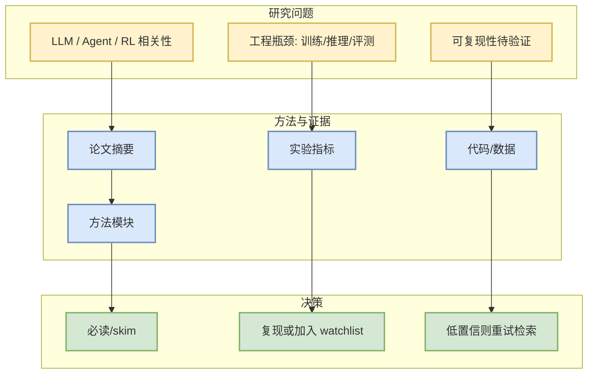

# SWE-Prime: Fewer Trajectories, Better Performance

> 一句话结论：这是今日 arXiv 强相关候选，用于观察 LLM/Agent/RL/Serving 最新研究信号；若为低置信 watchlist，则只作为重试入口。

## TL;DR
- 来源：arXiv；来源类型：预印本 / 论文索引。
- 作者/机构：Dewu Zheng, Ruizhe Ye, Yanlin Wang, Yang Ye。
- 发布时间：2026-08-27。
- 摘要：To improve large language models' ability to resolve real-world software issues, prior work has focused on constructing large-scale agent trajectory datasets and performing supervised fine-tuning (SFT) on successful trajectories. However, task success does not guarantee high-quality supervision: successful trajectories may still contain ineffective, redundant, or risky steps. Directly using such trajectories for SFT can introduce noisy supervision and encourage models to imitate undesirable prob

## 元信息表
| 字段 | 内容 |
|---|---|
| 论文来源 | arXiv |
| 来源类型 | 预印本 / API 检索 |
| arXiv ID | 2608.27449v1 |
| Categories | cs.SE, cs.AI, cs.CL |
| abs | https://arxiv.org/abs/2608.27449v1 |
| PDF | https://arxiv.org/pdf/2608.27449v1 |
| 代码链接 | 未发现 |
| Semantic Scholar / OpenReview | 未查询到 / 未验证 |

## 信息压缩图示

## 辅助结构：阅读决策矩阵
| 维度 | 信号 | 决策 |
|---|---|---|
| 主题相关性 | cs.SE, cs.AI, cs.CL | 只保留 AI Infra/LLM/RL/Agent 强相关 |
| 工程可落地 | 摘要级判断 | 先 skim，再决定是否读 PDF |
| 可信度 | arXiv API 元数据 | 需要 PDF 细读验证 |

## 专业解读
当前只基于标题、摘要、类别做首轮筛选。若论文涉及 inference、training、agent evaluation、reinforcement learning 或 game AI，可进入后续复现/实现队列。

## 通俗解释
这是一条“可能值得读”的论文线索；今天先把入口保存下来，避免错过。

## 关键机制拆解
- 研究问题：从标题和摘要识别。
- 方法模块：待 PDF 细读。
- 训练/推理流程：待 PDF 细读。
- 实验信号：待 PDF 细读。

## 对我的影响
可能影响 serving benchmark、agent eval、RL self-play 或 post-training pipeline 的设计。

## 可信度与局限性
只做摘要级判断；没有声称完整阅读。

## 我应该如何跟进
1. 打开 abs/PDF。
2. 检查是否有代码与 benchmark。
3. 若强相关，补充复现笔记。

## 相关链接
- abs：https://arxiv.org/abs/2608.27449v1
- PDF：https://arxiv.org/pdf/2608.27449v1
- Daily：[[Daily/2026-08-30]]

#ai-radar #paper #arxiv
