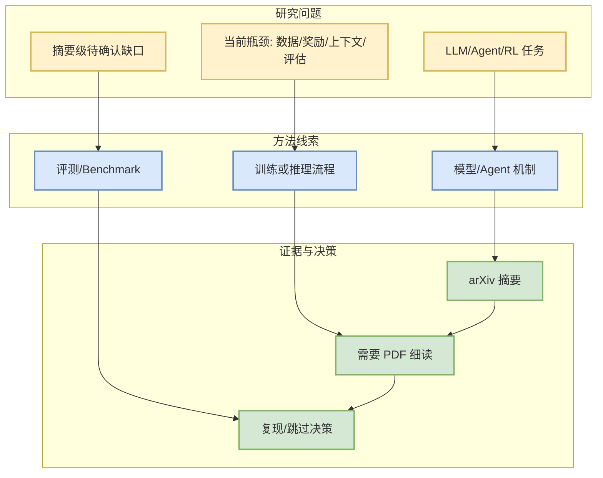

# Blind Men and the Elephant: Probing the Epistemic Myopia of LLMs under Long-Tail Divergent Knowledge

> 一句话结论：这是一篇来自 arXiv 的摘要级候选，和 LLM/Agent/RL/Serving 的关系需要后续 PDF 细读确认。

## TL;DR
- 来源：arXiv / 预印本
- 作者：Zhuoshi Pan, Junru Lu, Yan Qian, H. Vicky Zhao, Di Yin, Xing Sun
- 发布时间：2026-08-28
- Abs：https://arxiv.org/abs/2608.28478v1
- PDF：https://arxiv.org/pdf/2608.28478v1
- 代码链接：未发现

## 元信息表
| 字段 | 值 |
|---|---|
| 论文来源 | arXiv |
| 来源类型 | 预印本 / API 摘要级检索 |
| 查询来源 | agent evaluation coding agents |
| 原文 | https://arxiv.org/abs/2608.28478v1 |

## 论文机制图

## 摘要压缩
Factual question answering (QA) typically assumes a single canonical answer, obscuring whether large language models (LLMs) retain divergent accounts of long-tail facts. To address this gap, we introduce ElephantBench, a closed-book knowledge probe comprising 1,094 questions generated through an auditable graph-based pipeline. The pipeline retrieves related documents from a low-exposure web corpus, identifies naturally occurring disagreements, and converts them into multi-account QA records. Each answer is verified against the originating documents and authoritative public web sources and is then reviewed by human annotators. Across 32 models, even the strongest model recovers both accounts on only 52.4% of questions, while on nearly all remaining questions it recalls one account but omits the other. Scaling model size and inference-time reasoning improve recall but do not eliminate this incompleteness. Corpus analysis further shows that exposure imbalance favors the dominant account, whereas greater minority-side exposure is associated with more complete recall. These findings establish ElephantBench as a reproducible knowledge probe for diagnosing epistemic myopia in parametric m

## 对我的影响
- 若论文涉及 agent experience、coding agent、RL/post-training 或 serving benchmark，可转化为评测/复现实验。
- 当前只完成摘要级筛选，不能把未读 PDF 的细节当成确定结论。

## 跟进
1. 阅读 PDF 的方法和实验章节。
2. 搜索是否有代码或 benchmark。
3. 判断是否进入复现队列。

#ai-radar #paper #arxiv
