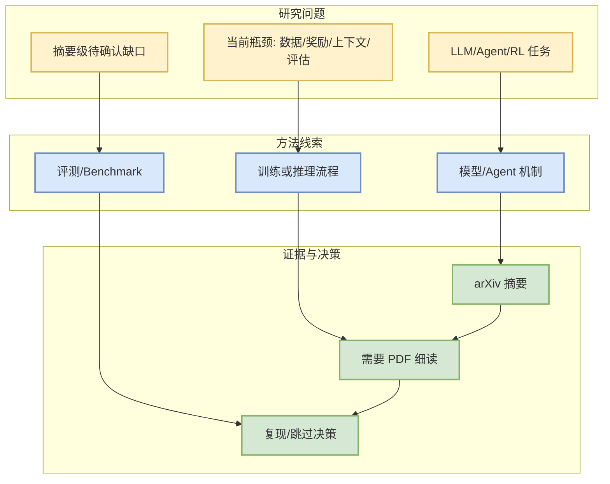

# ContextPilot: Teaching Agents for Proactive Context Management via Fine-grained RL

> 一句话结论：这是一篇来自 arXiv 的摘要级候选，和 LLM/Agent/RL/Serving 的关系需要后续 PDF 细读确认。

## TL;DR
- 来源：arXiv / 预印本
- 作者：Zhuoshi Pan, Qizhi Pei, Junru Lu, Honglin Lin, H. Vicky Zhao, Di Yin, Xing Sun
- 发布时间：2026-08-28
- Abs：https://arxiv.org/abs/2608.28476v1
- PDF：https://arxiv.org/pdf/2608.28476v1
- 代码链接：未发现

## 元信息表
| 字段 | 值 |
|---|---|
| 论文来源 | arXiv |
| 来源类型 | 预印本 / API 摘要级检索 |
| 查询来源 | agent evaluation coding agents |
| 原文 | https://arxiv.org/abs/2608.28476v1 |

## 论文机制图

## 摘要压缩
Long-horizon agentic tasks require large language models (LLMs) to iteratively retrieve, integrate, and maintain dispersed information across multi-turn interactions, but preserving all interaction histories leads to a continuously growing working context. Recent proactive context management methods allow models to edit their own working context with specialized tools, yet they still face three key limitations: (1) a limited toolset restricted to search, deletion, and summarization, with no support for global planning, long-term memory, and adaptive compression; (2) inefficient exploration that treats context management actions uniformly despite their heterogeneous impacts on final outcomes; and (3) coarse-grained credit assignment that assigns the final trajectory-level reward to all intermediate context editing actions during RL. To bridge these gaps, we introduce ContextPilot, a proactive context management framework for long-horizon agentic reasoning. Our approach systematically augments the toolset with planning, long-term memory, and soft context offloading tools. We further propose an RL method tailored for context management, which uses context and entropy variation to iden

## 对我的影响
- 若论文涉及 agent experience、coding agent、RL/post-training 或 serving benchmark，可转化为评测/复现实验。
- 当前只完成摘要级筛选，不能把未读 PDF 的细节当成确定结论。

## 跟进
1. 阅读 PDF 的方法和实验章节。
2. 搜索是否有代码或 benchmark。
3. 判断是否进入复现队列。

#ai-radar #paper #arxiv
