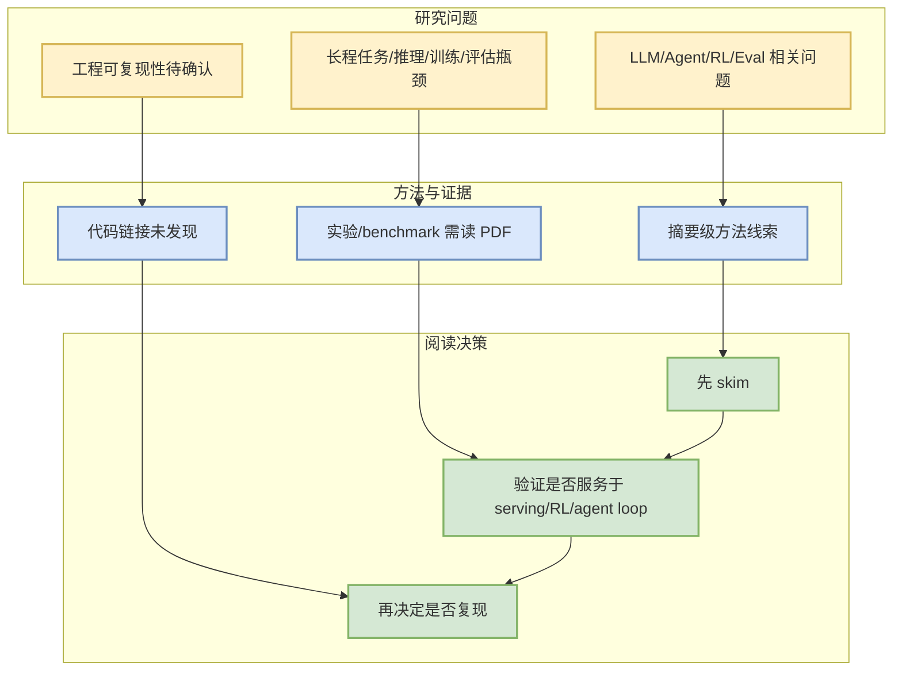

# Conducting Stylistic Analysis of Paintings through an Art-History Agent

> 日期：2026-09-01  
> 论文来源：arXiv  
> 来源类型：预印本 / 摘要级扫描  
> abs：https://arxiv.org/abs/2608.29644v1  
> PDF：https://arxiv.org/pdf/2608.29644v1

## 一句话结论
摘要显示该论文与 LLM / Agent / RL / Serving / Eval 相关，适合作为后续 PDF 深读候选。

## TL;DR
- 作者/机构：Marc S. Walton, Astrid Harth
- 发布时间：2026-08-30
- 代码链接：未发现
- 摘要压缩：Attributing an artwork to an artist has traditionally relied on detailed visual observations and descriptions, known as stylistic analysis in art history. By contrast, current artificial intelligence (AI) models used in the field offer only unexplained probabilistic classifications. To bridge this methodological gap, we present an AI framework that automates stylistic analysis of paintings, providing a foundation for

## 元信息表
| 字段 | 内容 |
|---|---|
| 来源 | arXiv |
| 来源类型 | 预印本 |
| arXiv ID | 2608.29644v1 |
| 作者 | Marc S. Walton, Astrid Harth |
| 发布时间 | 2026-08-30 |
| abs | https://arxiv.org/abs/2608.29644v1 |
| PDF | https://arxiv.org/pdf/2608.29644v1 |
| 代码 | 未发现 |

## 信息压缩图示

## 专业解读
目前只基于 arXiv 元数据与摘要，不把方法效果写成确定结论。后续应阅读 PDF 的实验设置、baseline、ablation 与限制条件，确认是否真正对 serving、post-training、agent evaluation 或 world model 有用。

## 通俗解释
这是一篇“可能值得读”的论文卡片，不是最终结论。它进入日报是因为摘要关键词与用户关注的 LLM/RL/Agent/Infra 方向重合。

## 关键机制拆解
| 模块 | 当前可确认 | 待确认 |
|---|---|---|
| 研究问题 | 摘要相关 | 是否强相关业务/工程 |
| 方法 | 摘要线索 | 具体算法/训练流程 |
| 实验 | 未细读 | benchmark 与 reproducibility |

## 对我的影响
- 可作为后续论文精读候选。
- 若涉及 agent/RL/eval，可加入评测或训练流程参考。

## 可信度与局限性
- 可信度：中低；仅摘要级扫描。
- 局限：未读取完整 PDF，未验证代码。

## 我应该如何跟进
1. 打开 PDF 读 method 和 experiments。
2. 查 Semantic Scholar citation/reference。
3. 若有代码，再补复现难度评估。

## 相关链接
- abs：https://arxiv.org/abs/2608.29644v1
- PDF：https://arxiv.org/pdf/2608.29644v1
- Daily：[[Daily/2026-09-01]]

#ai-radar #paper #arxiv
