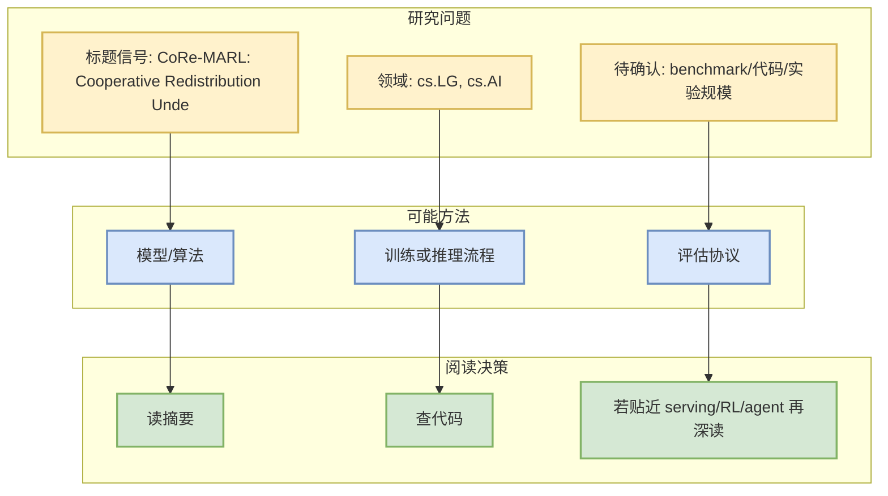
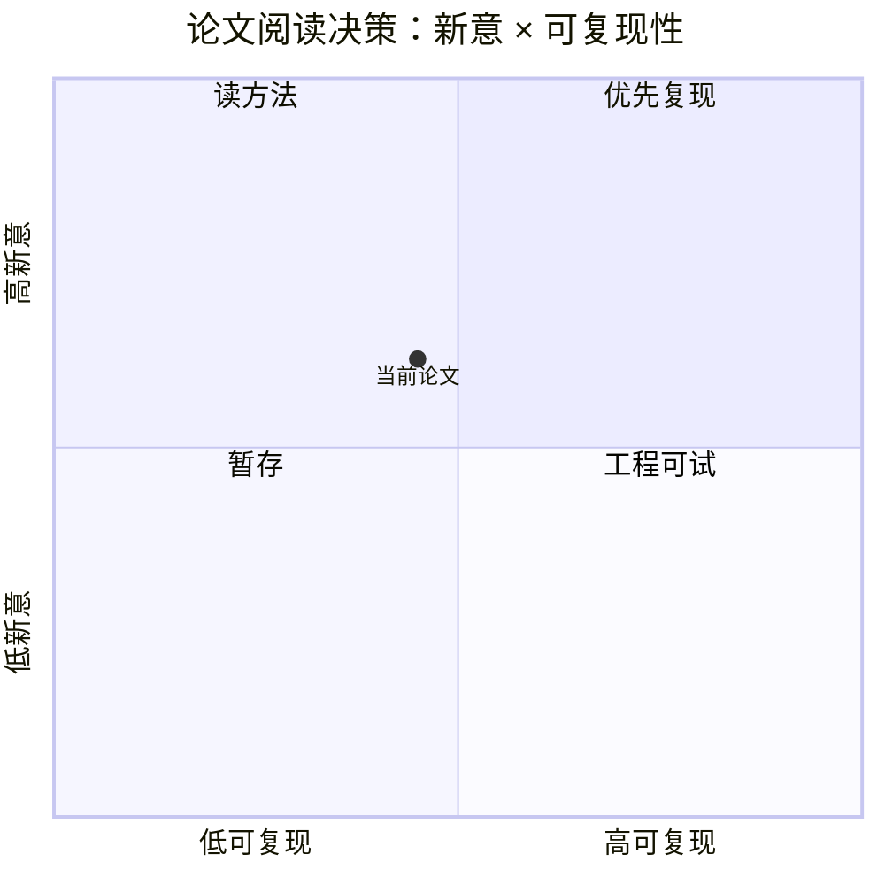

# CoRe-MARL: Cooperative Redistribution Under Unknown Dynamics Using Recurrent Multi-Agent Reinforcement Learning

> 类型：论文
> 大类：论文
> 小类：AI Infra / LLM / RL / Agent
> 推荐等级：可 skim
> 创建日期：2026-09-17
> 原文链接：https://arxiv.org/abs/2609.18639v1
> PDF：https://arxiv.org/pdf/2609.18639v1
> 返回日报：[[Daily/2026-09-17]]

## 一句话结论

这篇论文被今日 arXiv 扫描命中，主题与 LLM/RL/Agent/Serving 相关，适合作为低到中置信候选继续筛。

## 论文信息

| 字段 | 内容 |
|---|---|
| 论文来源 | arXiv |
| 来源类型 | 预印本 / 论文索引 |
| 作者/机构 | Naimur Rahman Chowdhury, Shatabdi Sen Prapti, Md. Salehin Seyam, Limon Bin Hossain |
| 发布时间 | 2026-09-16 |
| arXiv | [abs](https://arxiv.org/abs/2609.18639v1) |
| PDF | [pdf](https://arxiv.org/pdf/2609.18639v1) |
| 代码 | 未发现 |
| Categories | cs.LG, cs.AI |

## 方法/系统图示

## 摘要压缩

Emergency management assistance programs, such as relief distribution, are essential for delivering necessary supplies to affected communities. However, these programs operate in a decentralized network of local centers that face uncertain local demand and supply dynamics, resulting in inconsistent avail- ability of local services. Redistribution of supplies among these local centers reduces these imbalances, but the centers often make decisions independently, with limited information and disrupted transportation. This study develops CoRe-MARL, a cooperative multi-agent reinforcement learning (MARL) framework, by formulating a decentralized partially observable Markov decision process (Dec-POMDP). We treat each center as an agent that learns a redistribution policy to improve the service in the worst-case region and reduce the service gap across regions while protecting network-wide service. We incorporate a recurrent network that captures evolving supply and demand dynamics without direct observation, while multi-agent proximal policy optimization (MAPPO) enables centralized training and decentralized execution (CTDE). We evaluate the framework in a simulated environment with diverse trajectories, where exact dynamics are not observed by actors and the MAPPO critic. We compare the recurrent MAPPO with the recurrent independent PPO (IPPO) and a local only heuristic, and find that MAPPO reduces the service gap across local centers and enhances service for the worst-served center while maintaining competitive network-wide service. The recurrent MAPPO also shows consistent performance across diverse trajectory patterns, demonstrating its ability to adapt to evolving dynamics. The findings demonstrate the capability of cooperative learning for decentralized redistribution and improving equitable service under uncertain and evolving dynamics.

## 对我的影响

| 维度 | 影响 | 建议动作 |
|---|---|---|
| AI Infra | 先确认是否有系统/Serving/训练效率贡献 | skim |
| LLM 工程 | 看是否涉及模型训练、推理或 eval | 读摘要 |
| RL / Game AI | 若涉及 RL/world model/imperfect information，可后续深挖 | 加入观察 |
| Agent / Eval | 若涉及 agent evaluation，可纳入 benchmark 列表 | 查实验 |

## 相关链接

- 原文：https://arxiv.org/abs/2609.18639v1
- PDF：https://arxiv.org/pdf/2609.18639v1

## 标签

#ai-radar #paper
